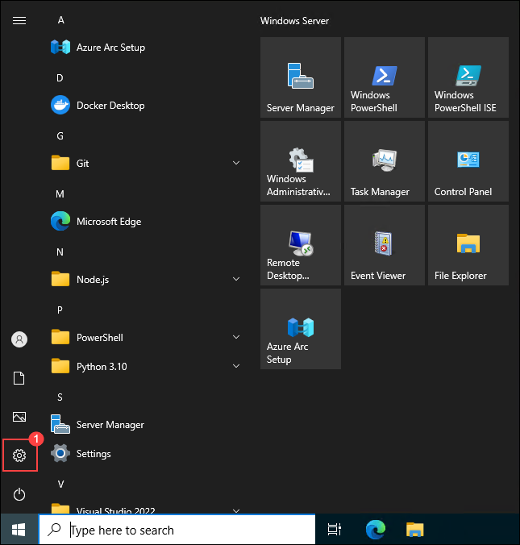
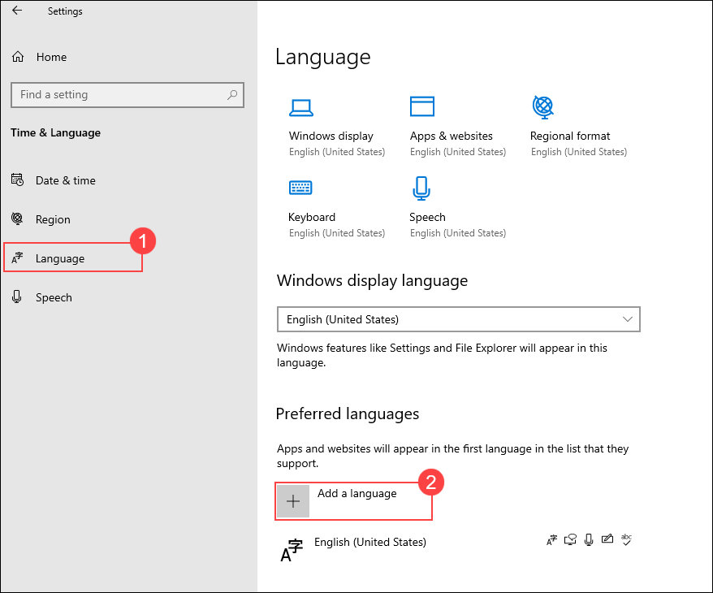
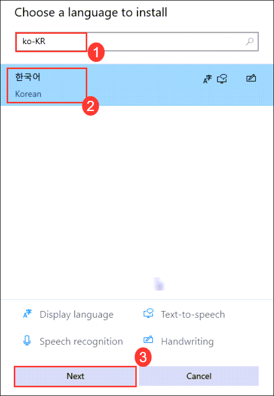
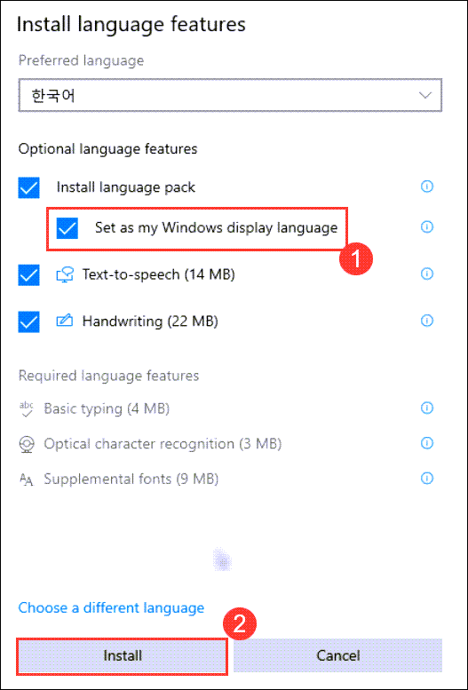
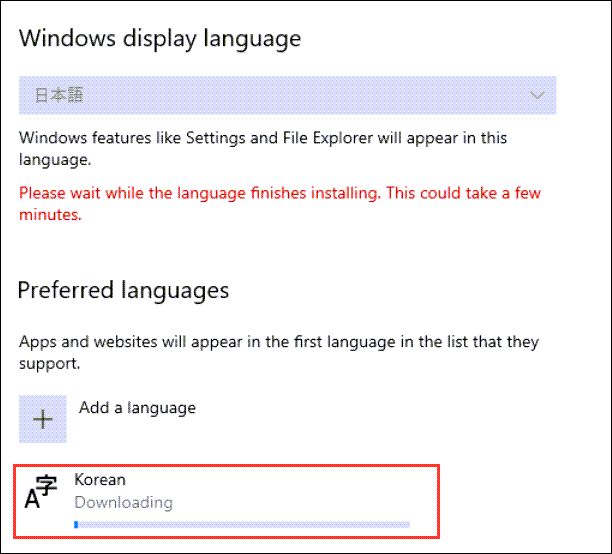
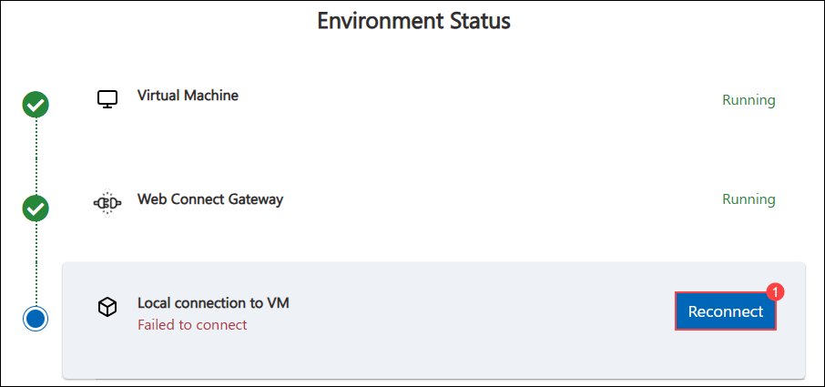

# Windows 언어 설정 변경하기

아래 단계에 따라 Windows의 표시 언어를 한국어(대한민국)로 변경할 수 있습니다.

## 1단계: Windows 설정 열기

   - **Windows + I** 키를 누르거나, 시작 버튼을 클릭한 후 톱니바퀴 아이콘을 선택해 설정을 엽니다.

      

## 2단계: 언어 옵션으로 이동

   - 설정 메뉴에서 **시간 및 언어**를 선택합니다.

      

   - 왼쪽 패널에서 **언어**를 클릭한 후, **언어 추가**를 클릭합니다.

      

## 3단계: 한국어 선택하기

   - 검색 창에 **ko-KR**을 입력하거나, 목록에서 **한국어(대한민국)**을 찾아 선택한 후, **다음**을 클릭합니다.

      

   - 다음 화면에서 **Windows 표시 언어로 설정**을 체크한 후 **설치**를 클릭합니다.

      

## 4단계: 설치 완료하기

   - 한국어 언어 팩이 다운로드되고 설치될 때까지 기다립니다.

      

   - 변경 사항을 적용하기 위한 로그아웃 알림이 나타나면 **예, 지금 로그아웃**을 클릭합니다.

      

   - 가상 머신을 사용 중이라면 **재연결**을 클릭해 연결을 복원합니다.

      

## 5단계: 변경 사항 확인

다시 로그인하면 Windows의 표시 언어가 한국어(대한민국)로 변경된 것을 확인할 수 있습니다.
