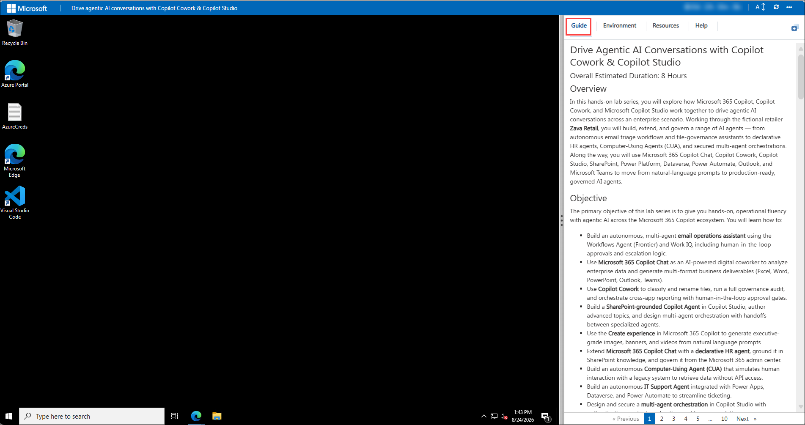
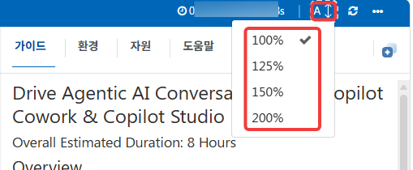
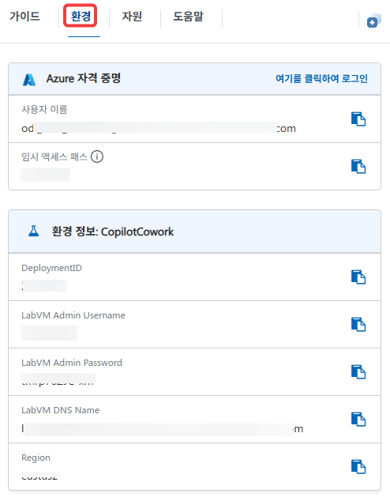
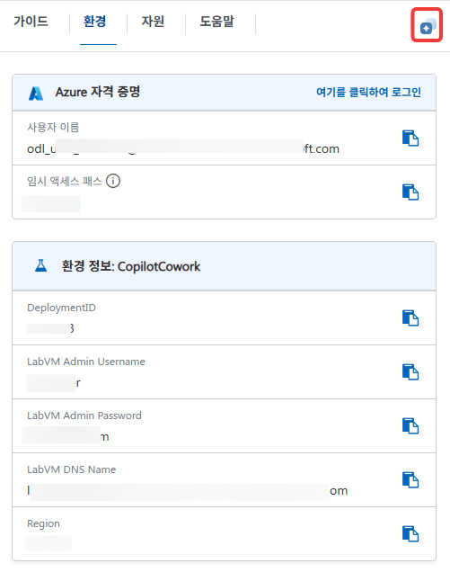
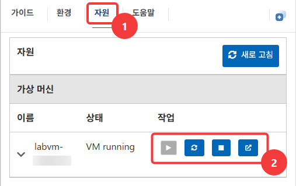
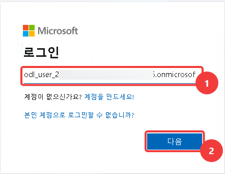
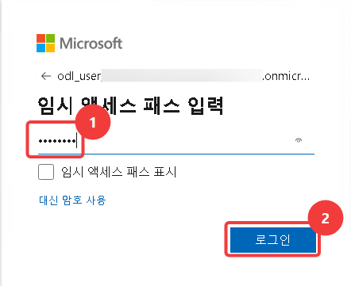
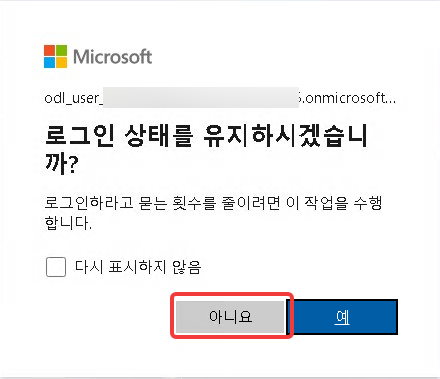

# 코파일럿 코워크 및 코파일럿 스튜디오로 에이전틱 AI 대화 주도하기

### 전체 예상 소요 시간: 8시간

## 개요

이 실습 랩 시리즈에서는 Microsoft 365 코파일럿, 코파일럿 코워크,
Microsoft 코파일럿 스튜디오가 엔터프라이즈 환경에서 에이전틱 AI
대화를 어떻게 구축하는지 살펴봅니다. 소매 회사 자바 리테일(Zava Retail)을 통해
자동 이메일 분류 워크플로, 파일 거버넌스 도우미, 선언형 HR
에이전트, 컴퓨터 사용 에이전트(CUA), 보안이 강화된 다중 에이전트
오케스트레이션까지 다양한 AI 에이전트를 구축, 확장, 운영합니다.
이 과정에서 Microsoft 365 코파일럿 챗, 코파일럿 코워크, 코파일럿
스튜디오, 쉐어포인트, 파워 플랫폼, 데이터버스, 파워 오토메이트,
Outlook, Teams를 활용하여 자연어 프롬프트에서 운영 준비가 완료된
AI 에이전트로 발전시킵니다.

```
컴퓨터 사용 에이전트(CUA, Computer-Using Agent)란?
시각 능력과 강화학습 기반 추론을 결합하여 화면의 버튼, 메뉴, 텍스트 필드를 인식하고 직접 조작할 수 있는 에이전트
```

## 목표

이 랩 시리즈의 핵심 목표는 Microsoft 365 코파일럿 환경에서
에이전틱 AI를 실무에 적용하는 능력을 갖추는 것입니다.
다음을 학습합니다.

- Workflows Agent(Frontier) 및 Work IQ를 활용하여 휴먼 인 더 루프
  승인(human-in-the-loop approval, 인간 참여형 승인)과 에스컬레이션 논리를 포함한 **이메일 운영 도우미**를 구축합니다.
- **Microsoft 365 코파일럿 챗**을 AI 기반 디지털 동료로 사용하여
  엔터프라이즈 데이터를 분석하고 여러 형식의 결과물(Excel, Word,
  PowerPoint, Outlook, Teams)을 생성합니다.
- **코파일럿 코워크(Copilot Cowork)**로 파일을 분류하고 이름을 바꾸며, 전체
  거버넌스 감사를 실행하고, 휴먼 인 더 루프 승인 단계가 있는
  앱 간 보고를 조율합니다.
- 코파일럿 스튜디오에서 **쉐어포인트 기반 코파일럿 에이전트**를
  구축하고, 고급 토픽을 작성하며, 전문가 에이전트 간 인수인계를
  포함한 다중 에이전트 오케스트레이션을 설계합니다.
- Microsoft 365 코파일럿의 생성 기능을 사용하여 자연어 프롬프트로
  경영진 수준의 이미지, 배너, 영상을 생성합니다.
- **Microsoft 365 코파일럿 챗**을 **선언형 HR 에이전트**로 확장하고,
  쉐어포인트 지식으로 기반을 마련하며, Microsoft 365 관리 센터에서
  운영합니다.
- API 접근이 불가능한 레거시 시스템과 상호 작용을 시뮬레이션하여
  데이터를 검색하는 자율 **컴퓨터 사용 에이전트(CUA)**를 구축합니다.
- 파워 앱스, 데이터버스, 파워 오토메이트와 통합된 자율 **IT
  지원 에이전트**를 구축하여 지원 요청 처리를 개선합니다.
- 인증, 콘텐츠 조정, 사람 에스컬레이션을 포함한 코파일럿 스튜디오의
  **다중 에이전트 오케스트레이션**을 설계하고 보안을 적용합니다.

## 필수 요구사항

- 랩 사용자에게 Microsoft 365 코파일럿 라이선스가 할당된
  Microsoft 365 테스트/랩 테넌트
- **코파일럿 스튜디오(Copilot Studio)** 및 **파워 플랫폼(Power Platform) 관리 센터** 접근 권한과
  환경에 대한 메이커/환경 어드민(Maker/Environment Admin) 권한
- Lab 1–3을 위한 **코파일럿 코워크(Copilot Cowork)** 및 **Workflows Agent(Frontier)**
  접근 권한
- **SharePoint Online**, **OneDrive for Business**, **Teams**,
  **Outlook** 접근 권한
- 조직의 DLP 정책에서 AI 작업, 데이터버스(AI 프롬프트), Outlook,
  Teams, SharePoint, Planner, 승인용 파워 플랫폼 커넥터를 허용해야
  합니다(Lab 1 필수).
- 최신 웹 브라우저 및 인터넷 연결

> **참고:** Microsoft는 각 작업에 필요한 최소 권한을 가진 역할만
> 사용할 것을 권장합니다. 전역 관리자 같은 고권한 역할은 다른
> 역할로는 작업을 완료할 수 없을 때만 사용합니다.

## 구성 요소 설명

- **Microsoft 365 코파일럿 챗(Copilot Chat):** 조직 데이터(Work IQ)와 웹(Web IQ)을
  기반으로 AI 대화를 시작하는 창입니다.
- **코파일럿 코워크(Copilot Cowork):** 원드라이브(OneDrive), 쉐어포인트(SharePoint), Excel, 팀즈(Teams)를 조율하여
  휴먼 인 더 루프 승인 단계가 있는 복잡한 작업을 실행하는
  에이전틱 AI 계층입니다.
- **코파일럿 스튜디오(Copilot Studio):** 토픽, 지식 원본, 도구, 다중 에이전트
  오케스트레이션을 포함한 선언형 및 자율 코파일럿 에이전트를
  구축, 구성, 배포하는 데 사용합니다.
- **Workflows Agent(Frontier):** 자연어 비즈니스 논리를 Outlook,
  Teams, 데이터버스 전반에서 실행되는 자동화된 AI 워크플로로
  변환합니다.
- **컴퓨터 사용 에이전트(CUA):** 코파일럿 스튜디오 도구로, API가
  없는 레거시 시스템과의 사람 상호 작용을 시뮬레이션합니다.
- **파워 플랫폼(Power Platform) 관리 센터 & 데이터버스(Dataverse):** 환경을 프로비저닝하고
  코파일럿 에이전트가 사용하는 구조화된 데이터(예: IT 지원 티켓)를
  저장합니다.
- **쉐어포인트(SharePoint) & 원드라이브(OneDrive):** 랩 전반에서 사용할 기반이 되는 지식
  출처 및 파일 저장소 역할을 합니다.
- **팀즈(Teams) & 아웃룩(Outlook):** 에이전트가 생성한 요약, 승인, 에스컬레이션을
  위한 통신 채널로 사용합니다.

## 랩 시작하기

워크숍에 오신 것을 환영합니다. 이 실습을 최대한 활용할 수 있도록
시작해 보겠습니다.

## 랩 환경 접근하기

시작할 준비가 되면 웹 브라우저에서 가상 머신과 가이드를 바로
사용할 수 있습니다.



## 가이드 확대/축소하기

환경 페이지의 확대/축소 수준을 조정하려면 랩 환경에서 타이머 옆의
**A↕ : 100%** 아이콘을 클릭합니다.



## 가상 머신 및 가이드

가상 머신은 워크숍 전반에서 사용할 주요 도구입니다. 가이드는
성공으로 향하는 길잡이입니다.

## 랩 리소스 살펴보기

랩 리소스와 자격 증명을 더 잘 이해하려면 **Environment** 탭으로
이동합니다.



## 분할 창 기능 사용하기

편의를 위해 오른쪽 상단의 **Split Window** 단추를 선택하여 가이드를
별도 창에서 열 수 있습니다.



## 가상 머신 관리하기

**(1) 자원** 탭에서 필요에 따라 가상 머신을 **(2) 시작, 취소
또는 재시작**할 수 있습니다. 환경을 직접 제어해 보세요.



## Microsoft 365 코파일럿 시작하기

1. 가상 머신에서 브라우저를 열고
   `https://m365.cloud.microsoft/chat/`의 Microsoft 365 코파일럿으로
   이동합니다.

2. **사용자 계정 로그인** 탭이 나타납니다. 자격 증명을
   입력합니다.

   - **이메일/사용자명:** <inject key="AzureAdUserEmail"></inject>

     

   - **임시 액세스 패스 입력:** <inject key="AzureAdUserPassword"></inject>

     

4. **액션 필요** 팝업 창이 나타나면 **나중에 묻기**를 클릭합니다.
5. **로그인 상태 유지** 메시지가 나타나면 **아니요**를 클릭합니다.

    

6. 환영 메시지 또는 "take a tour" 팝업 창이 나타나면 **Cancel** 또는
   **Skip**을 클릭하여 닫습니다.

## 지원 연락처

CloudLabs 지원팀은 이메일과 라이브 채팅을 통해 언제든지 도움을
드립니다. 학습자와 강사별로 전용 지원 채널을 운영하여 모든 문의에
신속하게 대응합니다.

학습자 지원 연락처:

- 이메일 지원: [cloudlabs-support@spektrasystems.com](mailto:cloudlabs-support@spektrasystems.com)
- 라이브 채팅 지원: https://cloudlabs.ai/labs-support

즐겁게 학습 진행하세요!
