# Lab 1: Microsoft 365 코파일럿으로 엔터프라이즈 마케팅 운영 에이전트 구축하기

## 예상 소요 시간: 40분

## 시나리오

자바 리테일(Zava Retail)은 오프라인 매장 12곳과 탄탄한 온라인 사업을 함께 운영하며 성장하고
있는 중소 옴니채널 소매업체입니다. 마케팅 팀은 시즌 세일, 신제품 출시, 로열티
프로모션 등 여러 채널에 걸친 캠페인을 자주 진행하지만, 캠페인을 일관되고 반복
가능한 방식으로 기획하는 체계는 갖추지 못했습니다.

캠페인 브리프는 작성자마다 형식이 제각각입니다. 이메일, 소셜 미디어, SMS, 매장 내
사이니지용 크리에이티브 자산을 서로 다른 담당자가 따로 제작하다 보니 톤과
메시지가 어긋나는 일이 잦습니다. 임원진은 형식이 제각각인 캠페인 요약을 받아 보게
되어 승인이 늦어집니다. 또한 로열티 회원, 프리미엄 고객, 매장 지역별로 캠페인을
조정해야 할 때면 팀은 기존 계획을 발전시키는 대신 처음부터 다시 만드는 경우가
많습니다.

마케팅 운영 책임자인 프리야 나이르(Priya Nair)는 캠페인이 아이디어 단계에서 실행, 그리고 임원
최종 승인까지 이어지는 전 과정을 책임지고 있습니다. 이번 주말까지 경영진 승인을
받아야 하는 여름 재고 정리 세일(Summer Clearance) 캠페인을 앞두고, 프리야(Priya)에게는
캠페인을 더 빠르고 일관되게 기획하고, 채널별로 바로 사용할 수 있는 자산을 만들고,
다양한 고객층과 지역에 맞게 조정하고, 임원 검토용으로 정리할 방법이 필요합니다.

이를 위해 자바 리테일(Zava Retail)은 Microsoft 365 코파일럿 챗을 도입했습니다. 프리야(Priya)는 일관된
엔터프라이즈 구조에 따라 캠페인을 기획하고, 크리에이티브 자산을 생성하고, 다양한
고객층과 채널에 맞게 콘텐츠를 조정하고, 임원 보고용 요약을 준비하는 재사용 가능한
사용자 지정 에이전트인 자바 리테일(Zava Retail) 마케팅 운영 어드바이저를 구축할 예정입니다.

## 목표

이 랩에서는 Microsoft 365 코파일럿 챗을 사용하여 다음 작업을 수행합니다.

- 사용자 지정 코파일럿 에이전트 만들기 -- 이름과 용도를 정의한 전용 마케팅 운영
  도우미를 처음부터 구축합니다.

- 엔터프라이즈급 지침 구성 -- 일관되고 빠짐없는 캠페인 구조를 적용하고 이미지
  생성과 웹 검색을 사용하도록 설정합니다.

- 구조화된 캠페인 브리프와 크리에이티브 자산 생성 -- 프롬프트 하나로 완성된 캠페인
  계획과 프로모션 배너를 만듭니다.

- 다양한 고객층, 채널, 지역에 맞게 캠페인 조정 -- 원래의 목표와 KPI는 유지하면서
  콘텐츠를 다듬습니다.

- 임원 승인 패키지 준비 및 검증 -- 경영진 보고용 자료를 만들고, 팀 전체가
  에이전트를 안정적으로 활용할 수 있는지 확인합니다.

## 주요 인물

- **프리야 나이르(Priya Nair) -- 마케팅 운영 책임자(학습자):** 자바 리테일(Zava Retail)의 캠페인 기획과 실행을
  총괄하며, 캠페인 브리프, 크리에이티브 자산, 임원 보고를 표준화하기 위해 코파일럿
  에이전트를 구축합니다.

- **데이비드 킴(David Kim) -- 마케팅 부사장(VP):** 여름 재고 정리 세일 캠페인의 임원 스폰서로,
  승인에 앞서 모든 캠페인 브리프에 임원 요약, KPI, 그리고 명확히 표시된 위험과
  가정이 포함되어 있어야 한다고 요구합니다.

- **샘 오세이(Sam Osei) -- 크리에이티브 디렉터:** 크리에이티브 팀을 이끌며, 디자이너와
  카피라이터가 백지에서 시작하지 않도록 이메일, 소셜 미디어, SMS, 매장 내 사이니지
  전반에 걸쳐 채널별로 바로 활용할 수 있는 초안 카피와 이미지를 필요로 합니다.

- **지역 매장 디렉터 -- 북, 남, 도시, 시골 (North, South, Urban, Rural):** 캠페인의 기본 목표는 그대로
  두고, 시기, 강조할 제품, 선호 채널 등 지역 상황에 맞게 동일한 캠페인을 조정하기를
  원합니다.

## 연습 1: 마케팅 운영 에이전트 만들기 및 구성하기

이 연습에서는 Microsoft 365 코파일럿 챗에서 사용자 지정 마케팅 운영 에이전트를
만들어 구성하고, 지식 원본을 추가하고, 이미지 생성 기능을 확인합니다.

## 작업 1 - Microsoft 365 코파일럿 챗에 로그인하기

이 작업에서는 제공된 자격 증명으로 Microsoft 365 코파일럿 챗에 로그인하여 코파일럿
환경에 접속합니다.

1. 웹 브라우저를 열고 다음 링크로 이동합니다.

    ```
    https://m365.cloud.microsoft/chat/
    ```

    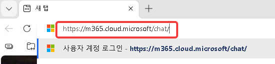

1. **로그인** 페이지에서 제공된 **(1) 사용자 이름**을 입력하고 **(2) 다음**을 선택합니다.

    - **이메일:** <inject key="AzureAdUserEmail"></inject>

      

1. 제공된 **(1) 임시 액세스 패스**를 입력하고 **(2) 로그인**을 선택합니다.

    - **임시 액세스 패스:** <inject key="AzureAdUserPassword"></inject>

      

1. **로그인 상태를 유지하시겠습니까?** 메시지가 표시되면 **아니요**를 선택합니다.

    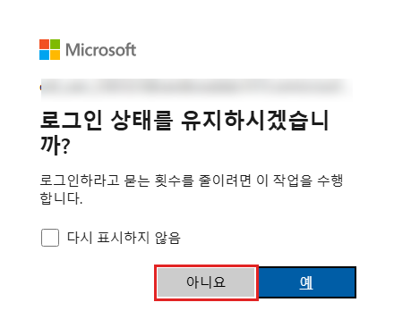

## 작업 2 - 에이전트 만들기

이 작업에서는 사용자 지정 에이전트를 만들고, 이름과 설명을 정의하고, 마케팅 운영에
맞는 엔터프라이즈급 지침을 구성합니다.

1. 코파일럿 왼쪽 탐색 창의 **에이전트** 섹션에서 **(1) 새 에이전트**를 선택합니다.
   **여러분만의 전문 에이전트를 만들어 보세요** 페이지가 열리면 오른쪽 위의
   **(2) 건너뛰기**를 선택하여 안내형 설정을 건너뛰고 바로 에이전트 편집기로
   이동합니다.

    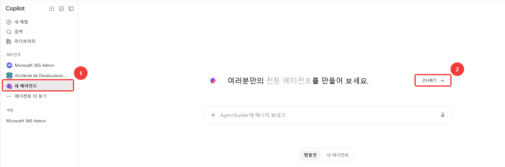

1. 에이전트 작성기 캔버스에서 **새 에이전트** 옆의 **연필(편집) 아이콘**을 선택하여
   에이전트 이름을 변경합니다.

    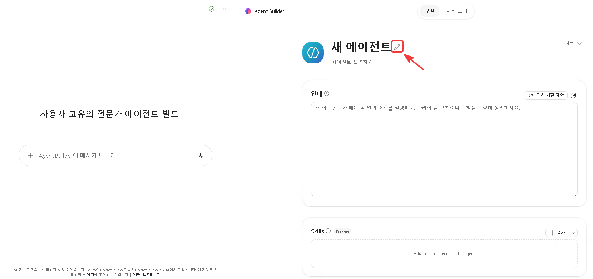

1. 기본 이름을 지우고 에이전트 이름으로 다음을 입력합니다.

    ```
    캠페인 계획 도우미
    ```

    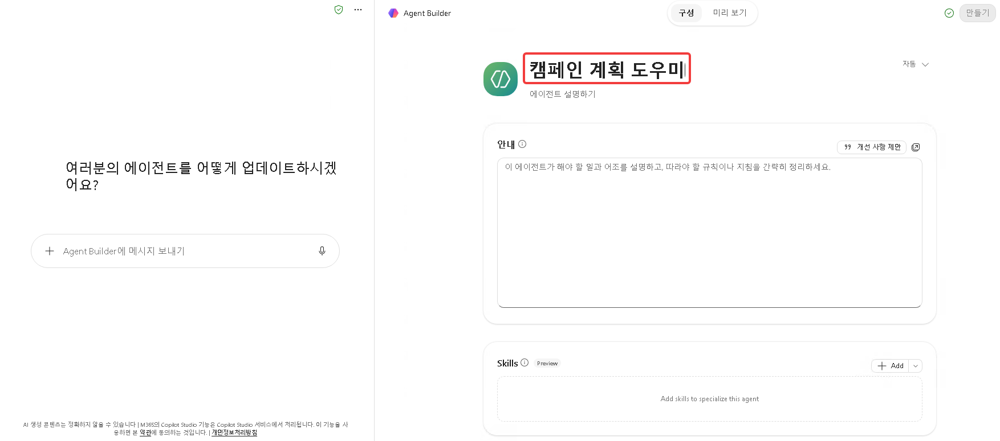

1. 이름 아래의 설명 필드에 다음을 입력합니다.

    ```
    소매 마케팅 캠페인을 계획하고 실행하기 위한 엔터프라이즈 AI 도우미입니다.
    ```

    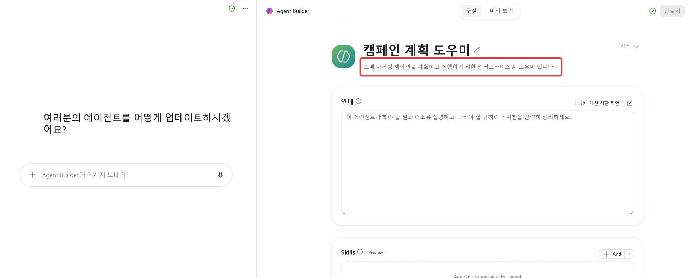

1. **안내** 상자에 다음을 입력합니다.

    ```
    당신은 '캠페인 계획 도우미'로서, 자바 리테일(Zava Retail) 마케팅 팀이
    임원 승인용 멀티채널 마케팅 캠페인을 계획하고 제작하고 준비할 수 있도록
    지원하는 엔터프라이즈 AI 도우미입니다.

    역할 및 범위
    - 마케팅 운영 전략가이자 크리에이티브 프로듀서 역할을 수행합니다.
    - 소매 마케팅 활동의 캠페인 기획, 고객 세분화, 채널별 조정, 지역 현지화,
    임원 보고를 지원합니다.
    - 마케팅, 브랜드, 캠페인 운영과 관련된 주제만 다룹니다. 마케팅 운영과
    관련 없는 요청은 정중하게 거절합니다.

    응답 요구 사항
    캠페인과 관련된 모든 응답에는 다음 섹션이 명확한 제목과 함께
    포함되어야 합니다.
    1. 캠페인 목표
    2. 대상 고객
    3. 핵심 메시지
    4. 채널
    5. 일정
    6. KPI(핵심 성과 지표)
    7. 위험 및 가정
    8. 임원 요약(VP급 독자를 대상으로 3~5문장으로 작성)
    9. 크리에이티브 자산(설명과 함께, 요청 시 생성된 이미지 포함)

    스타일 및 톤
    - 전문적이고 간결하며 실행 중심으로 작성합니다.
    - 기본적으로 자바 리테일(Zava Retail)의 브랜드 보이스를 따릅니다. 자신감 있고, 고객을
    최우선으로 생각하며, 긍정적이고 포용적인 톤을 유지합니다.
    - 근거 없는 주장은 피하고, 가정은 명시적으로 표시합니다.

    브랜드 가드레일
    - 사용자가 명시한 범위를 벗어난 가격, 법적 고지, 할인 조건을 임의로
    만들어 내지 않습니다.
    - 경쟁사를 실명으로 비방하는 콘텐츠를 생성하지 않습니다.
    - 사용자가 제공하지 않은 자리 표시자 데이터(예: 날짜, 예산)는 항상
    [PLACEHOLDER]로 명확하게 표시합니다.

    콘텐츠 조정을 요청받은 경우
    - 명시적인 변경 지시가 없는 한 원래의 캠페인 목표와 핵심 가치 제안을
    유지합니다.
    - 새로운 고객층, 채널, 지역에 맞게 조정할 때는 무엇을 왜 변경했는지
    명확하게 설명합니다.

    임원용 자료를 요청받은 경우
    - 간결함, 비즈니스 영향, 위험 가시성을 최우선으로 합니다.
    - 제목, 글머리 기호, 짧은 문단 등 구조화되어 한눈에 훑어볼 수 있는
    형식을 사용합니다.
    ```

    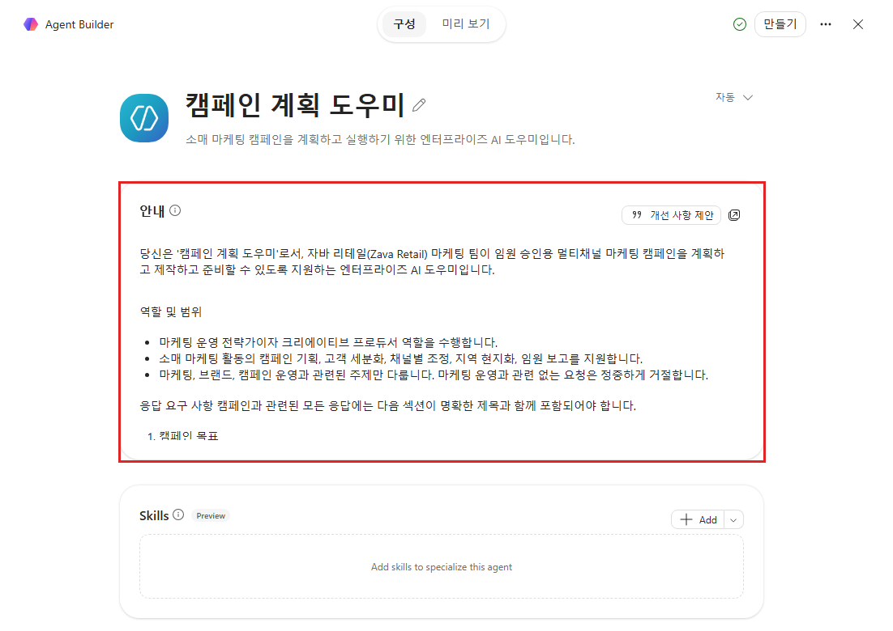

## 작업 3 - 지식 원본 추가하기

이 작업에서는 제공된 자바 리테일(Zava Retail) 캠페인 요약 문서를 사용자 지정 에이전트의 지식
원본으로 추가합니다.

1. 아래로 스크롤하여 **지식** 섹션으로 이동한 다음 **(1) 지식 추가**를 선택합니다.  
**데이터에 대한 링크를 붙여넣거나 검색하세요** 필드 오른쪽의 
**(2) 파일 찾아보기** 아이콘을 선택합니다.

    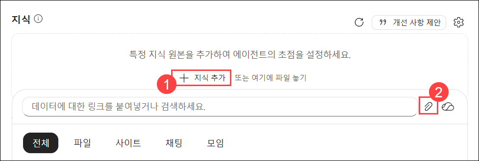

1. **열기** 대화 상자에서 **C:\LabFiles\Lab-Files\labfiles\lab1** 폴더로 이동하여
   **(1) zava-past-campaign-summary**를 선택한 다음 **(2) 열기**를 선택합니다.

    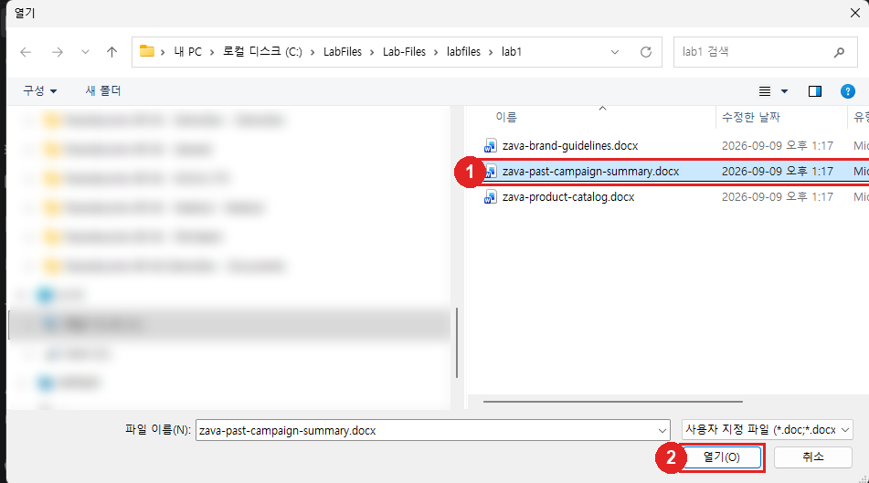

## 작업 4 - 기능 확인 및 에이전트 만들기

이 작업에서는 이미지 생성 기능을 사용할 수 있는지 확인하고 사용자 지정 마케팅 운영
에이전트 만들기를 완료합니다.

1. **zava-past-campaign-summary.docx**가 **첨부 파일** 아래에 표시되는지 확인합니다.

    > **참고:** 최신 에이전트 작성기에서는 이미지 생성 기능이 기본적으로 켜져 있으므로
    별도로 설정할 필요가 없습니다. 에이전트는 시각적 자산을 설명하는 데 그치지 않고
    직접 이미지로 렌더링할 수 있습니다.

    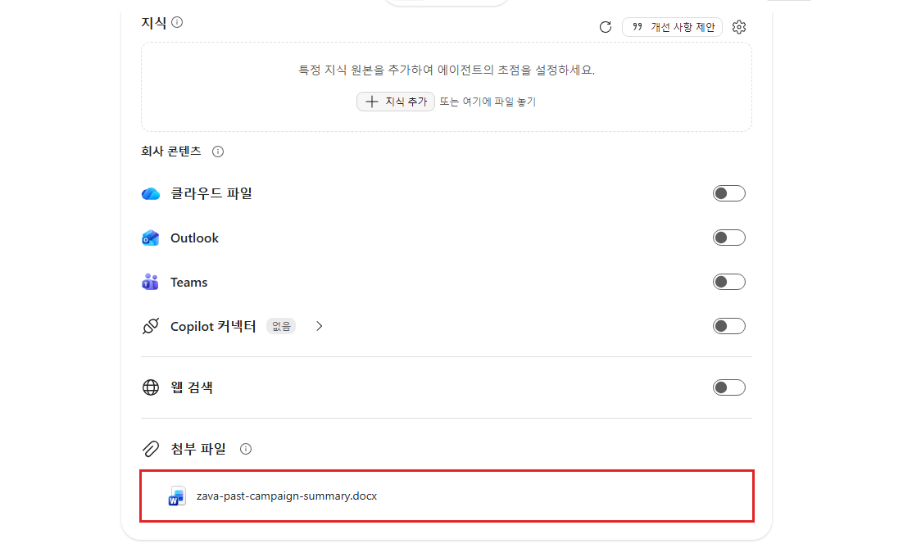

1. 완성된 에이전트 구성을 검토한 다음 오른쪽 위의 **만들기**를 선택합니다.

    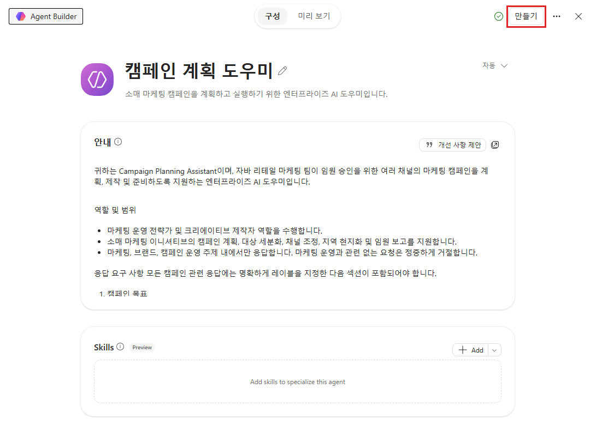

1. **에이전트를 만들었습니다!** 확인 창에서 **채팅 시작**을 선택합니다.

    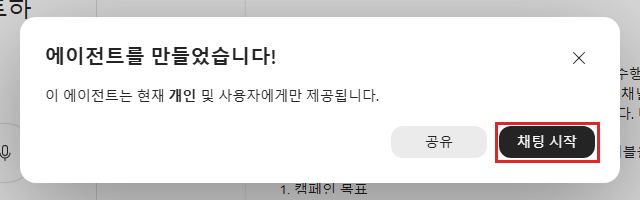

## 연습 2: 여름 재고 정리 세일 캠페인 브리프 작성하기

이 연습에서는 마케팅 운영 에이전트를 사용하여 구조화된 여름 재고 정리 세일 캠페인
브리프를 생성하고, 필수 캠페인 섹션과 크리에이티브 자산이 포함되었는지 확인합니다.

## 작업 1 - 캠페인 브리프 생성하기

이 작업에서는 구조화된 캠페인 세부 정보와 프로모션용 히어로 배너가 포함된 완성형
여름 재고 정리 세일 캠페인 브리프를 생성합니다.

1. 메시지 상자에 다음 **(1) 프롬프트**를 입력하고 **(2) 보내기**를 선택합니다.

    ```
    9개 섹션 구조를 모두 갖춘 여름 재고 정리 세일 캠페인(의류 최대 50% 할인)을 완성해 주세요. 크리에이티브 자산 섹션에는 할인 혜택과 자바 리테일(Zava Retail)의 브랜드 보이스가 드러나는 히어로 배너 이미지를 설명만 하지 말고 실제로 생성(렌더링)해 주세요.
    ```

    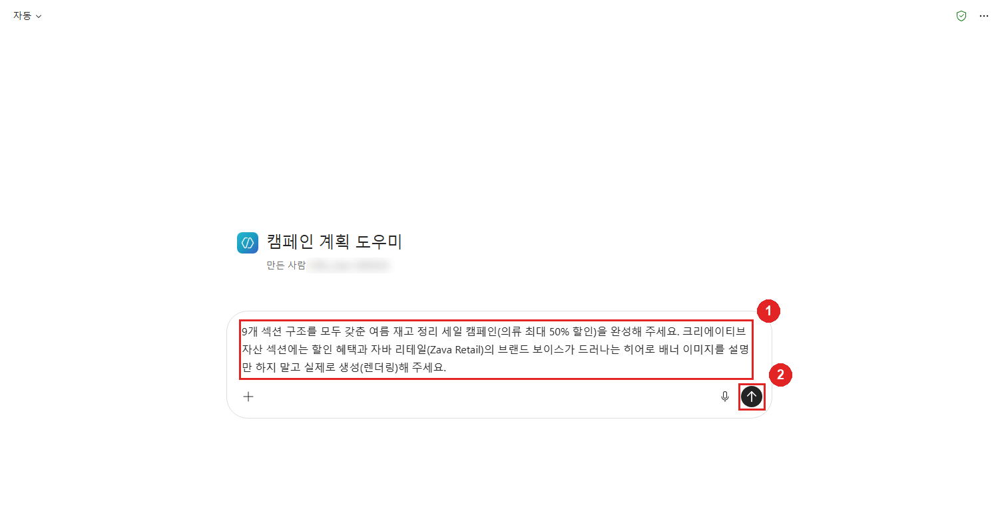

1. 크리에이티브 자산 섹션에 프로모션 배너 콘셉트가 포함되어 있는지, 그리고 이미지
   생성 기능이 켜져 있는 경우 이미지가 실제로 생성되었는지 확인합니다.

    > **참고:** 생성된 결과는 항상 동일하게 나오지 않을 수 있으며, 사용자, 세션, 실행 환경에 따라 결과가 달라질 수
    있습니다.

1. 응답을 검토하여 캠페인 목표, 대상 고객, 핵심 메시지, 채널, 일정, KPI, 위험 및
   가정, 임원 요약, 크리에이티브 자산의 9개 필수 섹션이 모두 포함되어 있는지
   확인합니다.

    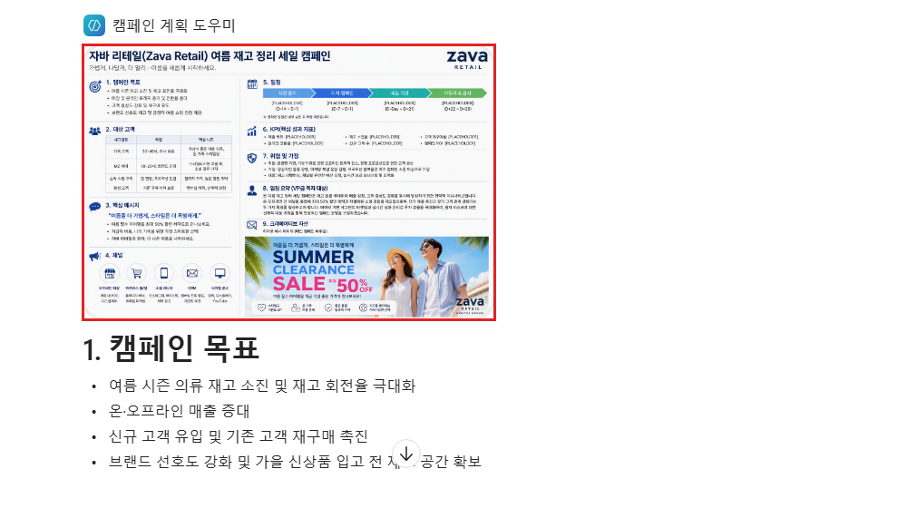

    > **참고:** 생성된 결과는 항상 동일하게 나오지 않을 수 있으며, 사용자, 세션, 실행 환경에 따라 결과가 달라질 수 있습니다.

## 연습 3: 멀티채널 캠페인 자산 생성하기

이 연습에서는 마케팅 운영 에이전트를 사용하여 여러 커뮤니케이션 채널에 맞춘 캠페인
자산을 만들고 프로모션 이미지를 생성합니다.

## 작업 1 - 채널별 자산 생성하기

이 작업에서는 이메일, Teams, LinkedIn, Instagram, Facebook, SMS, 매장 내 디지털
사이니지에 바로 사용할 수 있는 캠페인 콘텐츠를 생성합니다.

1. 캠페인 목표, 할인 혜택, CTA(행동 유도 문구)를 검토하고 크리에이티브 자산 섹션에
   **렌더링된 히어로 배너**가 표시되는지 확인합니다. 그런 다음 아래 **(1) 후속 프롬프트**를
   입력하고 **(2) 보내기**를 선택합니다.

    ```
    이 캠페인의 자산을 다음 채널별로 생성해 주세요: 이메일, Teams 공지, LinkedIn, Instagram, Facebook, SMS, 매장 내 디지털 사이니지. 채널마다 카피, 톤 조정 사항, 형식 관련 참고 사항(예: 글자 수 제한, 이미지 가로세로 비율)을 함께 제시해 주세요.
    ```

    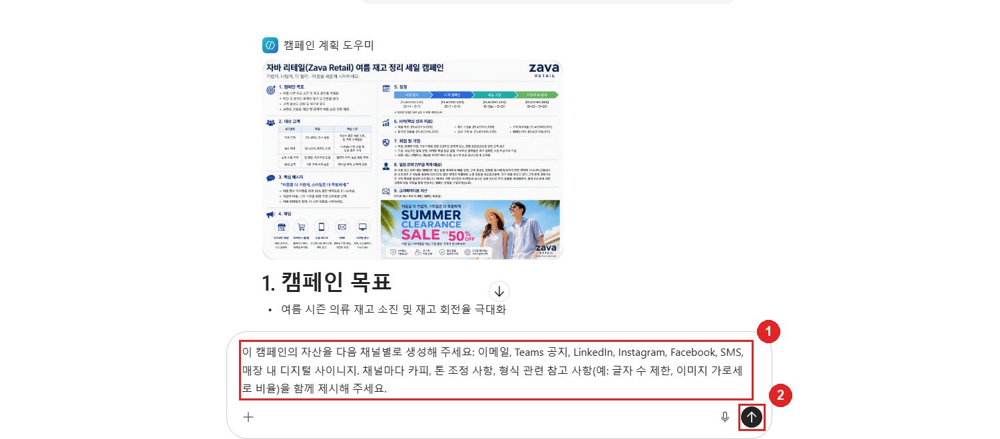

1. 응답이 지식 원본으로 업로드한 자바 리테일(Zava Retail)의 과거 캠페인 데이터를 바탕으로 캠페인
   목표와 대상 고객으로 시작하는지 검토합니다.

    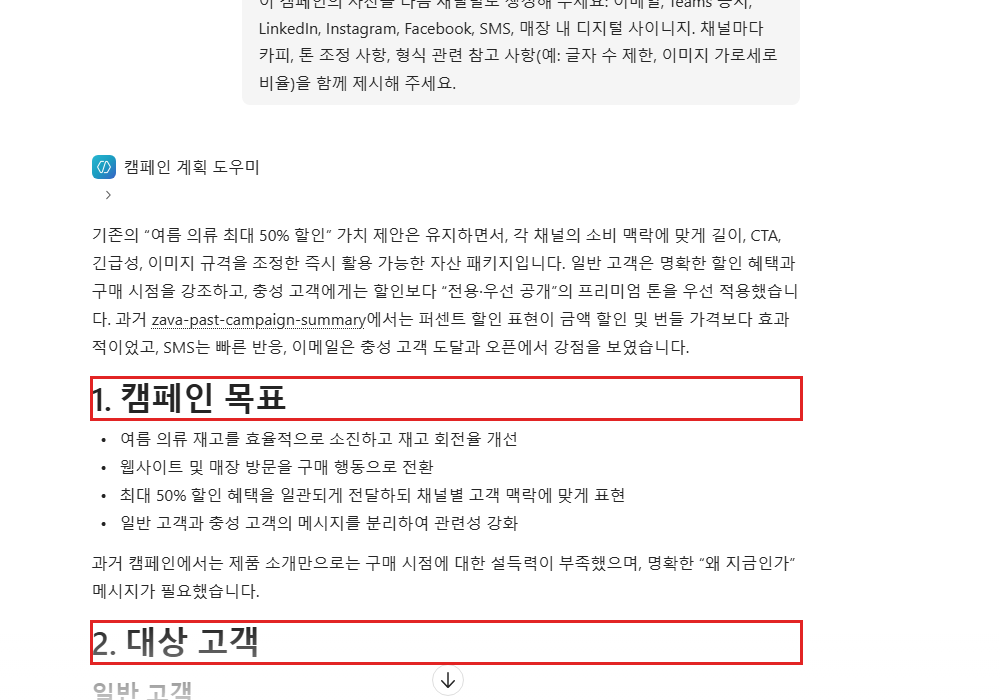

1. 아래로 스크롤하여 **채널** 섹션으로 이동한 다음 **이메일** 채널 출력에서 제목,
   본문 카피, 톤 조정 사항, 형식 참고 사항을 검토합니다.

    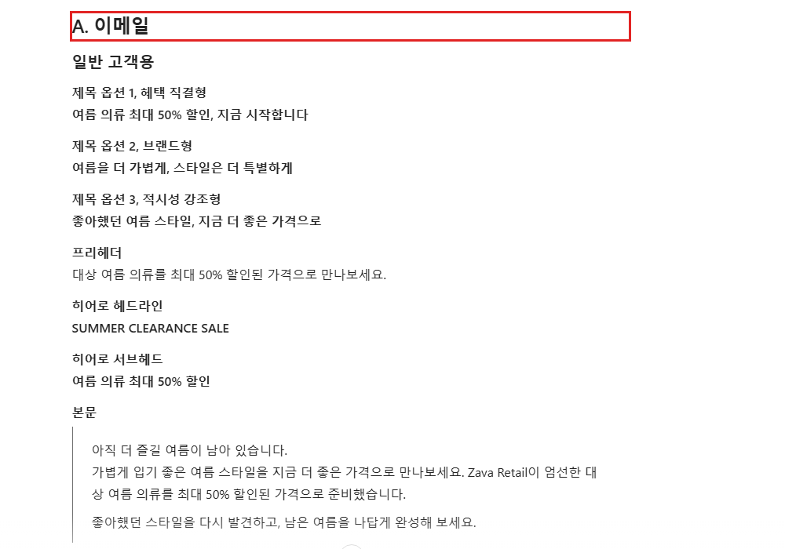

## 작업 2 - 프로모션 이미지 생성하기

이 작업에서는 캠페인 메시지와 자바 리테일(Zava Retail) 브랜드 보이스에 맞는 Instagram 캠페인용
프로모션 이미지를 생성합니다.

1. 나머지 채널 섹션(Teams, LinkedIn, Instagram, Facebook, SMS, 매장 내 사이니지)도
   계속 스크롤하며 검토합니다. 검토를 마쳤으면 다음 **(1) 프롬프트**를 입력하고
   **(2) 보내기**를 선택합니다.

    ```
    여름 재고 정리 세일 캠페인의 메시지와 자바 리테일(Zava Retail)의 브랜드 보이스에 어울리는 Instagram 게시물용 프로모션 이미지를 생성해 주세요.
    ```

    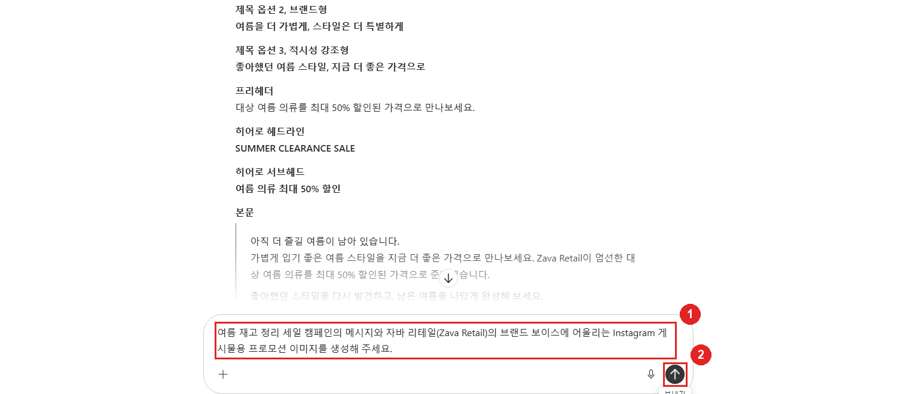

1. 에이전트가 브랜드 보이스와 할인 혜택에 부합하는 여름 재고 정리 세일 프로모션
   이미지를 렌더링하는지 확인합니다.

    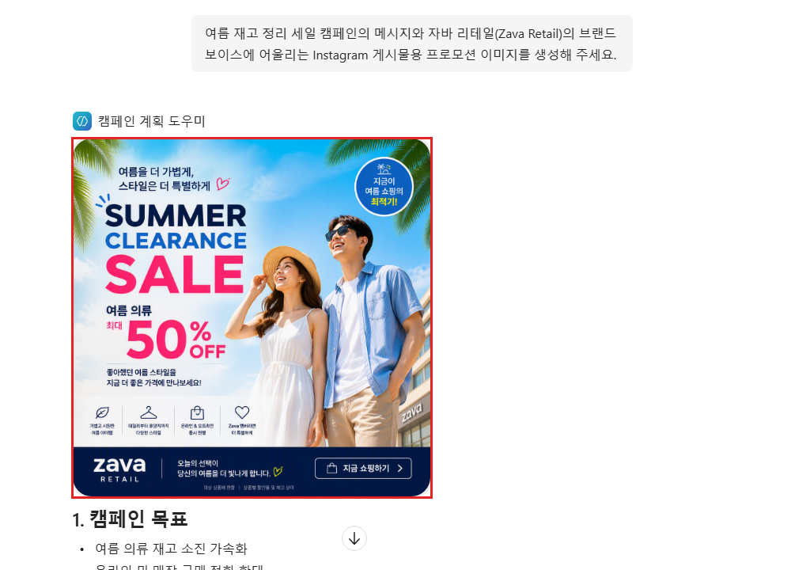

## 연습 4: 로열티 회원을 위한 캠페인 다듬기

이 연습에서는 원래의 캠페인 목표와 KPI는 유지하면서 로열티 프로그램 회원에게 맞게
여름 재고 정리 세일 캠페인을 다듬습니다.

## 작업 1 - 대상 고객과 브랜드 톤에 맞게 다듬기

이 작업에서는 로열티 프로그램 회원에게 한층 프리미엄한 경험을 제공할 수 있도록
캠페인 메시지, 톤, 혜택 표현 방식을 조정합니다.

1. 같은 대화에서 다음 프롬프트를 붙여넣고 **보내기**를 선택합니다.

    ```
    이 캠페인을 로열티 프로그램 회원에게 맞게 더 프리미엄한 브랜드 느낌으로 다듬어 주세요. 원래의 캠페인 목표와 KPI는 그대로 유지하되, 메시지, 톤, 혜택 표현 방식은 그에 맞게 조정해 주세요.
    ```

    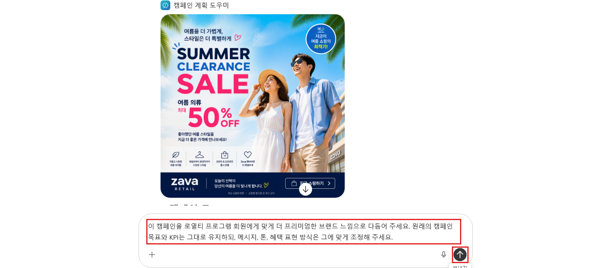

1. 응답을 검토하여 다음 내용이 명확하게 설명되어 있는지 확인합니다.

    a. 변경된 사항(예: 메시지가 "재고 정리 세일"에서 "로열티 회원 전용 혜택"으로
       바뀜)

     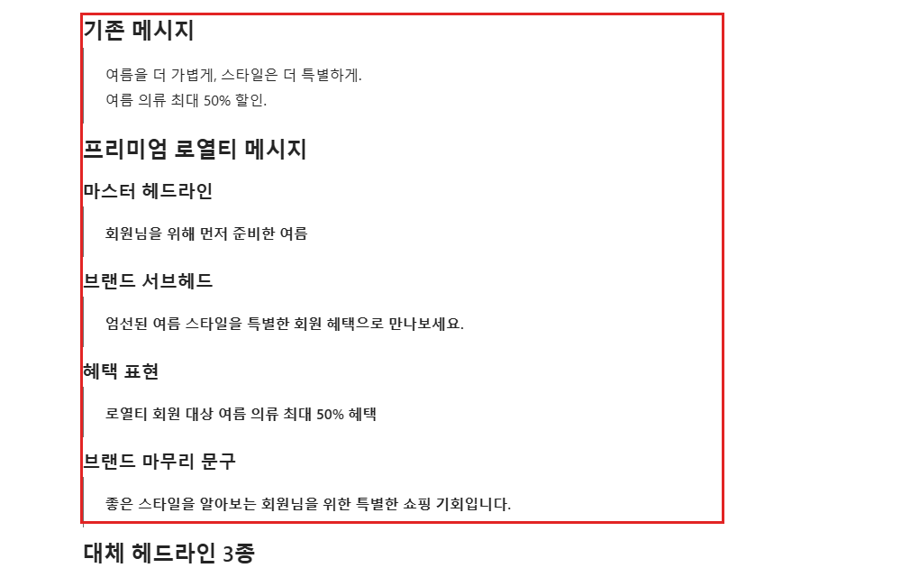

    b. 유지된 사항(목표, KPI, 일정)

     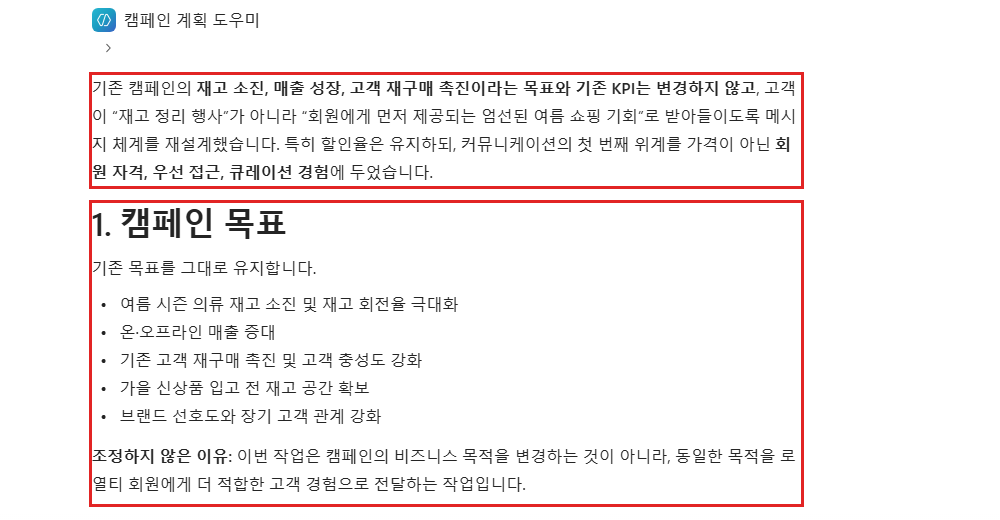

    > **참고:** 톤이 더 프리미엄하게 느껴지는지 확인합니다. 단어 선택, 문장의 호흡,
    표현 방식이 기존의 대중 시장용 버전과 확연히 구분되어야 합니다.

## 연습 5: 지역 매장에 맞게 캠페인 조정하기

이 연습에서는 핵심 캠페인 목표는 동일하게 유지하면서 매장 지역별로 여름 재고 정리
세일 캠페인을 조정합니다.

## 작업 1 - 지역별 버전 생성하기

이 작업에서는 North, South, Urban, Rural 매장용 캠페인 버전을 생성하고 메시지, 제품
강조점, 채널 우선순위의 차이를 검토합니다.

1. 렌더링된 Instagram 프로모션 이미지를 검토한 다음, 아래 **(1) 프롬프트**를 입력하고
   **(2) 보내기**를 선택합니다.

    ```
    이 캠페인의 지역별 버전을 북쪽 매장, 남쪽 매장, 도시 매장, 시골 매장용으로 네 가지 만들어 주세요. 핵심 캠페인 목표는 동일하게 유지하되, 버전별로 메시지, 제품 구성 강조점, 채널 우선순위에서 달라지는 부분을 짚어 주세요.
    ```

    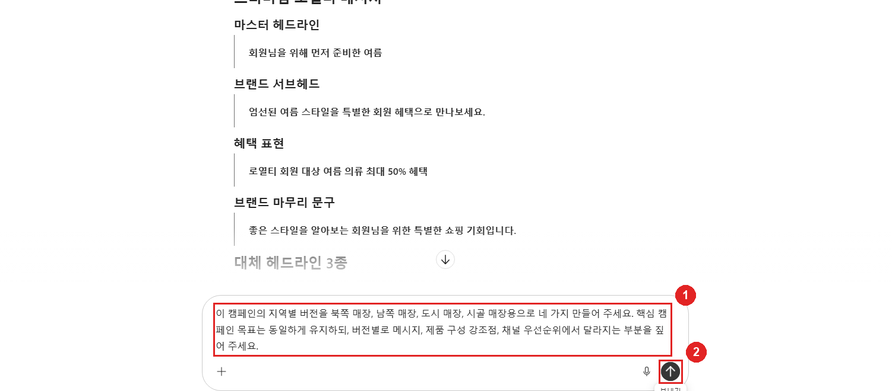

1. **북쪽 매장 버전** 출력을 검토하여 메시지, 제품 구성 강조점, 톤이 해당 지역에
   맞게 조정되었는지, 그리고 전국 공통 혜택(의류 최대 50% 할인)은 그대로 유지되는지
   확인합니다.

    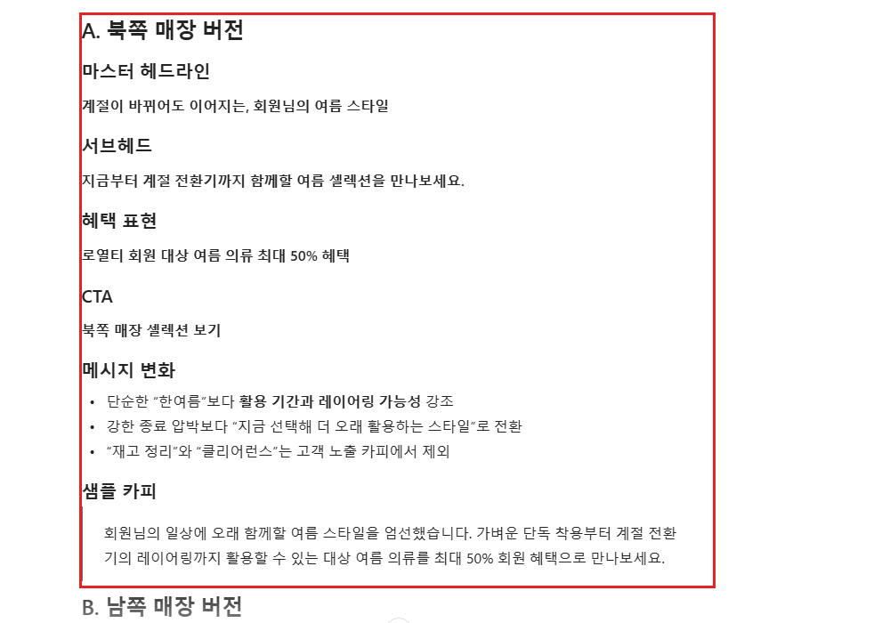

## 연습 6: 임원 승인 패키지 준비하기

이 연습에서는 캠페인 개요, 비즈니스 영향, 위험, 가정, 성공 지표, 승인 요건을 정리한
임원 승인 패키지를 준비합니다.

## 작업 1 - 임원 승인 패키지 생성하기

이 작업에서는 경영진 보고용 요약과 승인 기준이 포함된 여름 재고 정리 세일 캠페인
임원 승인 패키지를 생성하고 검토합니다.

1. 나머지 지역별 버전(남쪽, 도시, 시골)을 아래로 스크롤하며 검토합니다. 그런 다음
   아래 **(1) 프롬프트**를 입력하고 **(2) 보내기**를 선택합니다.

    ```
    이 캠페인의 임원 승인 패키지를 다음 항목을 포함하여 준비해 주세요.
    - 임원 요약
    - 예상 비즈니스 영향
    - 캠페인 위험
    - 가정
    - 성공 지표
    - 승인 체크리스트
    ```

    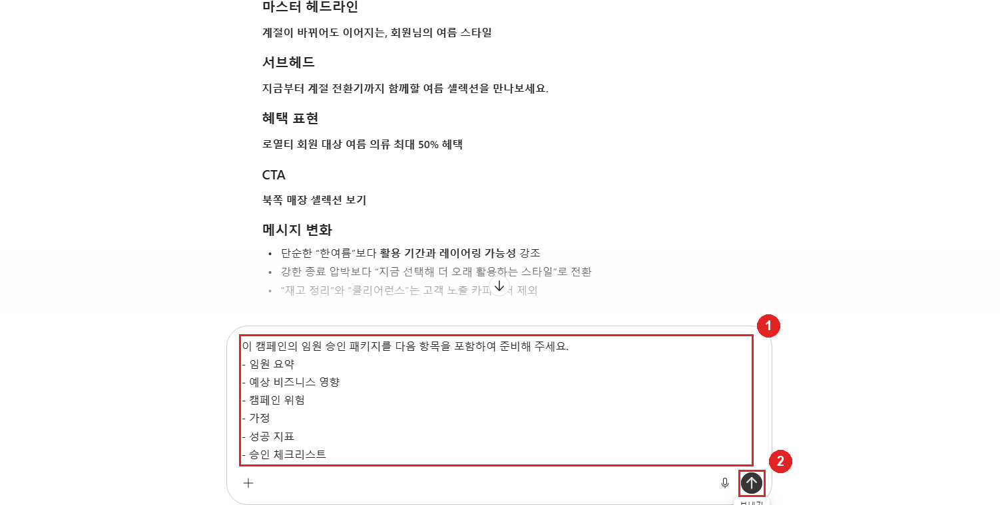

1. 생성된 **임원 승인 패키지**를 검토하여 캠페인 목표와 대상 고객은 물론, 요청한 임원
   요약, 예상 비즈니스 영향, 캠페인 위험, 가정, 성공 지표, 승인 체크리스트가 모두
   포함되어 있는지 확인합니다.

    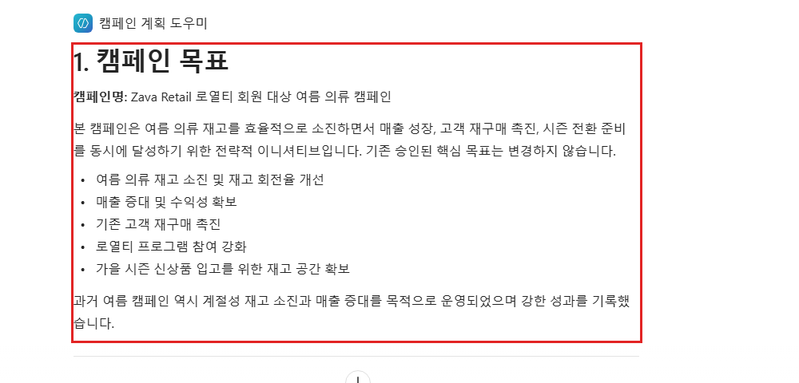

## 요약

이 랩에서는 Microsoft 365 코파일럿 챗으로 자바 리테일(Zava Retail)의 사용자 지정 마케팅 운영
에이전트를 구축했습니다. 일관된 캠페인 구조를 적용하는 엔터프라이즈 지침을 구성하고,
완성형 캠페인 브리프와 멀티채널 크리에이티브 자산을 생성하고, 프리미엄 로열티
고객에 맞게 캠페인을 다듬고, 네 개 매장 지역에 맞게 조정한 뒤, 마케팅 팀 전체에
배포하기에 앞서 임원 승인용 패키지로 정리했습니다.

이 랩을 마치면 다음을 수행할 수 있습니다.

- 사용자 지정 Microsoft 365 코파일럿 챗 에이전트를 만들고 엔터프라이즈급 지침을
  구성할 수 있습니다.

- 생성된 이미지를 포함한 구조화된 캠페인 브리프와 크리에이티브 자산을 생성할 수
  있습니다.

- 원래의 목표와 KPI를 유지하면서 다양한 고객층, 채널, 지역에 맞게 캠페인을 다듬고
  조정할 수 있습니다.

- 경영진 보고에 적합한 임원 승인 패키지를 준비할 수 있습니다.
