# Lab 2: 코파일럿 코워크(Copilot Cowork)로 AI 기반 일정 최적화하기

## 예상 소요 시간: 30분

## 개요

이 랩에서는 Microsoft 365 코파일럿 코워크(Copilot Cowork)를 사용하여 임원 비서처럼
일정을 관리합니다. 연습 1에서는 로그인한 후 앞으로 5영업일의 일정 충돌을 검색합니다.
요일 선호도, 완충 시간, Teams 링크, 참석자 확인 등 여러 제약을 동시에 만족하는
모임을 예약합니다. 연습 2에서는 코워크가 자체적으로 확인할 수 없는 일정 요청을
제출합니다. 한 주에 적용할 임원식 상시 규칙을 지정하고 주간 업무량 요약을 검토합니다.
이 과정에서 빈 일정, 설정되지 않은 표준 시간대, 모호한 참석자 같은 실제 환경 문제를
코워크가 표시하고 각각을 처리하는 방식을 확인합니다.

> **참고:** 생성된 결과는 항상 동일하게 나오지 않을 수 있으며, 사용자, 세션, 실행 환경에 따라 결과가 달라질 수 있습니다. 아래 날짜, 시간, 일정 건수는 화면에 기록된 실행 예시입니다. 본인의 일정과 표준 시간대 설정을 기준으로 실제 결과를 확인합니다.

## 랩 목표

이 랩에서는 다음을 수행합니다.

- 연습 1: 일정 충돌 감지 및 제약 조건이 있는 모임 예약
  - 작업 1: Microsoft 365 코파일럿 코워크에 로그인
  - 작업 2: 일정에서 충돌 검색
  - 작업 3: 여러 제약 조건이 있는 모임 예약
- 연습 2: 제약 조건 처리 테스트 및 임원 상시 규칙 적용
  - 작업 1: 모호한 일정 요청 테스트
  - 작업 2: 임원 상시 규칙 지정 및 일정 메모리 저장
  - 작업 3: 주간 업무량 요약 검토

## 연습 1: 일정 충돌 감지 및 제약 조건이 있는 모임 예약

이 연습에서는 코파일럿 코워크에 로그인하고 충돌 감지 검색을 실행한 후 여러
제약 조건을 동시에 만족하는 모임을 예약합니다.

### 작업 1: Microsoft 365 코파일럿 코워크에 로그인

이 작업에서는 랩 자격 증명으로 Microsoft 365에 로그인하고 코워크 탭으로 전환합니다.

1. 웹 브라우저를 열고 다음 링크로 이동합니다.

    ```
    https://m365.cloud.microsoft
    ```

    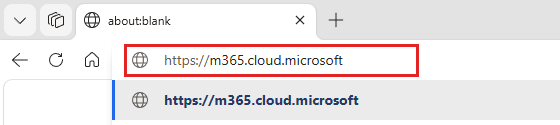

1. Microsoft 365 랜딩 페이지에서 **로그인**을 선택합니다.

    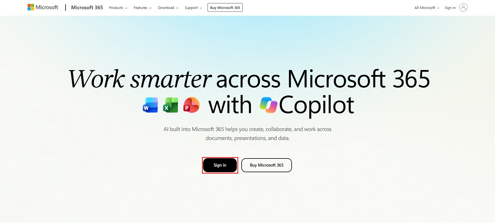

1. **로그인** 페이지에서 제공된 **(1) 사용자 이름**을 입력한 후 **(2) 다음**을
   선택합니다.

    - **이메일:** <inject key="AzureAdUserEmail"></inject>

      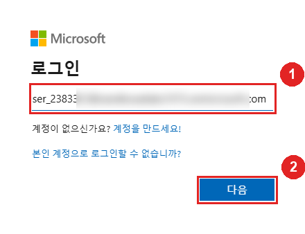

1. 제공된 **(1) 임시 액세스 패스**를 입력한 후 **(2) 로그인**을 선택합니다.

    - **임시 액세스 패스:** <inject key="AzureAdUserPassword"></inject>

      

1. **로그인 상태를 유지하시겠습니까?** 메시지에서 **아니요**를 선택합니다.

    

1. 코파일럿 앱에서 **코워크** 탭을 선택합니다. 홈 화면에서 왼쪽 사이드바의
   **새 작업**, **내 작업**, **자동화**, **사용자 지정** 옵션과 가운데의
   **작업 시작...** 프롬프트 입력 창을 확인합니다.

    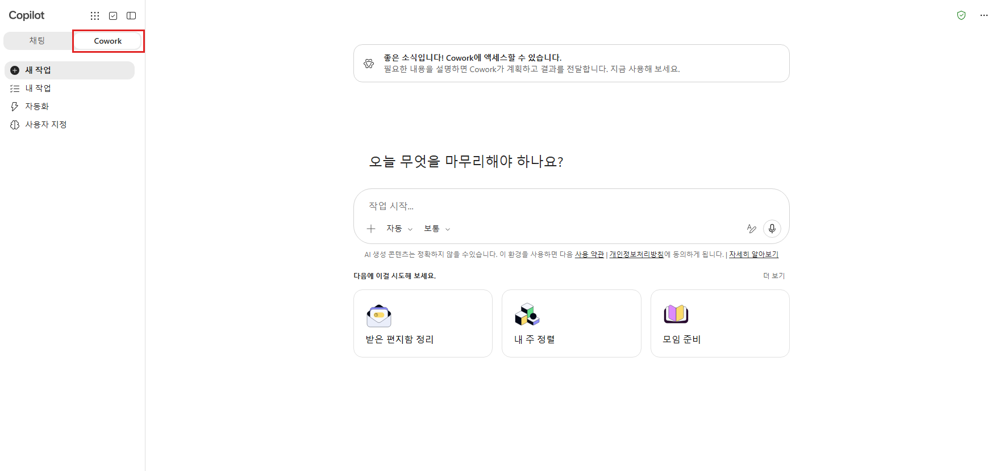

### 작업 2: 일정에서 충돌 검색

이 작업에서는 향후 5영업일 동안 충돌 감지 검색을 실행합니다. 코워크가 빈 일정을
처리하는 방식을 확인합니다.

1. **(1) 프롬프트 입력 창**을 선택하고 다음 프롬프트를 정확히 입력한 후 **(2) 보내기**를
   선택합니다.

    ```
    향후 5영업일 동안 내 일정을 검색해 주세요. 모든 충돌이나 연속된 3개 이상의 모임을 나열해 주세요. 각 충돌마다 해결 방안을 제안해 주세요. 이동할 모임, 모든 참석자에게 가장 좋은 대체 시간, 정중한 일정 변경 메시지를 포함해 주세요.
    ```

    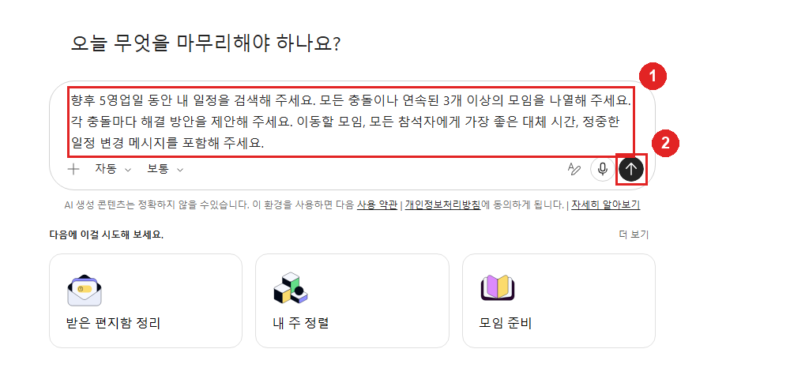

1. 오른쪽 **작업 영역** 패널의 **도구** 아래에 코워크가 호출한 **일정** 도구가
   표시되는지 확인하고, 채팅 창에서 **N items complete**를 펼쳐 컨텍스트 수집 →
   일정 검색 → 결과 정리로 이어지는 진행 단계를 살펴봅니다. 코워크는 요청한
   5영업일을 검색해 일정이 비어 있음을 확인한 뒤, 실제로 아무 일정도 없는지
   다시 확인하기 위해 검색 범위를 약 두 달로 넓혔습니다.

    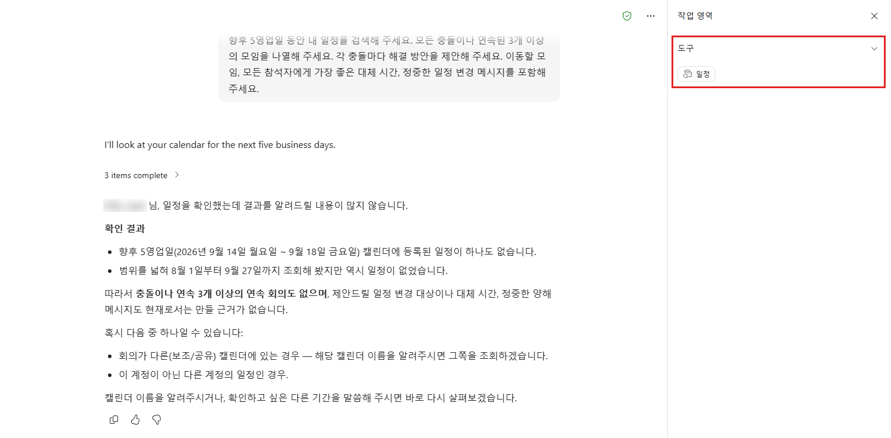

1. 전체 요약을 검토합니다. 일정에 이벤트가 없으므로 코워크는 **일정 충돌이나
   3개 이상 연속되는 모임이 없으며**, 일정 변경 대상이나 대체 시간, 양해 메시지를
   만들 근거가 없다고 보고합니다. 이는 검색 실패가 아니라 빈 일정의 올바른
   예상 결과입니다. 코워크가 스스로 제시하는 두 가지 가능성도 확인합니다. 모임이
   **다른(보조/공유) 캘린더**에 있거나 **다른 계정의 일정**일 수 있다고
   알려줍니다. 검토를 마친 후 다음 프롬프트를 같은 입력 창에 입력합니다.

    ```
    다음 주에 ODL User와 45분 "프로젝트 동기화" 모임을 예약해 주세요. 조건: 월요일 제외, 각자의 기존 모임 전후 30분 이내 제외, 오전 시간 선호. Teams 링크를 추가하고, 프로젝트 관련 최근 이메일 스레드를 바탕으로 논의 사항 3개가 포함된 안건 초안을 작성해 주세요.
    ```

    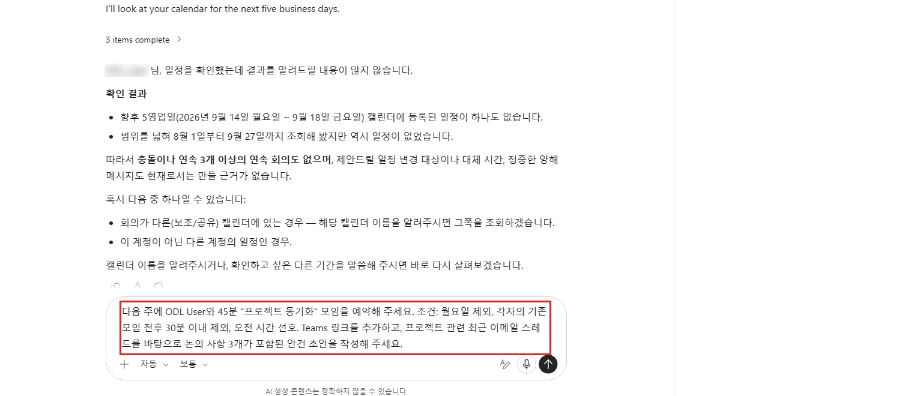

    > **참고:** 코워크는 실제로 존재하는 모임 간의 충돌만 감지할 수 있습니다.
    > 일정이 비어 있으면 이 작업 전에 의도적인 중복을 포함한 샘플 이벤트를 추가하세요.
    > 그러면 빈 일정 보고서 대신 전체 충돌 감지 및 해결 과정을 확인할 수 있습니다.

### 작업 3: 여러 제약 조건이 있는 모임 예약

이 작업에서는 코워크가 고른 모호한 참석자를 바로잡고 작성된 초대장을 검토합니다.
제약 조건이 적용되어 모임이 생성되었는지 확인합니다.

1. 코워크가 디렉터리에서 "ODL User"와 이름이 비슷한 계정을 찾아 참석자로 채워
   넣은 **일정 이벤트를 만드시겠습니까?** 카드를 표시합니다. 이 계정은 의도한
   참석자가 아니므로 참석자 칩의 **(1) X**를 선택해 제거하고, **(2) 참석자** 필드에
   본인의 이메일 주소를 입력한 후 Enter 키를 누릅니다.

    - **이메일:** <inject key="AzureAdUserEmail"></inject>

    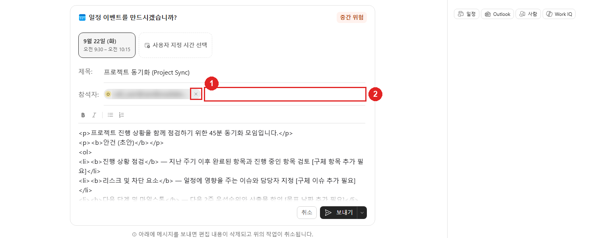

    > **참고:** 디렉터리에 같은 표시 이름을 쓰는 계정이 여러 개이면 코워크가
    > 이벤트 카드 대신 초대할 사람을 고르는 목록을 먼저 보여 줄 수 있습니다. 이 경우
    > 자유 텍스트 필드에 본인의 이메일 주소를 입력하고 **제출**을 선택합니다.

1. 작성된 이벤트를 검토합니다. 다음 주 화요일 오전 시간대(예: **9월 22일 (화)
   오전 9:30 – 오전 10:15**)에 제목 **프로젝트 동기화 (Project Sync)**로
   작성되었고, 참석자에는 방금 입력한 본인 계정이 표시됩니다. 본문의 안건 초안에는
   *[구체 항목 추가 필요]*처럼 대괄호로 묶인 자리 표시자가 들어 있습니다.
   **보내기**를 선택합니다.

    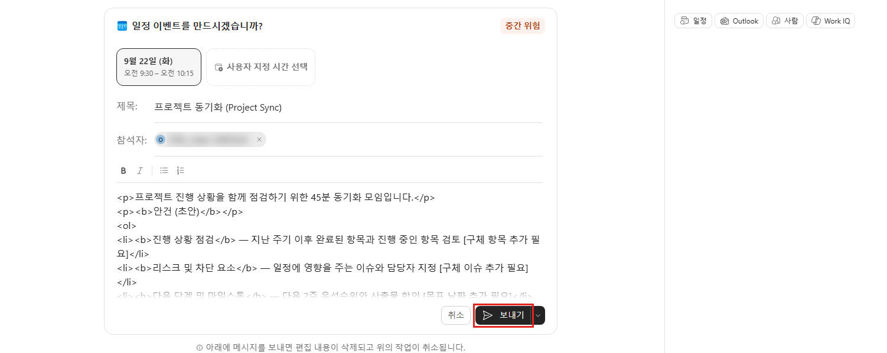

1. 예약 확인을 검토합니다. **조건 반영** 아래에서 코워크가 그 시간을 선택한 이유를
   설명합니다(월요일 제외 → 화요일, 오전 선호 → 오전 9:30, 기존 모임이 없어 30분
   완충 조건 자동 충족). 이어서 알아야 할 사항을 표시합니다. "ODL User"라는 이름이
   모호해 참석자 확인을 요청하고, 메일함과 Teams에서 프로젝트 관련 스레드를 찾지
   못해 안건은 일반 템플릿으로 작성했으며, 시간대 설정을 확인할 수 없어 시간이
   **UTC 기준으로 저장**되었다고 알려줍니다.

    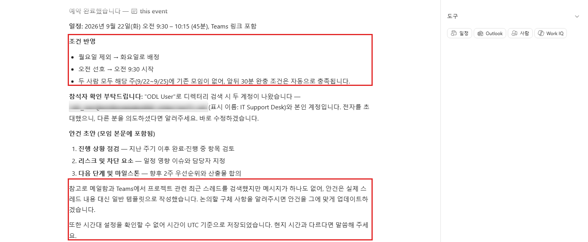

1. 왼쪽 위의 **(1) 앱 시작 관리자**(격자 아이콘)를 선택하고 **(2) Outlook**을
   선택하여 일정을 열고 이벤트를 확인합니다.

    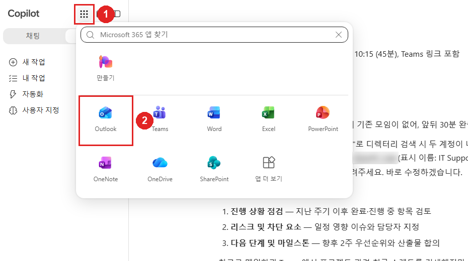

1. Outlook 일정에서 제안된 날짜로 이동하여 **프로젝트 동기화 (Project Sync)**
   이벤트가 만들어졌는지 확인합니다. 이벤트가 코워크가 안내한 오전 시간이 아니라
   저녁 시간(예: 오후 6:30)에 표시될 수 있습니다.

    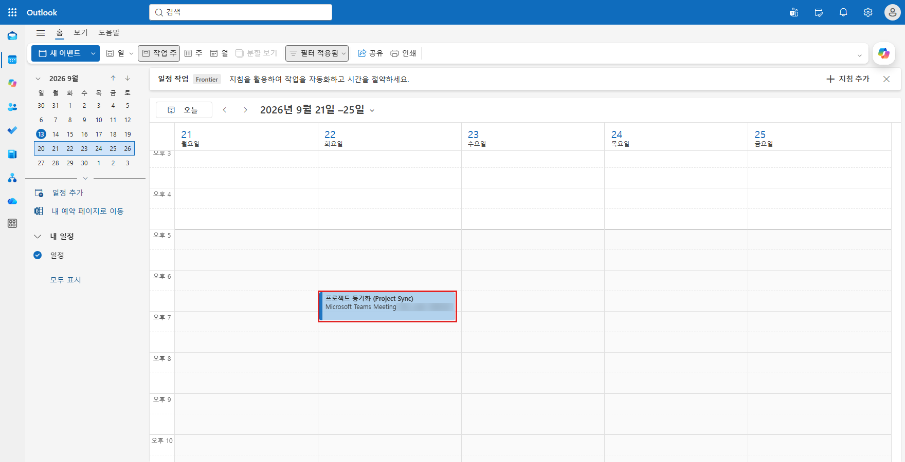

    > **중요:** 이 Outlook 탭을 열어 두고 이벤트가 실제로 표시된 시간을 기록해 두세요.
    > 코워크가 시간을 UTC 기준으로 저장했기 때문에 한국 표준시(KST)로 보면 9시간
    > 늦게 표시됩니다. 연습 2, 작업 2에서 이 기록과 코워크가 이후 제안에 사용하는
    > 표준 시간대를 비교합니다.

## 연습 2: 제약 조건 처리 테스트 및 임원 상시 규칙 적용

이 연습에서는 코워크가 자체적으로 완전히 확인할 수 없는 요청을 제출합니다. 한 주에
적용할 상시 규칙을 지정하고 결과 업무량 요약을 검토합니다.

### 작업 1: 모호한 일정 요청 테스트

이 작업에서는 엄격한 제약 조건과 확인되지 않은 참석자가 있는 일정 요청을 제출합니다.
코워크가 자체적으로 완전히 확인할 수 없는 요청을 처리하는 방식을 확인합니다.

1. **(1) 프롬프트 입력 창**을 선택하고 다음 프롬프트를 입력한 후 **(2) 보내기**를
   선택합니다.

    ```
    내 일정과 내 고객 담당자 일정을 검토해 주세요. 내일 두 사람 모두 완전히 비어 있는 시간에 4시간 "프로젝트 계획 워크숍"을 예약해 주세요.

    조건:
    - 반드시 내일이어야 합니다.
    - 연속된 4시간 블록이어야 합니다.
    - 오전 10:00 이전에 시작해야 합니다.
    - 기존 모임과 중복되면 안 됩니다.
    - Teams 모임 링크를 포함해야 합니다.

    모든 조건을 충족하는 시간이 없으면 그 이유를 설명해 주세요. 가장 가까운 대체 옵션 3개를 제시해 주세요.
    ```

    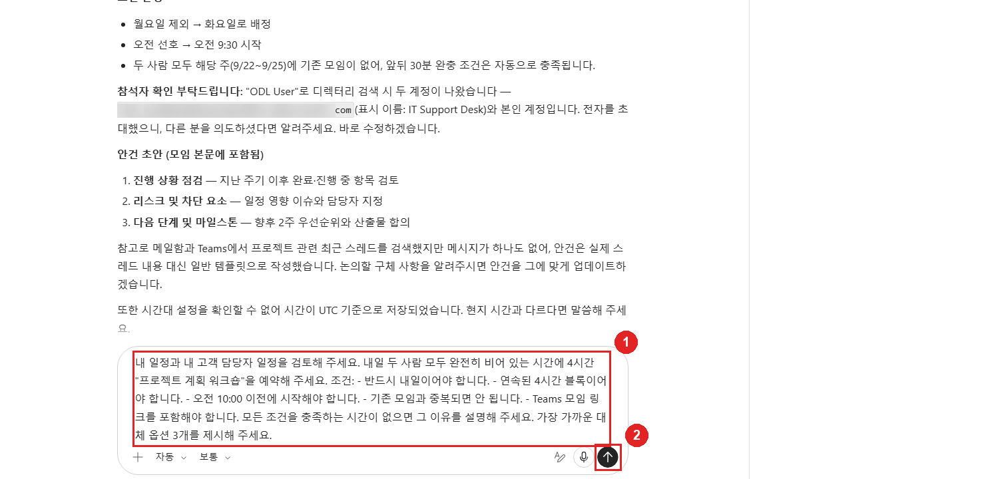

1. 코워크가 메일함과 디렉터리에서 "고객 담당자"를 찾지 못했다며 누구를 초대할지
   묻습니다. 추측으로 아무 계정이나 초대하는 대신 **(1) 참석자 없이 예약**을
   선택한 후 **(2) 제출**을 선택합니다.

    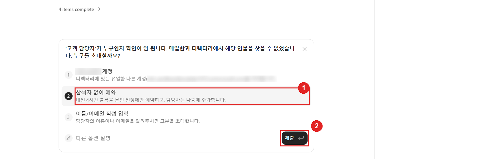

1. 작성된 이벤트를 검토합니다. 내일 오전 시간대(예: **9월 14일 (월) 오전 9:00 –
   오후 1:00**)에 제목 **프로젝트 계획 워크숍**으로 작성되었고, 참석자는 비어
   있으며, 본문에 고객 담당자는 확정 후 참석자로 추가할 예정이라고 적혀 있습니다.
   **저장**을 선택합니다.

    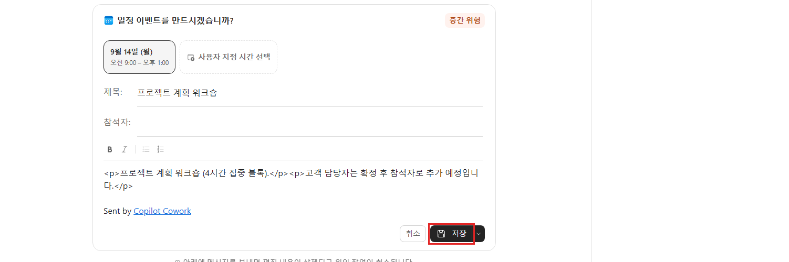

1. 응답을 검토합니다. 코워크가 수행한 작업을 설명합니다. 내일 본인의 일정이 완전히
   비어 있었으므로 **조건 충족 여부** 목록에서 반드시 내일, 연속 4시간, 오전 10:00
   이전 시작, 기존 모임과 중복 없음, Teams 링크 조건을 하나씩 확인합니다. 이어서
   요청한 대로 참석자 없이 본인 일정에만 블록을 잡았으며, 고객 담당자를 확정해
   알려주면 바로 초대하겠다고 안내합니다. 연습 1과 마찬가지로 시간이 UTC 기준으로
   저장되었다는 참고 사항도 다시 표시합니다.

    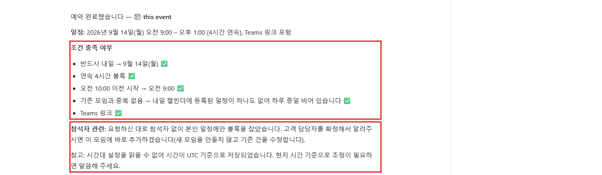

    > **참고:** 코워크는 고객 담당자를 임의로 정해 4시간 모임을 만들지 않았습니다.
    > 먼저 누구를 초대할지 묻고, 명확한 설명이 붙은 임시 블록만 예약한 뒤 누락된
    > 정보를 요청했습니다. 이는 연습 1의 참석자 확인에서 본 "추측하지 말고 질문하기"
    > 원칙을 부분적으로만 확인할 수 있는 요청에 적용한 것입니다.

### 작업 2: 임원 상시 규칙 지정 및 일정 메모리 저장

이 작업에서는 코워크에게 다음 주의 상시 규칙을 제공합니다. 규칙을 영구 일정 메모리
파일에 저장하도록 승인한 뒤, 코워크가 제안한 변경 사항을 적용하기 전에 검토합니다.

1. **프롬프트 입력 창**을 선택하고 다음 프롬프트를 입력합니다.

    ```
    내 임원 비서 역할을 해 주세요. 다음 주에 이 상시 규칙을 적용해 주세요. 정오 전에 90분 집중 시간 블록 2개를 확보하고, 안건이 없는 모임은 주최자에게 안건을 요청한 후 거절해 주세요. 금요일 오후는 비워 두세요. 또한 변경 사항을 적용하기 전에 승인을 받을 수 있도록 모든 변경 사항을 요약해 주세요.
    ```

    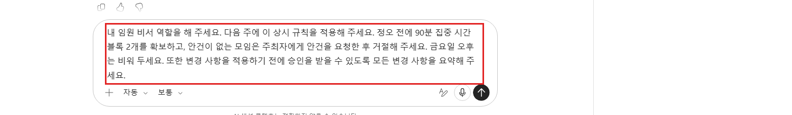

1. 코워크가 시간대, 근무 시간, 집중 시간 및 금요일 오후 보호 정책, 방금 지정한
   상시 규칙을 담은 메모리 파일을 **`.claude/calendar-memory.md`** 경로에
   만들겠다고 제안합니다(**파일 만들기** 카드). 그러면 다음부터는 이런 내용을 다시
   설명할 필요가 없습니다. 파일 내용을 검토한 후 **승인**을 선택합니다.

    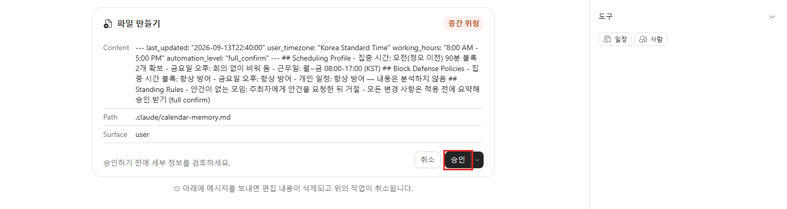

1. 코워크가 규칙을 어떻게 적용할지 세 가지를 차례로 묻습니다(1/3~3/3). 집중 블록
   주기는 **(1) 주 2개**를 선택하고 **(2) 다음**을 선택합니다. 이어서 월요일
   워크숍은 **그대로 두기**, 금요일 오후를 비우는 방식은 **차단 일정 생성**을
   선택한 뒤 **제출**을 선택합니다.

    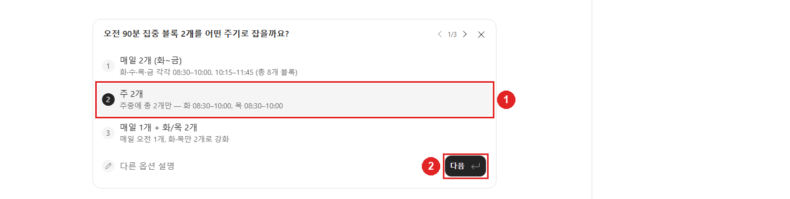

1. 응답을 주의 깊게 검토합니다. 코워크는 선택한 답을 정리한 뒤 **(1) 집중 시간
   (Focus Time) 2건과 금요일 오후 비움 일정 만들기**를 제안하고, **(2) 모두
   승인(3)** 단추와 함께 각 일정 이벤트 카드를 표시합니다. 이 시점에는 아무것도
   적용되지 않았습니다. 여기서는 승인하지 않고 제안 내용만 검토합니다. 메모리
   파일에 기록된 시간대(Korea Standard Time)와 가정된 근무 시간도 함께 확인합니다.

    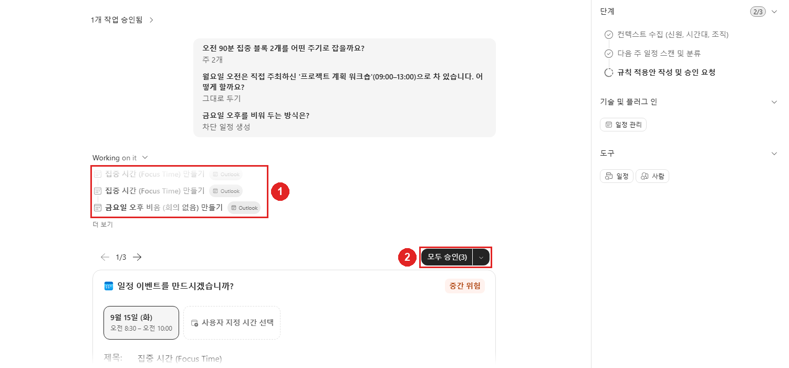

    > **중요:** 앞서 만든 두 이벤트는 사서함 표준 시간대가 설정되지 않아
    > UTC 기준으로 저장되었고, Outlook에서는 의도한 오전이 아니라 저녁 시간에
    > 표시됩니다. 일정을 예약하기 전에 Outlook에서 사서함 표준 시간대와 근무
    > 시간을 먼저 설정할 가치가 있는 이유입니다. 코워크는 메모리 파일에 시간대를
    > 기록해 이후 작업에서 같은 문제가 반복되지 않도록 하지만, 감지할 방법이 없는
    > 불일치는 방지할 수 없습니다.

### 작업 3: 주간 업무량 요약 검토

이 작업에서는 다음 주의 업무량 요약을 요청합니다. 지금까지 실제로 적용된 내용만
반영하는지 확인합니다.

1. **프롬프트 입력 창**을 선택하고 다음 프롬프트를 입력합니다.

    ```
    다음 주의 업무량 요약을 보여 주세요. 총 모임 시간, 집중 시간, 요일별 가장 긴 여유 시간을 표시해 주세요.
    ```

    

1. 일자별 표를 검토합니다. **프로젝트 동기화**만 화요일의 유일한 모임(45분)으로
   계산되고, 나머지 요일의 모임 시간은 0분입니다. **가장 긴 연속 여유 시간** 열이
   각 요일의 가정된 09:00–18:00 근무 시간을 반영하는지도 확인합니다. **세부 사항**
   에서 작업 2에서 제안한 집중 시간 블록이 **아직 적용되지 않아** 공식으로 확보된
   집중 시간 블록은 0개라고 명시되어 있는지 확인합니다. 새 메시지를 보내면 위에서
   승인하지 않은 제안은 취소된다는 코워크의 안내도 함께 확인합니다.

    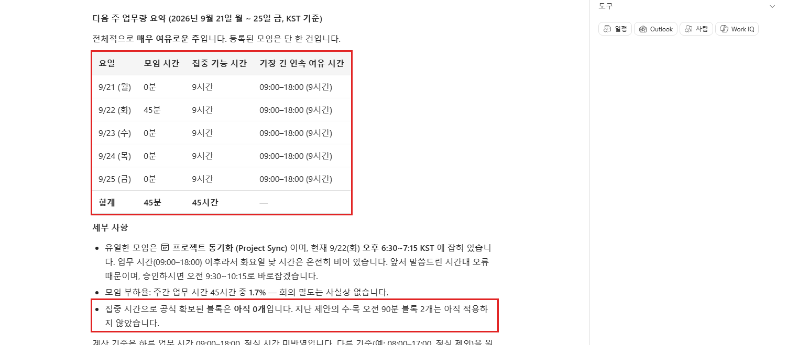

    > **참고:** 이는 랩 전반에서 사용되는 휴먼 인 더 루프(human-in-the-loop,
    > 인간 참여형) 패턴을 확인합니다. 메모리 파일 승인과 집중 시간 블록 생성은
    > 별개의 승인입니다. 작업 2에서 **모두 승인(3)**을 선택한 후 이 프롬프트를 다시
    > 실행하면 집중 시간이 반영됩니다.

## 문제 해결

| 증상 | 해결 방법 |
|---|---|
| "코워크가 충돌, 모임, 연속 모임을 전혀 보고하지 않습니다." | 검색한 기간의 일정에 이벤트가 없습니다. 새 계정에서는 검색 실패가 아니라 예상 결과입니다. 의도적인 중복을 포함한 샘플 이벤트를 Outlook 일정에 추가한 후 검색을 다시 실행하세요. |
| "코워크가 동료에 대해 긴 디렉터리 목록에서 선택하라고 요청합니다." | 여러 계정이 같은 표시 이름을 사용합니다(예: "ODL User"). 목록 항목 대신 자유 텍스트 필드에 정확한 이메일 주소를 입력하거나, 실제로 구분되는 동료를 초대하세요. |
| "Outlook에서 모임 시간이 잘못 표시됩니다." | 사서함 표준 시간대와 근무 시간이 설정되지 않아 코워크의 제안 시간이 UTC로 해석되었을 가능성이 높습니다. Outlook 설정에서 표준 시간대와 근무 시간을 설정한 후, 코워크에 영향을 받은 이벤트를 원래 의도한 현지 시간으로 이동하도록 요청하세요. |
| "안건이 일반적이거나 자리 표시자로 가득합니다." | 코워크는 실제로 존재하는 이메일 스레드만 안건의 근거로 사용할 수 있습니다. 실제 스레드가 없으면 모임의 일반적인 목표를 바탕으로 안건을 생성하도록 요청하세요. |
| "코워크가 실제 4시간 모임 대신 임시 자리 표시자를 만들었습니다." | 필수 참석자(예: "고객 담당자")가 식별되지 않은 경우의 예상 동작입니다. 코워크는 추측하는 대신 명확한 레이블이 붙은 임시 블록을 임시 예약하고 누락된 이름 또는 이메일을 요청합니다. 참석자 정보를 회신하여 확정하거나 이동하세요. |

## 요약

이 랩에서 다음을 완료했습니다.

- Microsoft 365 코파일럿 코워크에 로그인하고 코워크 탭으로 전환했습니다.
- 5영업일 동안 충돌 감지 검색을 실행하고 빈 일정 결과를 올바르게 해석했습니다.
- 코워크가 잘못 고른 참석자를 바로잡고 Teams 링크가 포함된 제약 조건이 있는
  "프로젝트 동기화" 모임을 예약했습니다.
- 코워크가 완전히 확인할 수 없는 일정 요청을 제출했습니다. 추측 대신 임시 블록을
  임시 예약하고 누락된 정보를 요청하는 동작을 확인했습니다.
- 해당 주의 임원식 상시 규칙을 지정하고 영구 일정 메모리 파일을 승인했으며,
  코워크가 적용 전에 제안한 변경 사항을 검토했습니다.
- 예약 결과와 Outlook의 표시 시간을 비교하여 사서함 표준 시간대 불일치와
  해결 방법을 확인했습니다.
- 주간 업무량 요약을 검토하고 실제로 적용된 변경 사항만 반영하는지 확인했습니다.

## 랩을 성공적으로 완료했습니다
