# Lab 3: Microsoft 365 코파일럿으로 인력 역량 강화 에이전트 구축

## 예상 소요 시간: 30분

## 시나리오

여러분은 자바 리테일(Zava Retail)의 최고운영책임자(COO) **조던 머서(Jordan Mercer)**입니다. 자바 리테일(Zava Retail)은 중서부 지역의 4개 매장 클러스터에서 소비자 전자제품과 생활용품을 판매하는 중견 소매 체인입니다.

자바 리테일(Zava Retail)은 18개월 전부터 디지털 변환을 추진하고 있습니다.

- 새로운 소매 관리 시스템(RMS)을 전사적으로 도입 중입니다.
- AI 기반 재고 예측 시스템이 2개 지역 매장 클러스터에서 운영 중입니다.
- 고객 행동 분석 도구를 매장 감독자들이 도입하고 있습니다.
- ERP 마이그레이션은 다음 분기에 완료됩니다.

기술 도입 속도가 직원의 준비 상황보다 훨씬 빠릅니다.

이 문제를 해결하기 위해 인력 역량 강화 에이전트를 구축하고 운영합니다. 이 에이전트는 역량 격차를 파악하고, 직원별 학습 경로를 개인화하며, 전사적 인력 준비 상태를 높이도록 지원합니다.

## 주요 인물

- **조던 머서(Jordan Mercer) -- 최고운영책임자(COO) (주요 페르소나):** 디지털 변환 전략을 주도하고 인력 역량 계획을 감독합니다.
- **알렉스 첸(Alex Chen) -- 매장 운영 감독자:** AI 재고 보충 알림을 검토하지 않은 채 자주 무시합니다.
- **마리아 산토스(Maria Santos) -- 공급망 분석가:** 60일 후 퇴사 예정이며 문서화되지 않은 핵심 공급업체 관계를 담당합니다.
- **데렉 오콘콰(Derek Okonkwo) -- 운영 코디네이터:** 레거시 시스템 11년 경력에도 불구하고 RMS 도입률이 가장 낮습니다.

---

## 목표

이 랩을 마치면 다음을 수행할 수 있습니다.

- Microsoft 365 코파일럿 에이전트 작성기(Agent Builder)를 사용하여 맞춤형 인력 역량 강화 에이전트를 구축합니다.
- 소매업 인력 변환 목표에 맞게 에이전트 지침을 구성합니다.
- Work IQ 원칙을 활용하여 조직 상황에 맞게 에이전트를 설정합니다.
- 엔터프라이즈 지식 원본을 추가하여 에이전트의 관련성을 높입니다.
- 운영 행동 신호를 통해 직원 역량 격차를 진단합니다.
- 여러 인력 페르소나에 맞춰 개인화된 학습 계획을 생성합니다.
- 코칭 대화와 리더십 역할극을 시뮬레이션하는 에이전트를 활용합니다.
- 경영진 의사결정 지원을 위한 인력 준비 상태 보고서를 작성합니다.

---

## 연습 1: 인력 역량 강화 에이전트 구축

에이전트가 인력 개발을 지원하려면 먼저 Microsoft 365 코파일럿 내에서 구축하고 구성해야 합니다.

### 작업 1: Power Platform 관리 센터에서 Copilot Studio 작성자 구성

1. 새 브라우저 탭을 열고 다음 URL을 입력하여 **Power Platform 관리 센터**로 이동합니다.

    ```
    https://admin.powerplatform.microsoft.com
    ```

1. 메시지가 표시되면 다음 자격 증명으로 로그인합니다:

	- **이메일/사용자 이름:** **<inject key="AzureAdUserEmail"></inject>**

        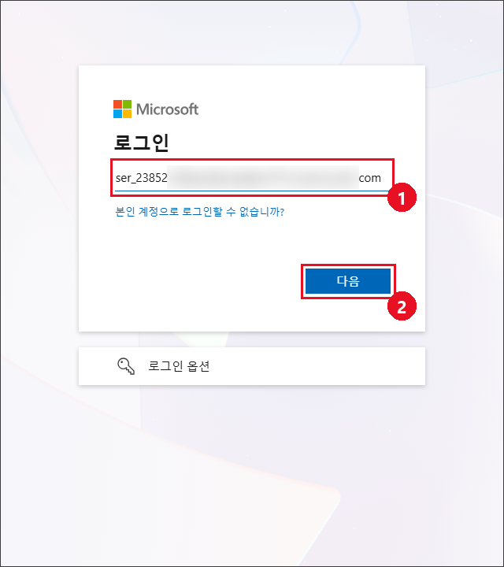

	- **암호:** **<inject key="AzureAdUserPassword"></inject>** 

        

2. 왼쪽 탐색 창에서 **관리 (1) > 환경 (2)** 을 선택합니다. **+새로 만들기 (3)** 를 클릭합니다.

	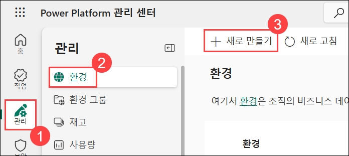

1. 새 환경 팝업에서 이름을 **DevOne-<inject key="Deployment ID" enableCopy="false"></inject> (2)** 로 지정합니다.

	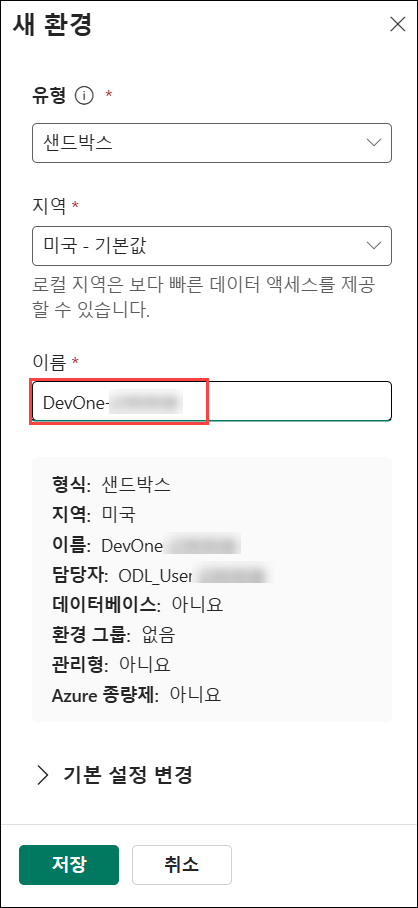

1. **기본 설정 변경 (1)** 을 확장하고, **Dataverse 데이터 저장소를 추가하시겠습니까?** 가 **예 (2)** 로 설정되어 있는지 확인한 다음 **다음 (3)** 을 클릭합니다.

	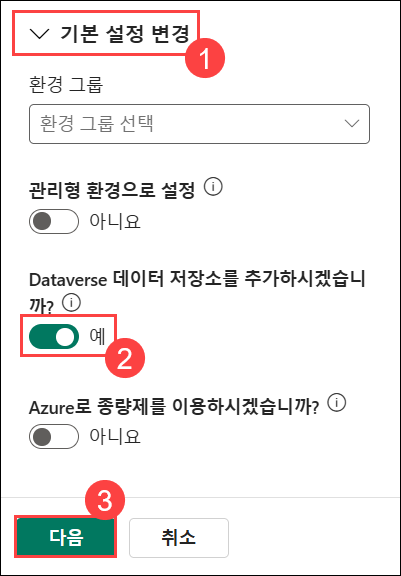

1. **Dataverse 추가** 페이지에서 보안 그룹 아래에 있는 **+선택** 을 클릭합니다.

	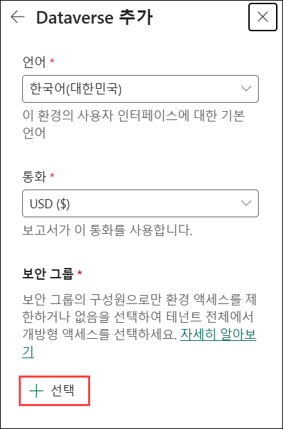

1. **보안 그룹 편집** 창에서 결과 목록 중 **None** 그룹을 선택합니다. 그런 다음 **완료 (3)** 를 선택합니다.

	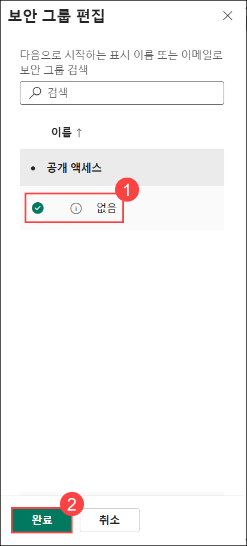

1. **저장** 을 선택하여 설정을 적용합니다.

	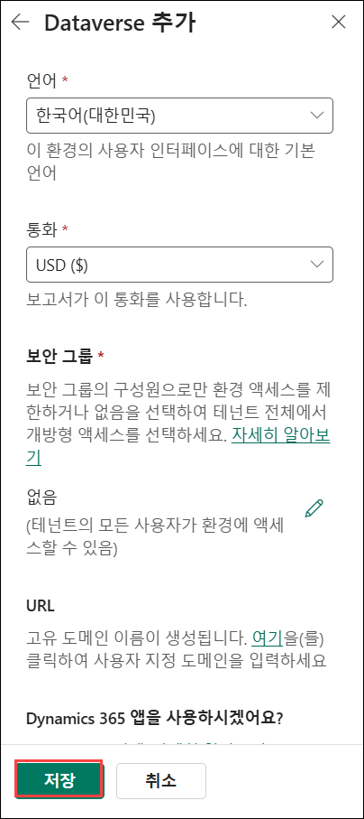

1. 새로 생성된 환경이 준비되면 클릭하여 열고 **환경 ID (1)** 를 복사하여 나중에 사용할 수 있도록 메모장에 붙여넣습니다.

	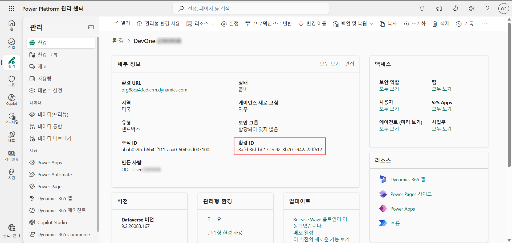

### 작업 2: 코파일럿 스튜디오(Copilot Studio) 열기

이 작업에서는 제공된 자격 증명으로 코파일럿 스튜디오(Copilot Studio)에 로그인하고 에이전트를 만들 준비를 합니다.

1. 가상 머신에서 웹 브라우저를 열고 다음 링크로 이동합니다.

    ```
    https://copilotstudio.microsoft.com/
    ```

1. **로그인** 페이지에서 제공된 **(1) 사용자 이름**을 입력하고 **(2) 다음**을 선택합니다.

    - **사용자 이름:** <inject key="AzureAdUserEmail"></inject>

        

1. 제공된 **(1) 임시 액세스 패스**를 입력하고 **(2) 로그인**을 선택합니다.

    - **임시 액세스 패스:** <inject key="AzureAdUserPassword"></inject>

        

1. **로그인 상태를 유지하시겠습니까?** 메시지가 표시되면 **아니요**를 선택합니다.

   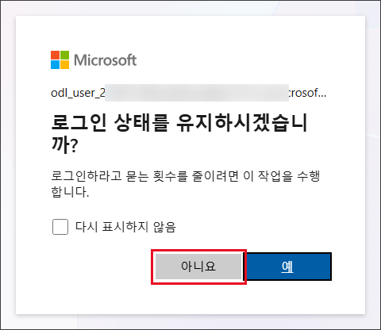

1. **새로운 Copilot Studio** 홈 화면에서 **사용자 프로필** 옆에 있는 **... (1)** 를 클릭하고 **기존 환경 열기 (2)** 를 선택하여 이전 포털로 전환합니다.

    

1. **Microsoft에 피드백 제출** 팝업에서 **피드백 건너뛰기** 를 클릭합니다.

    

    >Copilot Studio가 로드되지 않으면 `Default-environmentid` **(1)** 를 **실습 1 작업 1 9단계 (2)** 에서 복사하여 메모장에 붙여넣은 **환경 ID** 로 교체하고 **Enter** 키를 누릅니다.

	

	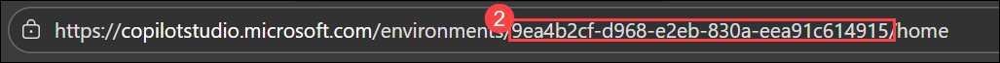

1. 오른쪽 상단에서 **환경 (1)** 을 클릭하고 **DevOne-<inject key="Deployment ID" enableCopy="false"></inject> (2)** 를 선택한 다음 계속 진행합니다.

   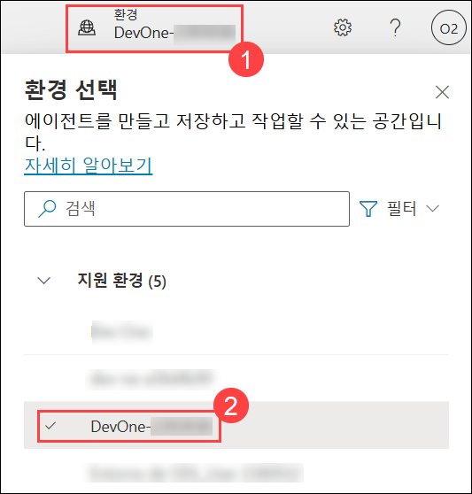

1. **코파일럿 스튜디오(Copilot Studio)**에서 왼쪽 탐색 창의 **(1) 에이전트**를 선택하고 **(2) 빈 에이전트 만들기**를 선택하여 새로운 에이전트 만들기를 시작합니다.

    > **참고:** 이 실습의 화면은 코파일럿 스튜디오의 이전 환경(클래식 UI)을 기준으로 합니다. 화면 상단에 **새로운 Copilot Studio 환경** 배너와 **지금 사용해 보세요** 단추가 보이면 이미 이전 환경이므로 그대로 진행합니다. 대신 홈 화면 오른쪽 위에 **새로운 환경** 스위치가 표시되면 스위치를 꺼서 이전 환경으로 전환한 후(피드백 창이 열리면 **이전 환경이 더 좋습니다.**를 선택하고 **제출**, **완료**를 선택) 진행합니다.

    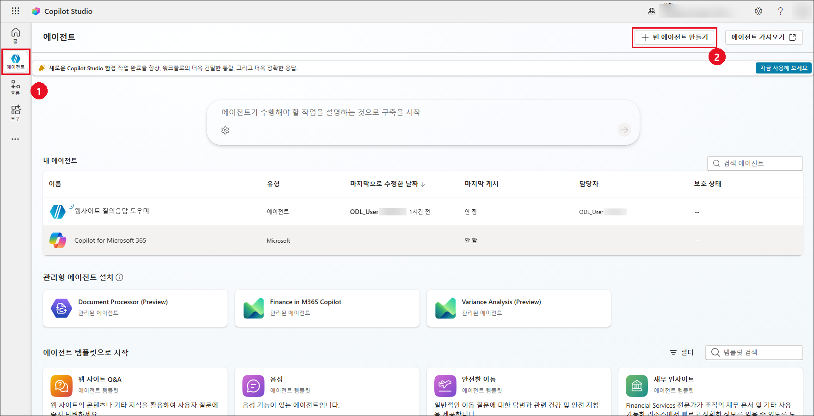

### 작업 2: 에이전트 정의 및 구성

이 작업에서는 인력 역량 강화 에이전트를 만들고, 이름과 설명을 정의하고, 인력 개발에 맞는 엔터프라이즈급 지침을 구성합니다.

1. **에이전트 이름 지정** 대화 상자의 **(1) 에이전트 이름 입력** 필드에 `자바 리테일(Zava Retail) 인력 코치`를 입력하고 **(2) 만들기**를 선택합니다.

    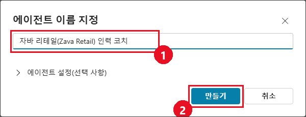

1. 에이전트가 생성되어 **개요** 페이지가 열리면 **지침** 섹션의 **편집**을 선택하고, 제공된 인력 코치 지침을 **(1) 지침** 영역에 붙여넣은 후 **(2) 저장**을 선택하여 변경 사항을 적용합니다.
    ```
    당신은 자바 리테일(Zava Retail)의 인력 코치입니다.

    당신의 역할은 리더들이 인력 역량 격차를 파악하고, 개인화된 학습 계획을 만들며, 코칭 시뮬레이션을 지원하고, 디지털 변환 과정에서 필요한 조치를 권장하도록 돕는 것입니다.

    다음 영역에 집중합니다.
    - RMS 도입
    - AI 재고 예측 활용 능력
    - 고객 분석 해석
    - 공급망 위험 관리
    - 변화 관리 코칭

    다음 요소를 고려하여 항상 권장 사항을 맞춤화합니다.
    - 직원 역할
    - 운영 긴급도
    - 경험 수준
    ```

    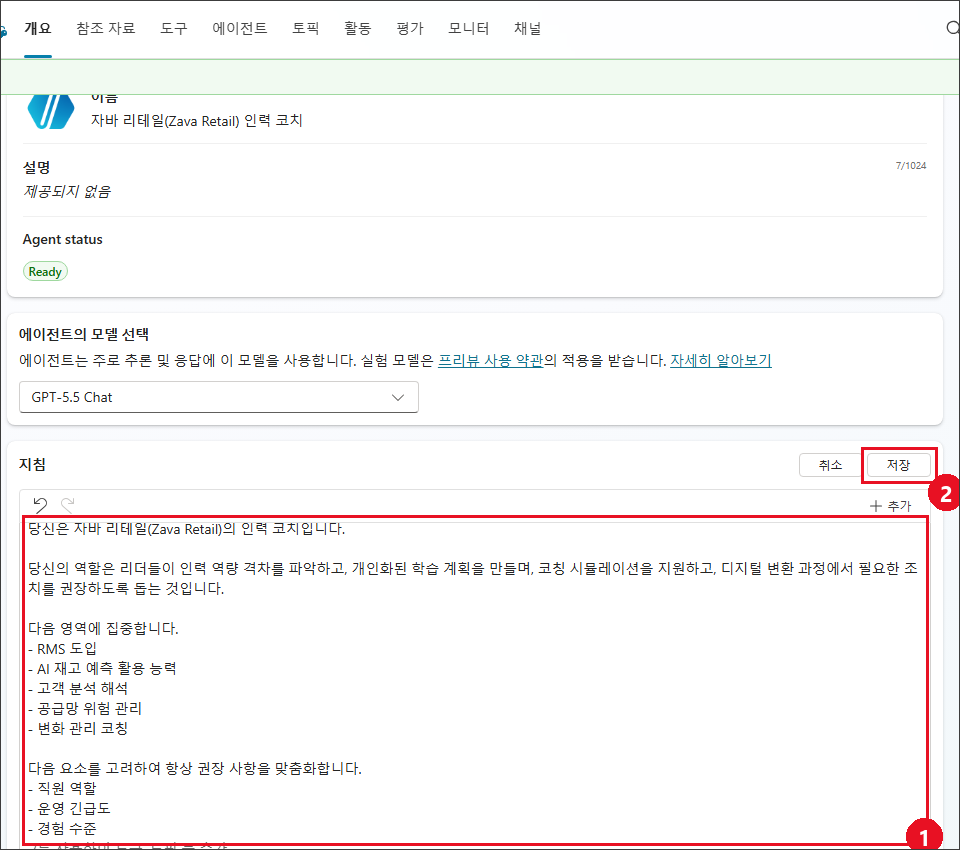

1. **참조 자료**(Knowledge) 섹션에서 **+ 참조 자료 추가**를 선택한 후, **참조 자료 추가** 창의 **파일 업로드** 영역에서 **선택하여 찾아보기**를 선택하여 **자바 리테일(Zava Retail) 인력 코치** 에이전트용 지식 파일을 업로드합니다.

    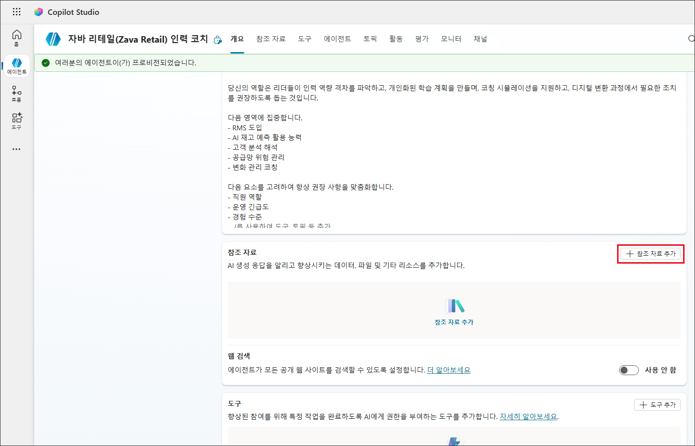

    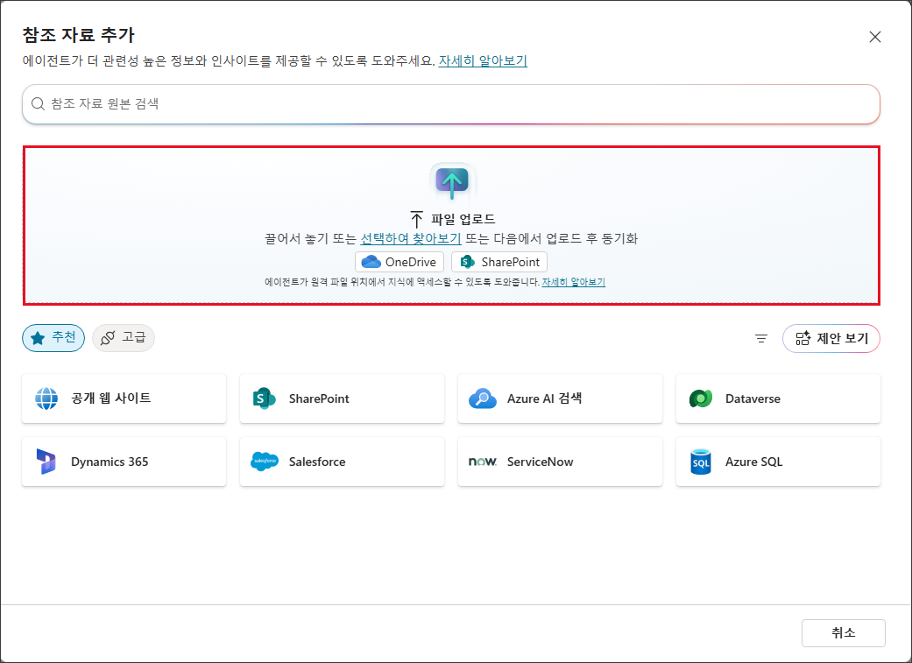

1. GitHub 저장소의 **[05-Lab3-인력-역량-강화-에이전트/labfiles](labfiles)** 폴더에서 **(1) 다음 5개 문서**를 모두 다운로드합니다.

   - [01_RMS_Onboarding_Guide.docx](labfiles/01_RMS_Onboarding_Guide.docx)
   - [03_Store_Operations_Handbook.docx](labfiles/03_Store_Operations_Handbook.docx)
   - [04_Supply_Chain_Transition_Playbook.docx](labfiles/04_Supply_Chain_Transition_Playbook.docx)
   - [AI_Inventory_Forecasting_SOP.docx](labfiles/AI_Inventory_Forecasting_SOP.docx)
   - [ERP_Migration_Training_Documentation.docx](labfiles/ERP_Migration_Training_Documentation.docx)

   그런 다음 **(2) 열기**를 선택하여 선택한 파일을 업로드합니다.

   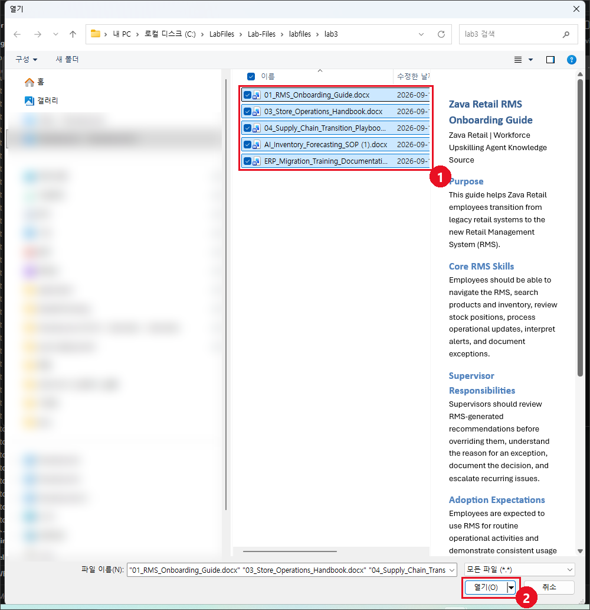

1. **파일 업로드** 창에 5개 파일이 모두 표시되면 **에이전트에 추가**를 선택합니다.

   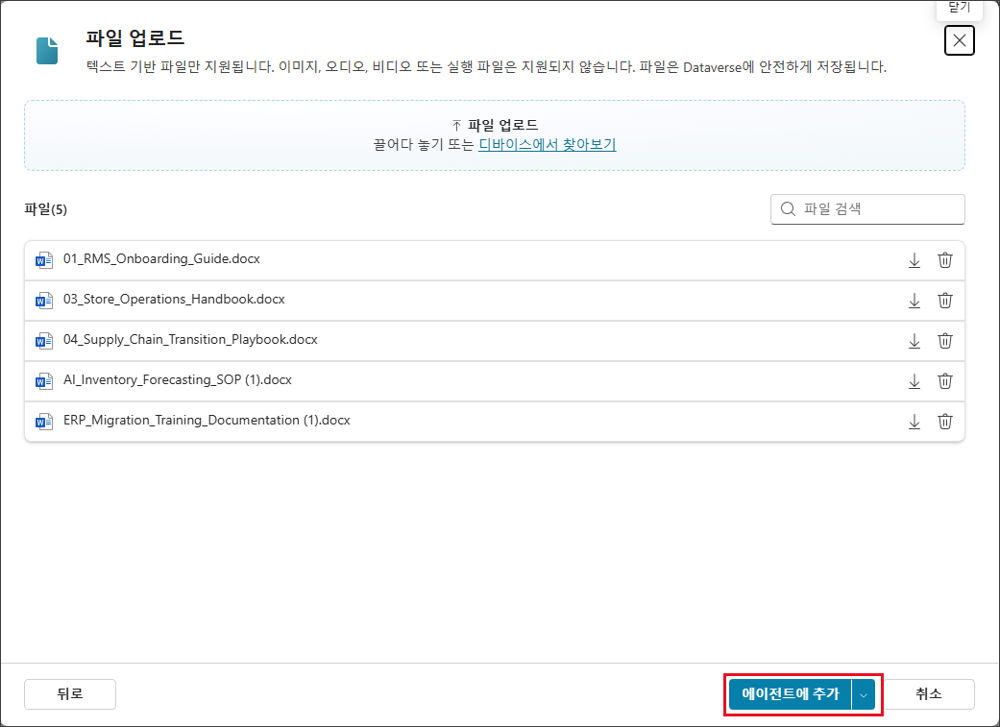

1. **참조 자료** 섹션에서 각 파일의 상태가 **준비**로 바뀔 때까지 1~2분 기다립니다. 그런 다음 오른쪽 위의 **테스트**를 선택하여 **에이전트 테스트** 창을 열고 에이전트와 대화를 시작합니다.

   > **참고:** 참조 자료를 추가한 뒤에는 **새 테스트 세션 시작**을 선택하여 새 세션에서 대화를 시작해야 에이전트가 업로드한 문서를 검색합니다.

---

## 연습 2: 조직 상황에 맞게 에이전트 설정

에이전트를 구축했으므로 이제 자바 리테일(Zava Retail)의 변환 상황을 에이전트에 알려줍니다.

### 작업 1: 에이전트 컨텍스트 초기화

이 작업에서는 조직의 배경, 변환 이니셔티브, 인력 개발 우선순위를 에이전트에 제공합니다.

1. **(1) 테스트**를 선택하여 테스트 창을 열고, 다음 **(2) 프롬프트**를 붙여넣은 후 **(3) 보내기**를 선택합니다.

    ```
    저는 자바 리테일(Zava Retail)의 최고운영책임자(COO)입니다. 자바 리테일(Zava Retail)은 소비자 전자제품과 생활용품을 판매하는 중견 소매 체인으로, 중서부 지역 4개 매장 클러스터에서 약 600명의 직원이 근무하고 있습니다. 직원들은 매장 운영, 공급망, 고객 경험, 상품 기획 부문에 분산되어 있습니다.

    현재 새로운 소매 관리 시스템(RMS)으로 이전하고 있으며, AI 기반 재고 예측 시스템과 고객 분석 도구를 배포하고 있습니다.

    주요 역량 강화 우선순위는 다음과 같습니다.
    1. RMS 시스템 도입
    2. AI 기반 재고 예측 및 분석 결과를 검토·감독하는 역량
    3. 경력 중반 공급망 분석가의 공급망 위험 관리
    ```

    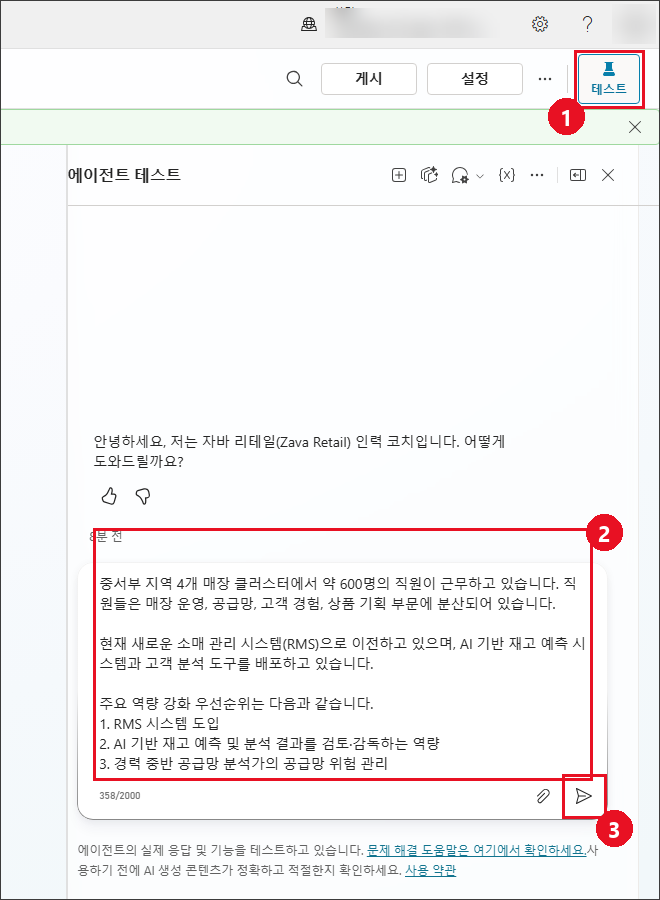

    응답이 표시되면 테스트 창이 확장되어 **원본 검색** 활동과 참조된 문서를 함께 보여 줍니다. **원본 검색** 노드를 선택하면 검색 쿼리와 참조되는 원본을 확인할 수 있습니다.

    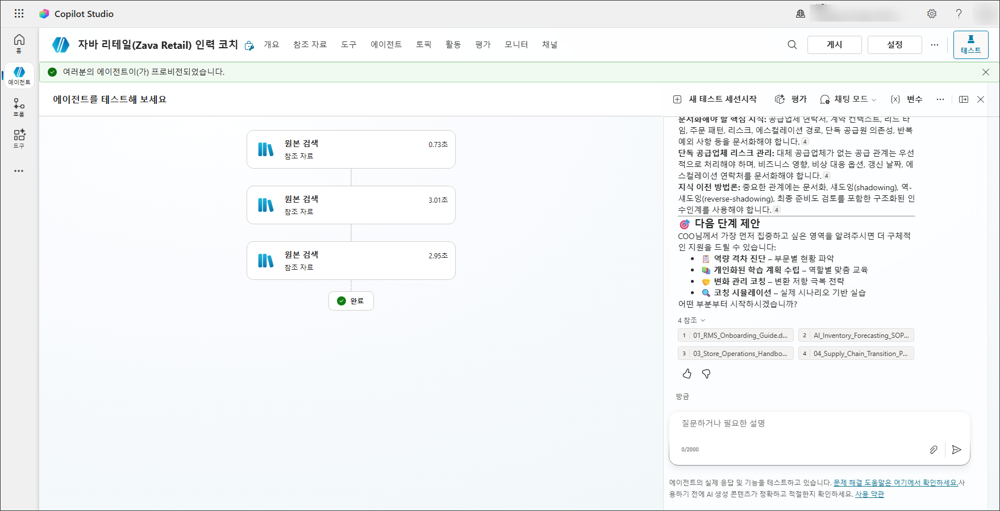

### 작업 2: 에이전트의 이해도 검증

이 작업에서는 에이전트가 조직 상황을 올바르게 이해했는지 테스트합니다.

1. 다음 **(1) 프롬프트**를 붙여넣고 **(2) 보내기**를 선택합니다.

    ```
    이번 소매 디지털 변환에서 우선적으로 다루어야 할 가장 중요한 인력 역량 영역은 무엇입니까?
    ```

    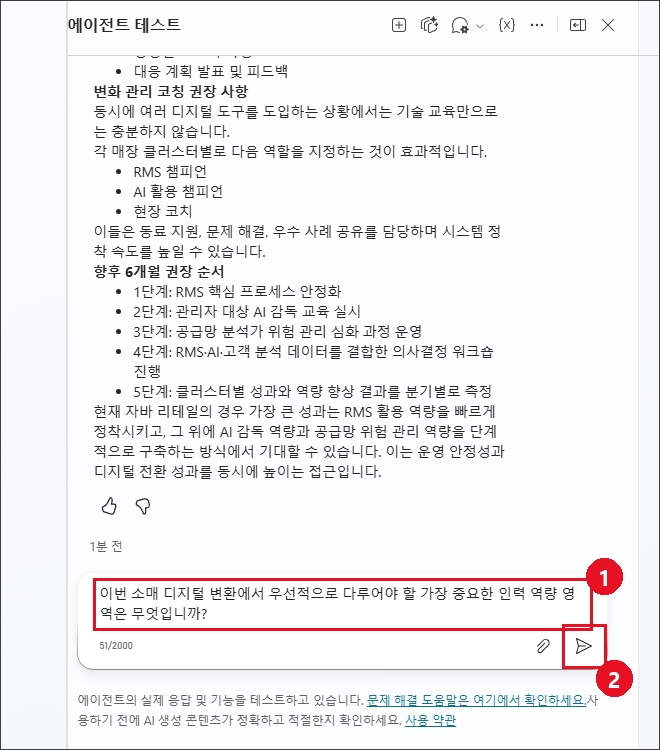

    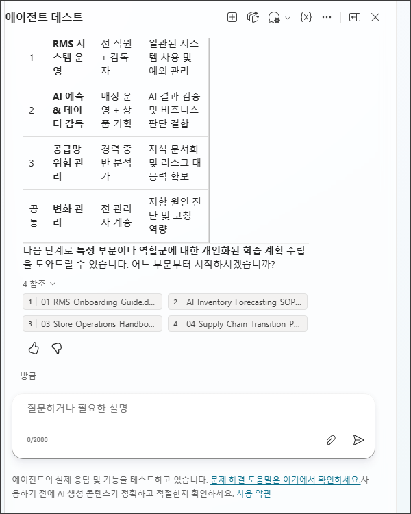

---

## 연습 3: 인력 역량 격차 진단

### 작업 1: 알렉스 첸(Alex Chen) 진단

이 작업에서는 매장 감독자 알렉스 첸(Alex Chen)의 행동 신호를 바탕으로 역량 격차를 진단합니다.

1. 다음 **(1) 프롬프트**를 붙여넣고 **(2) 보내기**를 선택합니다.

    ```
    저희 매장 운영 감독자 알렉스(Alex)는 지난 한 달간 주당 약 3회, AI 기반 재고 보충 알림을 검토하지 않은 채 계속 무시하고 있습니다.
    이런 행동 신호를 바탕으로 볼 때 어떤 역량 격차를 가정해야 하며, 어떤 맞춤형 학습 계획을 세워야 할까요?
    ```

    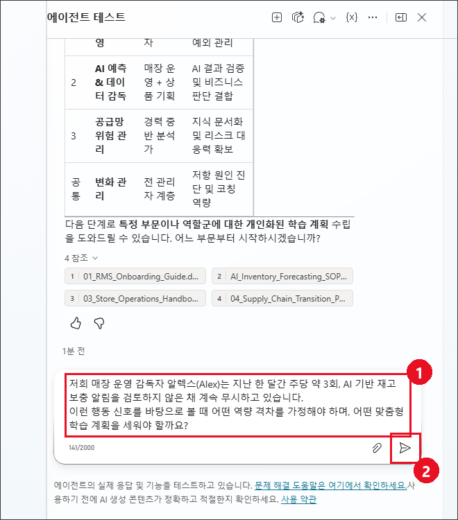

    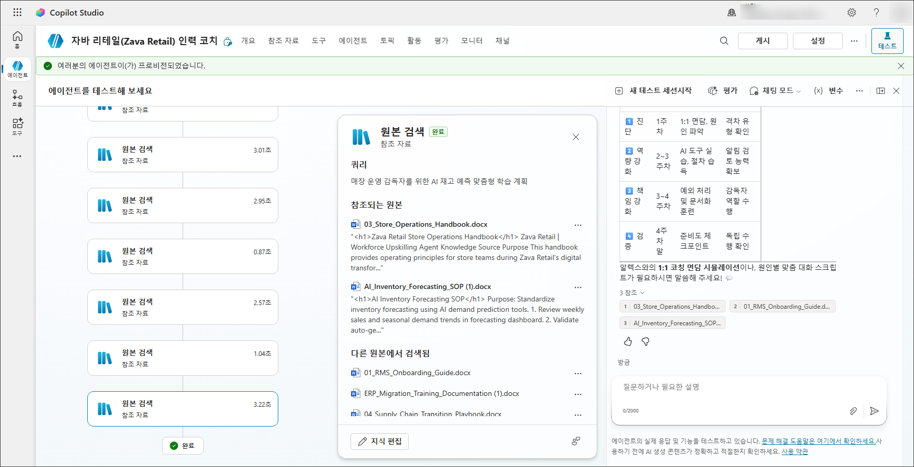

### 작업 2: 마리아 산토스(Maria Santos) 진단

이 작업에서는 공급망 분석가 마리아 산토스(Maria Santos)의 퇴사 상황에 맞춰 긴급 지식 이전 계획을 진단합니다.

1. 다음 **(1) 프롬프트**를 붙여넣고 **(2) 보내기**를 선택합니다.

    ```
    공급망 분석가 중 한 명인 마리아(Maria)가 60일 후 퇴사합니다. 마리아는 문서화된 인수인계 절차가 없는 단독 공급원 공급업체 4곳과의 관계를 담당하고 있습니다.
    어떤 긴급 학습 및 지식 이전 계획을 실행해야 할까요?
    ```

    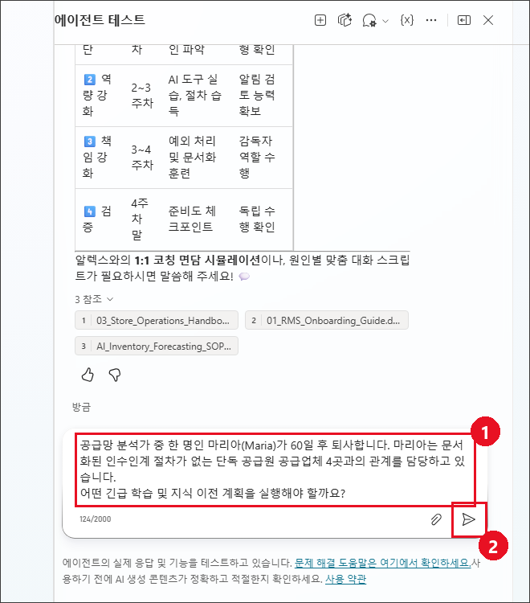

    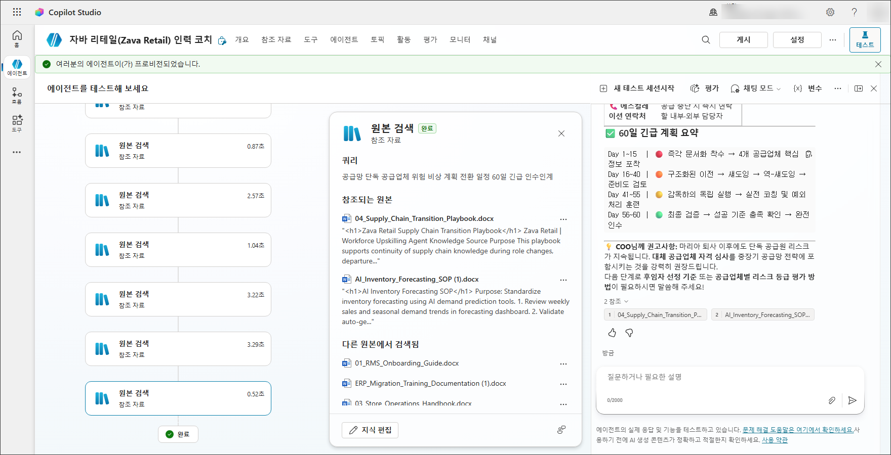

### 작업 3: 데렉 오콘콰(Derek Okonkwo) 진단

이 작업에서는 운영 코디네이터 데렉 오콘콰(Derek Okonkwo)의 낮은 시스템 도입률 원인을 진단합니다.

1. 다음 **(1) 프롬프트**를 붙여넣고 **(2) 보내기**를 선택합니다.

    ```
    저희 RMS는 6개월 전에 가동을 시작했습니다. 데렉(Derek)의 시스템 활용률은 31%로 팀 내에서 가장 낮습니다.
    데렉은 레거시 시스템 경력이 11년입니다.
    어떤 저항 패턴과 역량 격차를 해결해야 할까요?
    ```

    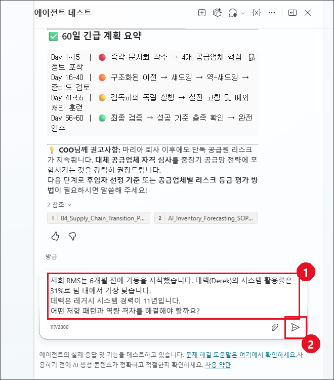

1. 에이전트의 응답을 검토합니다.

    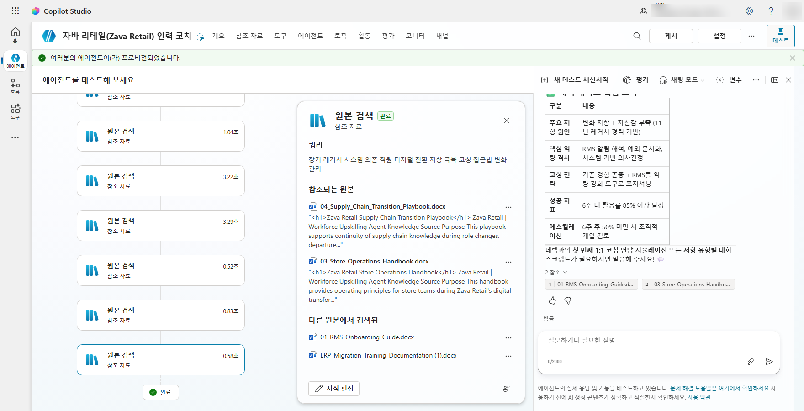

---

## 연습 4: 개인화된 학습 계획 생성

### 작업 1: 알렉스(Alex)의 6주 학습 계획 생성

이 작업에서는 알렉스 첸(Alex Chen)을 위한 구조화된 6주 학습 계획을 생성합니다.

1. 다음 **(1) 프롬프트**를 입력하고 **(2) 보내기**를 선택합니다.

    ```
    알렉스(Alex)를 위한 체계적인 6주 학습 계획을 만들어 주세요. 다음을 포함하세요.
    - 학습 목표
    - 주간 활동
    - 학습 자료
    - 중간 점검
    - 성공 지표
    ```

1. 에이전트의 응답을 검토합니다.

    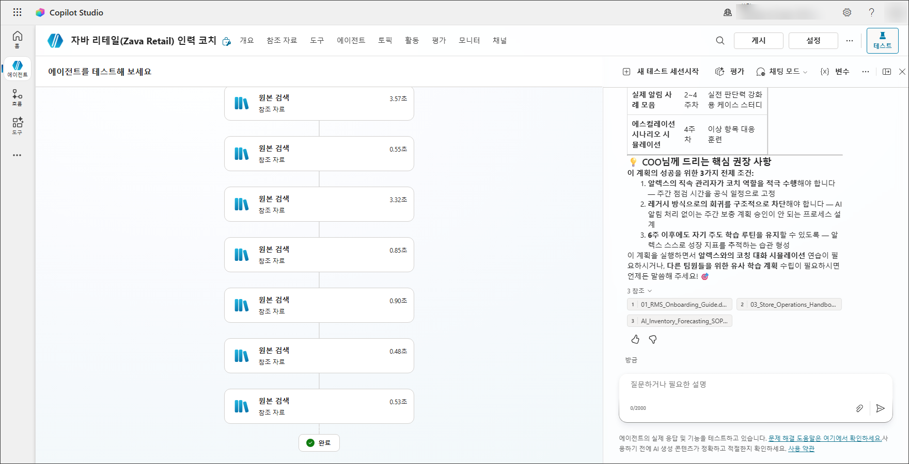

### 작업 2: 마리아(Maria)의 60일 전환 계획

이 작업에서는 마리아 산토스(Maria Santos)의 퇴사를 대비한 60일 지식 이전 및 역량 강화 계획을 생성합니다.

1. 다음 **(1) 프롬프트**를 붙여넣고 **(2) 보내기**를 선택합니다.

    ```
    마리아(Maria)의 퇴사 상황에 맞춰 60일 지식 이전 및 역량 강화 계획을 만들어 주세요.
    다음 병렬 트랙을 포함해 주세요.
    1. 지식 이전
    2. 분석가 역량 강화
    ```

    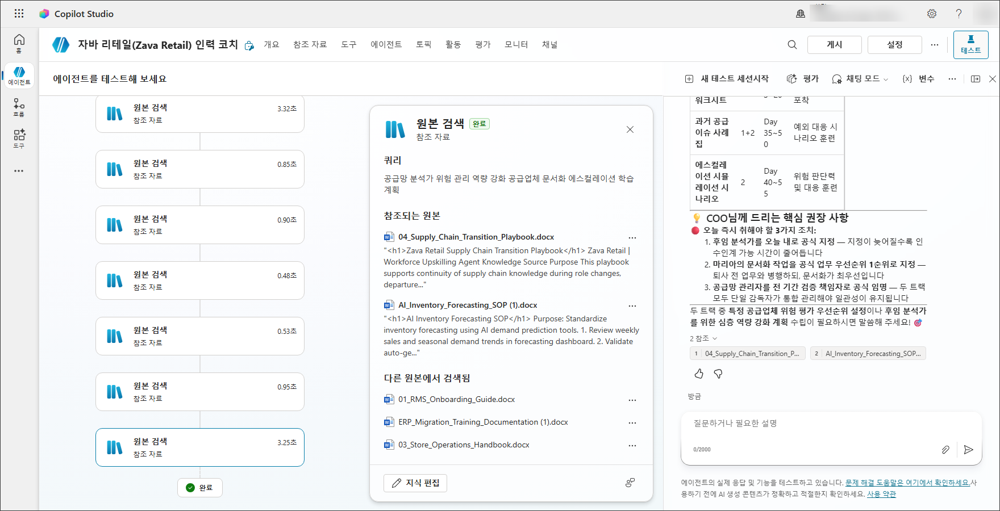

### 작업 3: 데렉(Derek)의 RMS 도입 계획

이 작업에서는 데렉 오콘콰(Derek Okonkwo)를 위한 8주 도입 중심 학습 계획을 생성합니다.

1. 다음 **(1) 프롬프트**를 입력하고 **(2) 보내기**를 선택합니다.

    ```
    데렉(Derek)을 위한 8주 도입 중심 학습 계획을 만들어 주세요. RMS 능숙도를 경력 성장 기회로 제시하세요.
    ```

    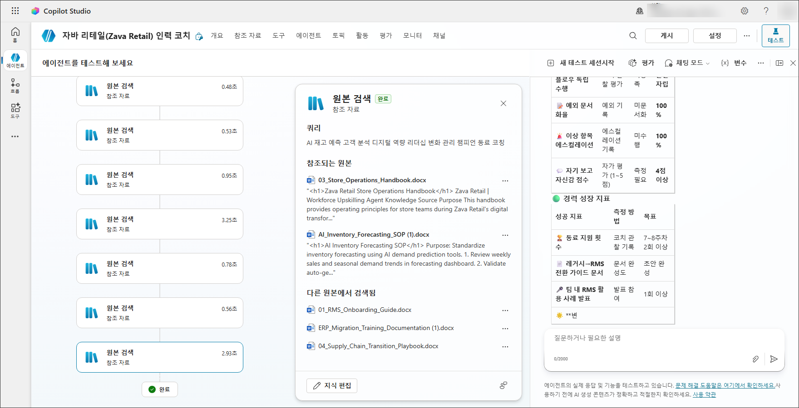

---

## 요약

이 랩에서는 소매 인력 변환을 지원하도록 설계된 맞춤형 인력 역량 강화 에이전트를 Microsoft 365 코파일럿에서 구축했습니다. 에이전트의 동작을 인력 개발 목표에 맞게 설정하고, 조직 상황을 에이전트에 알려 더 정확한 응답을 얻었으며, 운영 신호를 활용하여 직원 역량 격차를 파악했습니다. 또한 직원별 맞춤 학습 계획을 생성하고, 프롬프트 개선을 통해 에이전트 응답을 더 효과적으로 활용하며, 경영진 의사결정을 지원하는 인력 준비 상태 보고서를 작성하는 방법을 실습했습니다.
