# Lab 4: 코파일럿 스튜디오(Copilot Studio) 에이전트 보안 및 거버넌스

## 예상 소요 시간: 30분

## 랩 목표

자바 리테일(Zava Retail)의 전자상거래 팀이 IT 보안 부서의 관여 없이 고객 주문 조회, 반품 처리, 내부 재고 문의를 담당하는 코파일럿 스튜디오(Copilot Studio) 에이전트를 구축하고 있습니다. 이 랩에서는 이러한 에이전트를 평가하고 관리하는 방법을 배웁니다. 에이전트의 보안 상태를 검토하고, 데이터 손실 방지(DLP, Data Loss Prevention) 정책으로 연결 및 데이터 접근을 제한하며, 호출 권한을 제어하고, 활동 감사 가능성을 확인합니다. 이를 통해 자바 리테일(Zava Retail)은 고객 데이터와 재고 정보의 통제력을 유지하면서도 매장과 전자상거래 팀이 계속해서 에이전트를 개발하도록 할 수 있습니다.

## 랩 개요

시민 개발자의 코파일럿 스튜디오(Copilot Studio) 에이전트 배포 속도를 보안 팀의 검토가 따라가지 못하고 있습니다. 가장 흔한 오해는 에이전트 자체가 별도의 보안 계층을 제공한다는 것입니다. 실제로는 그렇지 않습니다. 에이전트는 제작자(또는 이벤트 트리거 에이전트의 경우 호출자)의 기존 권한을 그대로 물려받으며, 이미 공개된 모든 데이터와 기능을 노출합니다.

이 랩은 보안 검토 전에 배포된 자바 리테일(Zava Retail)의 에이전트를 중심으로 진행됩니다. 이 에이전트는 고객 주문 기록이 있는 쉐어포인트(SharePoint) 사이트에 연결되어 있고, 인증 없이 웹 채널에 공개되어 있으며, 환불을 처리하는 파워 오토메이트(Power Automate) 흐름에 연결되어 있습니다. 거버넌스 담당자가 실제로 수행하는 검토 과정을 직접 경험합니다. 에이전트의 기본 보안 상태 지표를 확인하고, 실제로 에이전트를 제한하는 DLP 정책을 작성하며, 인증 모드와 조건부 액세스 적용 지점을 비교하고, 에이전트의 감사 기록을 찾습니다. 여기에는 고객 Lockbox(Customer Lockbox, Microsoft 지원 엔지니어가 테넌트 데이터에 접근하려 할 때 고객 관리자의 명시적 승인을 요구하는 기능)가 다루지 않는 활동 범주도 포함됩니다.

동시에 OrderBot에 대한 거버넌스 검토와 별개로, 두 번째 에이전트(Zava Inventory Watcher)를 직접 만들어 에이전트 생성과 지식 구성 과정을 처음부터 체험합니다.

## 시나리오

자바 리테일(Zava Retail)의 고객 관리 팀은 고객이 회사 웹 사이트에서 주문 상태를 확인하고 반품을 시작할 수 있도록 "OrderBot"이라는 코파일럿 스튜디오(Copilot Studio) 에이전트를 구축했습니다. 신속한 개발을 위해 제작자(IT 관리자가 아닌 비즈니스 분석가)는 고객 주문 기록이 있는 쉐어포인트(SharePoint) 사이트에 OrderBot을 연결하고, 로그인을 요구하지 않아 고객이 계정 없이 사용할 수 있도록 웹 채널을 활성화했으며, 환불을 발급하는 "Returns" 파워 오토메이트(Power Automate) 흐름에 접근 권한을 부여했습니다.

자바 리테일(Zava Retail)의 보안 팀은 정기 검토에서 OrderBot이 공개적으로 접근 가능하고 인증이 없으며 환불 흐름에 쓰기 권한을 가진 것을 발견한 후 이제 관여하게 되었습니다. 현재로서는 어떤 데이터가 노출되었는지, 누가 이 에이전트를 사용했는지, 사용 중인 커넥터가 승인된 것인지 파악할 수 없습니다. 당신은 더 진행되기 전에 OrderBot을 평가하고 보호하기 위해 투입된 보안/거버넌스 담당자입니다.

## 사전 요구 사항

**필수 접근 권한**

- 파워 플랫폼(Power Platform) 관리 센터 접근 권한(최소 환경 관리자 역할, 데이터버스(Dataverse) 데이터베이스가 있는 환경에서 환경 수준 DLP 정책을 구성하려면 시스템 관리자 필요)
- 하나 이상의 환경에서 코파일럿 스튜디오 제작자 역할
- Microsoft Purview 규정 준수 포털 접근 권한(4부에서 감사 권한 필요)
- 테스트/검토 계정에 할당된 Microsoft 365 라이선스(코파일럿 스튜디오가 Purview 감사 이벤트와 대화 내용을 기록하는 데 필요)

**라이선스 안내**

- 테넌트에 에이전트 365(Agent 365)가 프로비저닝되어 있고 마무리 토론에서 언급하는 Agent Registry 또는 소유자 없는 에이전트 재할당 기능을 살펴보려면, Agent 365는 Microsoft 365 E5, F5 Defender and Purview, 또는 Business Premium이 필요합니다. E3, Business Basic, Business Standard는 지원하지 않습니다. 핵심 랩에는 필수가 아니지만 참가자가 Agent Registry를 볼 수 없는 이유를 묻는 경우 안내하세요.

**환경 설정(진행자가 준비)**

- 인증 없이 웹 채널이 활성화된 테스트 에이전트 1개
- DLP 정책으로 차단할 커넥터 1개(미리 지정)

## 학습 목표

이 랩을 완료하면 다음을 수행할 수 있습니다:

- 에이전트가 자체 보안 계층을 추가하지 않는 이유를 설명합니다. 에이전트는 제작자 또는 호출자의 기존 권한을 물려받으므로, 상위 계층에서 과도하게 공개된 데이터가 에이전트를 통해 그대로 노출됩니다.
- 코파일럿 스튜디오 작성 환경에서 에이전트의 보안 상태(인증 부재, 정책 영향)를 검토합니다.
- 환경 내 에이전트의 커넥터와 지식 원본을 제한하는 파워 플랫폼 DLP 정책을 작성합니다.
- 인증이 있는 에이전트 접근과 인증이 없는 에이전트 접근을 비교하고, Entra ID 로그인이 필요한 시점을 판단합니다.
- Purview에서 에이전트의 활동 기록(호출, 도구 사용, 정책 결정)을 찾고, 고객 Lockbox(Customer Lockbox)가 적용되지 않는 범위를 파악합니다.
- Analytics Viewer 역할을 사용해 편집 권한 없는 관계자에게 에이전트 사용 현황과 위험 신호에 대한 최소 권한 가시성을 제공합니다.

---

## 연습 1 — Zava Inventory Watcher 에이전트 만들기

에이전트가 자동으로 작동하려면 먼저 코파일럿 스튜디오에서 에이전트를 만들고 구성해야 합니다.

### 작업 1 — 에이전트 작성기 열기

1. 가상 머신에서 브라우저를 열고 <https://copilotstudio.microsoft.com/>으로 이동합니다.

1. **로그인** 페이지에서 제공된 **(1) 사용자 이름**을 입력하고 **(2) 다음**을 선택합니다.

    - **사용자 이름:** <inject key="AzureAdUserEmail"></inject>

        

1. 제공된 **(1) 임시 액세스 패스**를 입력하고 **(2) 로그인**을 선택합니다.

    - **임시 액세스 패스:** <inject key="AzureAdUserPassword"></inject>

        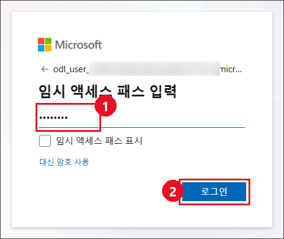

1. **로그인 상태를 유지하시겠습니까?** 메시지가 표시되면 **아니요**를 선택합니다.

   


1. **코파일럿 스튜디오**에서 왼쪽 탐색 창의 **(1) 에이전트**를 선택한 후 **(2) 빈 에이전트 만들기**를 선택하여 새 에이전트를 만듭니다.

    > **참고:** 이 실습의 화면은 코파일럿 스튜디오의 이전 환경(클래식 UI)을 기준으로 합니다. 화면 상단에 **새로운 Copilot Studio 환경** 배너와 **지금 사용해 보세요** 단추가 보이면 이미 이전 환경이므로 그대로 진행합니다. 대신 홈 화면 오른쪽 위에 **새로운 환경** 스위치가 표시되면 스위치를 꺼서 이전 환경으로 전환한 후(피드백 창이 열리면 **이전 환경이 더 좋습니다.**를 선택하고 **제출**, **완료**를 선택) 진행합니다.

    

### 작업 2 — 에이전트 정의 및 구성

1. 다음 에이전트 정보를 입력합니다.

   **에이전트 이름:** **에이전트 이름 지정** 대화 상자의 **(1) 에이전트 이름 입력**에 `Zava Inventory Watcher`를 입력하고 **(2) 만들기**를 선택합니다.

      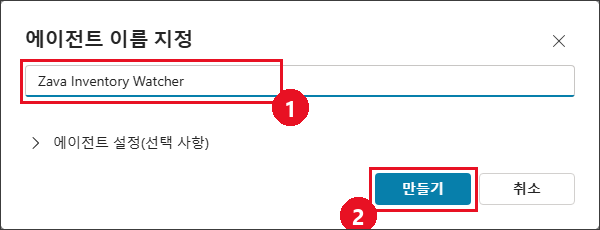

   **에이전트 설명:** **개요** 페이지의 **세부 정보** 섹션에서 **편집**을 선택하고 **(1) 설명**에 다음 내용을 입력한 후 **(2) 저장**을 선택합니다. `자바 리테일(Zava Retail)의 제품 재고를 모니터링하고, 재고가 재주문 기준 수량 아래로 떨어지면 조달 담당자에게 자동으로 이메일을 보냅니다.`

      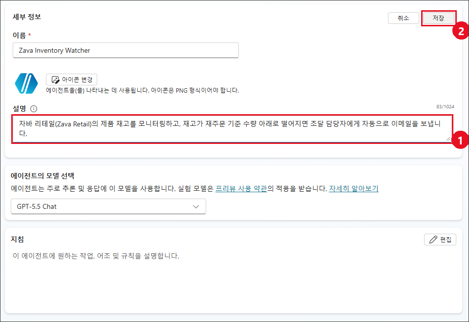

   **에이전트 지침:** **지침** 섹션에서 **편집**을 선택하고 **(1) 지침** 영역에 다음 내용을 붙여넣은 후 **(2) 저장**을 선택합니다.

      ```
      당신은 자바 리테일(Zava Retail)의 재고 관리 보조입니다. 제품 재고가 재주문 기준선 아래로 떨어지면, 조달 담당자에게 보낼 간결하고 명확한 재입고 요청 이메일을 작성하세요.

      이메일에 제품명, SKU, 현재 재고 수준, 재주문 기준선, 제안 수량(지시가 없으면 기준선의 2배 가정)을 포함하세요. 전문적이고 효율적인 톤을 유지하세요.

      SKU, 재고 수준, 또는 조달 담당자 이메일이 누락되면 이메일을 보내지 말고 대신 해당 기록을 수동 검토 대상으로 표시하세요.
      ```

      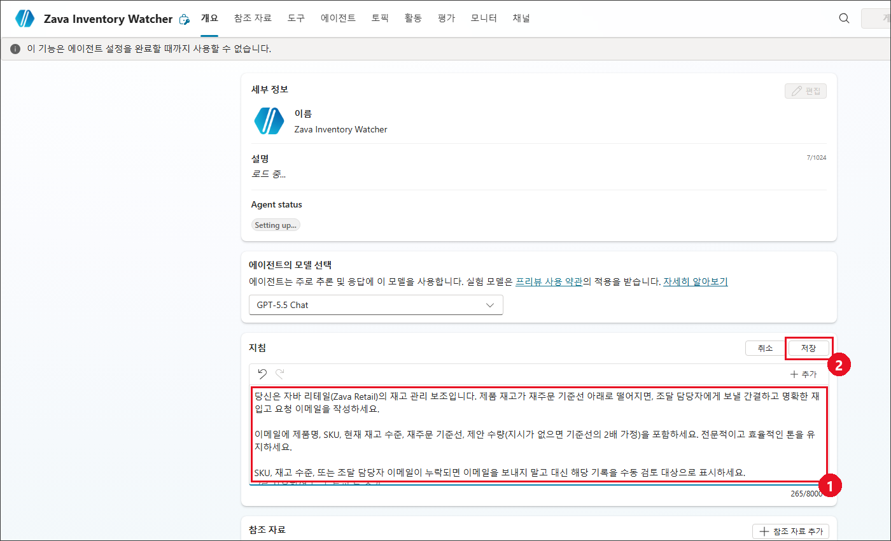

2. 오른쪽 위의 **게시**를 선택하여 에이전트를 게시합니다.

   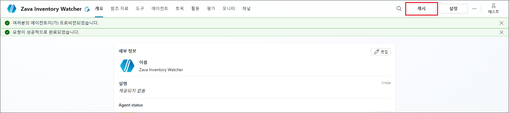

   > **참고:** 실습 테넌트의 라이선스에 따라 게시 대화 상자에 "게시할 수 있는 사용자 라이선스가 없습니다"라는 메시지가 표시되고 **게시** 단추가 비활성화될 수 있습니다. 이 경우 **취소**를 선택하고 지식 추가와 설정 검토를 계속합니다. 이후 단계에서 실제 게시와 게시 결과를 확인하려면 게시 가능한 라이선스가 필요합니다. 라이선스 오류를 DLP 정책이나 인증 설정으로 인한 게시 차단으로 해석하지 마세요.

   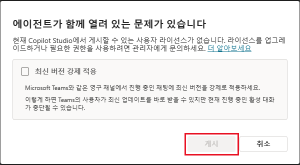

### 작업 3 — 지식 추가

자동으로 작동하는 에이전트는 사람의 개입 없이 명확한 지침과 기반이 되는 지식에 크게 의존합니다.

1. **개요** 페이지를 아래로 스크롤하여 **참조 자료**(Knowledge) 섹션에서 **+ 참조 자료 추가**를 선택한 후, **참조 자료 추가** 창의 **파일 업로드** 영역에서 **선택하여 찾아보기**를 선택합니다.

   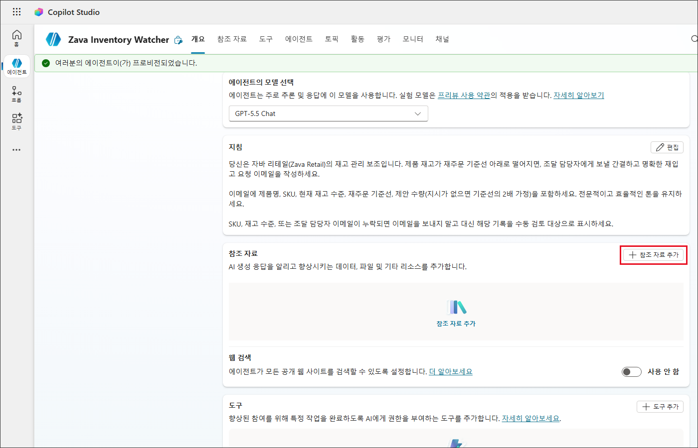

   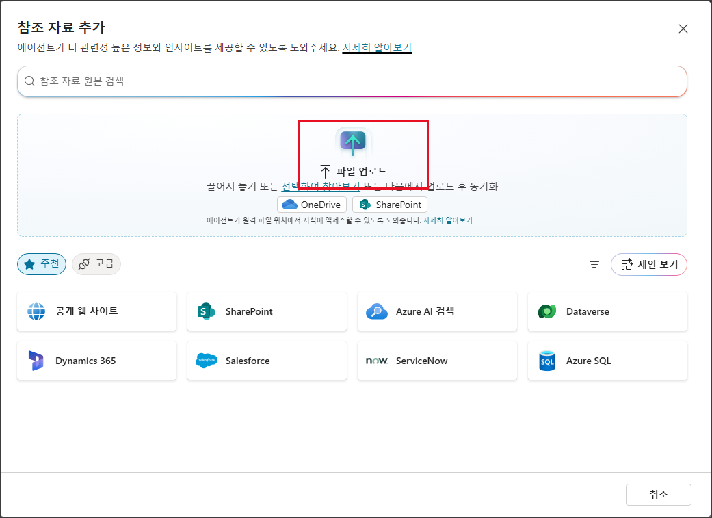

1. **C:\LabFiles\Lab-Files\labfiles\lab4**로 이동하여 **(1) Zava_Inventory** 파일을 선택하고 **(2) 열기**를 선택합니다. **파일 업로드** 창에 파일이 표시되면 **에이전트에 추가**를 선택합니다. 잠시 후 **참조 자료** 섹션에 파일이 **준비** 상태로 표시됩니다.

   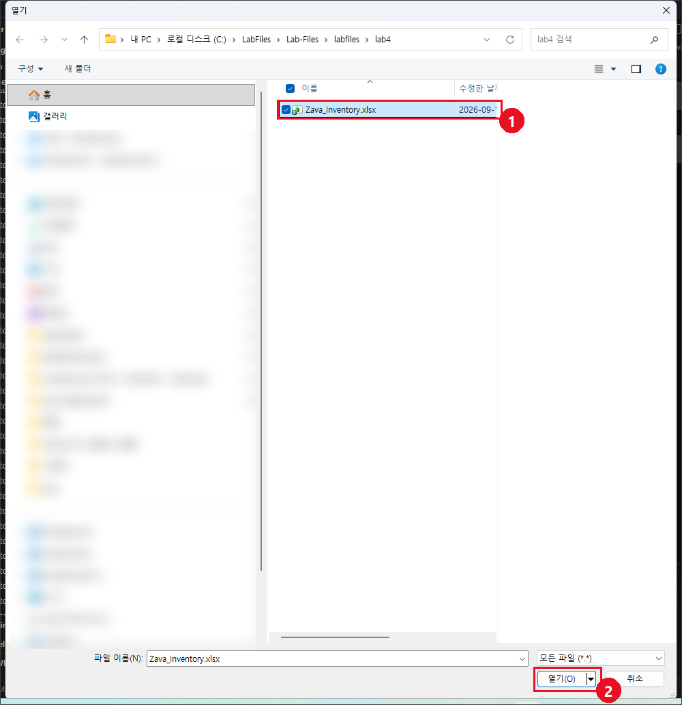

   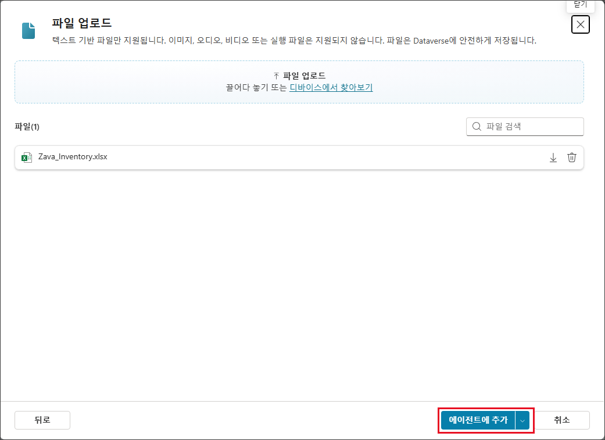

   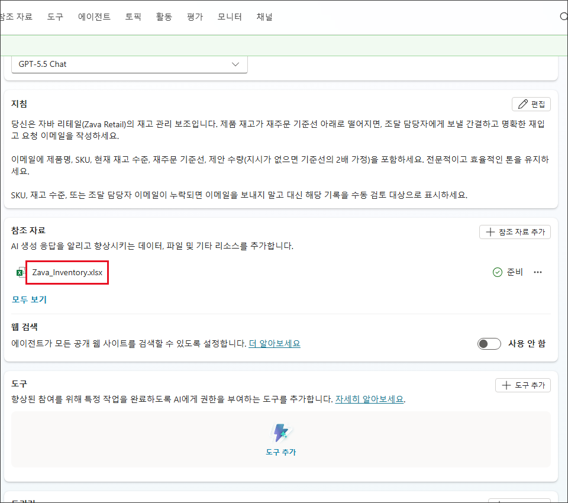

---

## 연습 2 — 에이전트용 파워 플랫폼 DLP 정책 만들기

### 작업 1 — DLP 정책 만들기

1. 가상 머신에서 브라우저를 열고 **파워 플랫폼(Power Platform) 관리 센터**로 이동합니다.

   ```
   https://admin.powerplatform.microsoft.com/
   ```

2. 왼쪽 탐색 메뉴에서 **(1) 보안**을 선택하고, **(2) 데이터 및 개인정보 보호**를 선택한 후 **(3) 데이터 정책**을 선택합니다.

   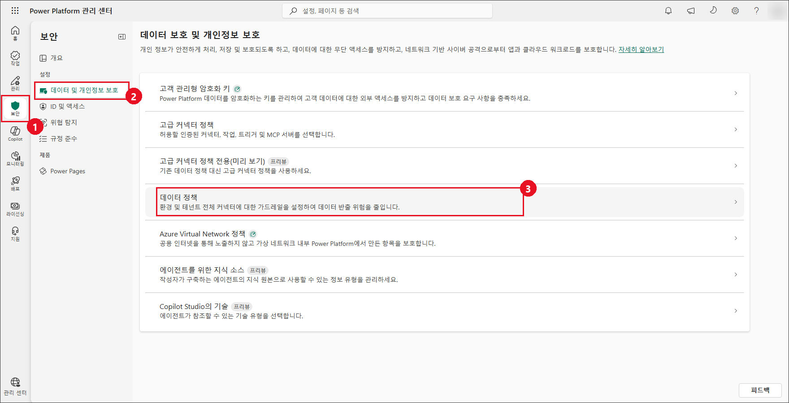

3. **+ 새 정책**을 선택합니다.

   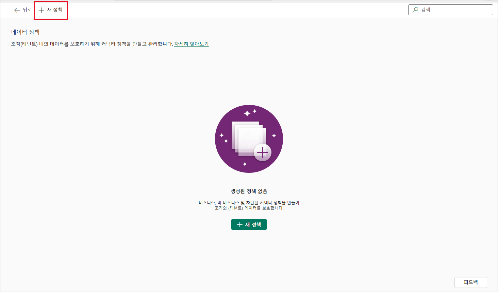

4. 각 단계에서 필요한 정보를 입력하여 정책을 구성합니다. **정책 이름**으로 다음을 입력합니다: **New_Policy-<inject key="DeploymentID" enableCopy="false"></inject>**. **다음**을 선택합니다.

   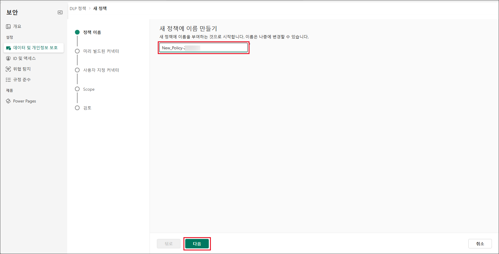

5. **미리 빌드된 커넥터** 단계에서 에이전트 환경의 커넥터를 정책에 할당합니다. DLP 정책을 테스트하기 위해 쉐어포인트(SharePoint) 커넥터를 차단합니다. 검색 상자에 `SharePoint`를 입력하고, **Knowledge source with SharePoint and OneDrive in Copilot Studio** 행의 **(1) 기타 작업(⋮)**을 선택한 후 **(2) 블록**을 선택합니다. **차단됨** 탭에 커넥터가 표시되면 **다음**을 선택합니다.

   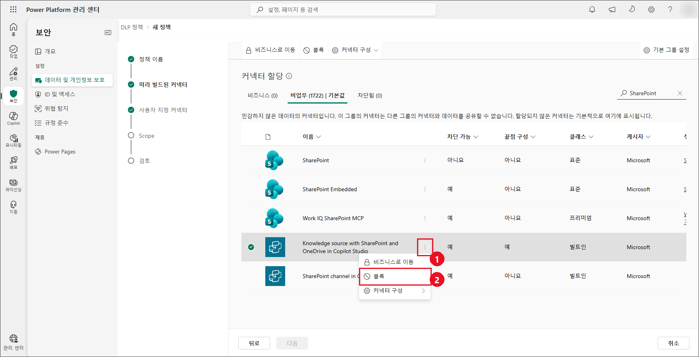

6. **사용자 지정 커넥터 패턴** 단계에서는 기본값을 그대로 두고 **다음**을 선택합니다.

   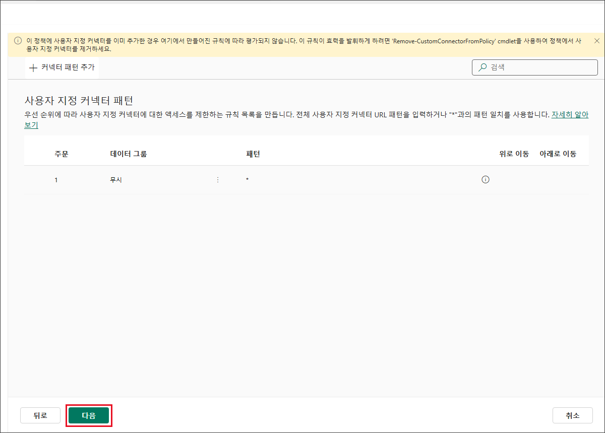

7. **범위 정의** 단계에서 **여러 환경 추가**를 선택하고 **다음**을 선택합니다.

   > **참고:** 실습 테넌트에서는 **여러 환경 추가**로 특정 환경을 고르면 정책이 만들어지지 않습니다. 이 실습에서는 **모든 환경 추가**를 선택합니다. 정책은 연습 5에서 삭제하므로 다른 환경에 남는 영향은 없습니다.

   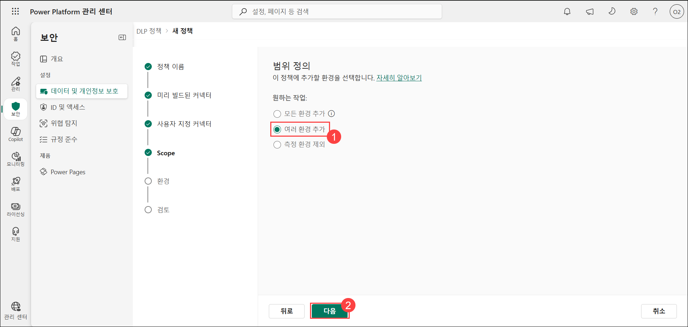

1. 환경 추가 페이지에서 **DevOne-<inject key="Deployment ID" enableCopy="false"></inject> (1)** 을 선택하고, **+ 정책에 추가 (2)** 를 선택한 다음 **다음 (3)** 을 클릭합니다.

   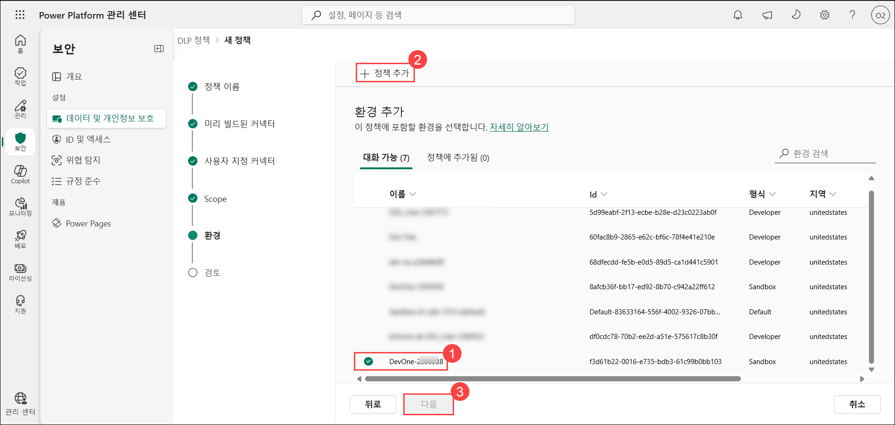

8. 변경 사항을 검토합니다. **정책 만들기**를 선택합니다.

   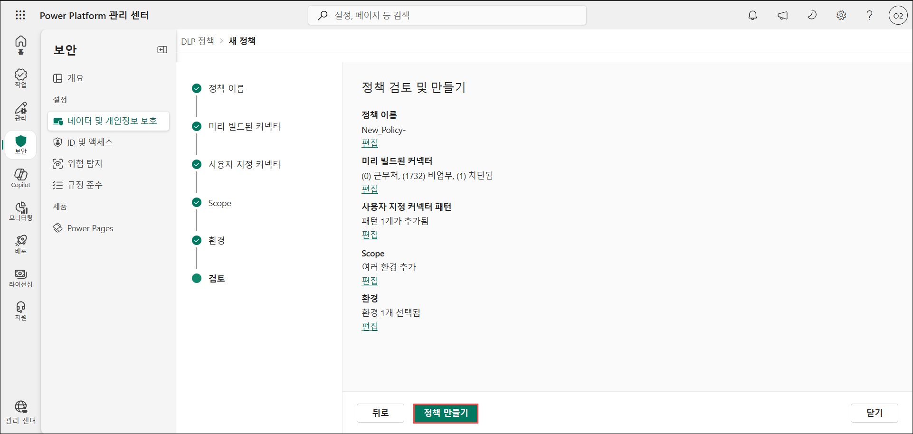

9. 정책이 만들어지면 Zava 에이전트로 돌아갑니다.

### 작업 2 — DLP 정책 테스트

1. Zava Inventory Watcher 에이전트로 이동합니다.

2. **참조 자료** 섹션으로 이동합니다. **+ 참조 자료 추가**를 선택합니다.

   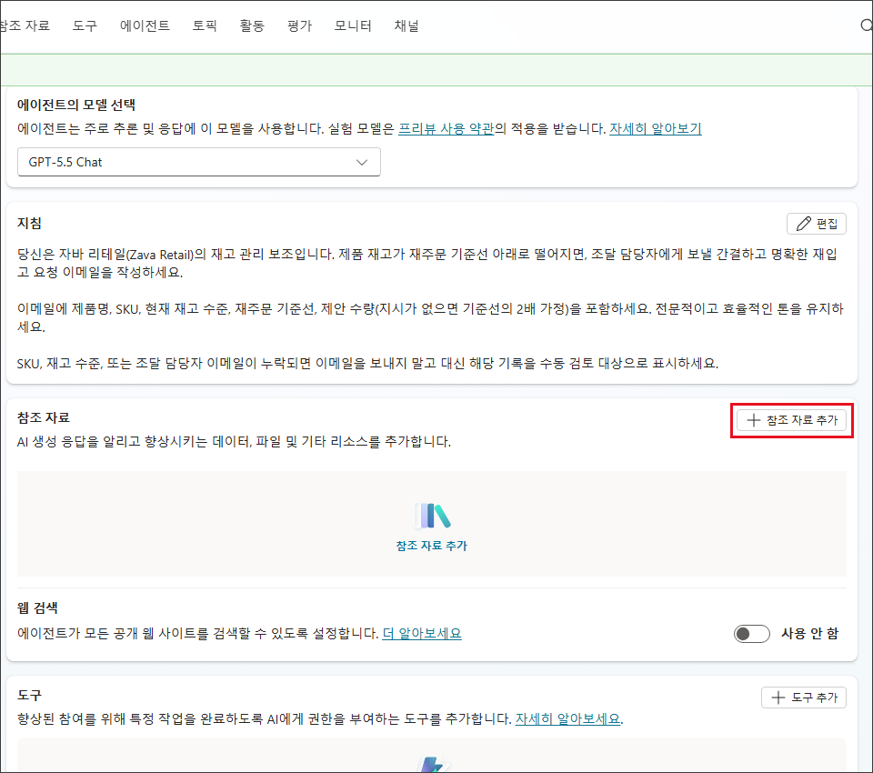

3. **SharePoint** 타일을 선택합니다.

   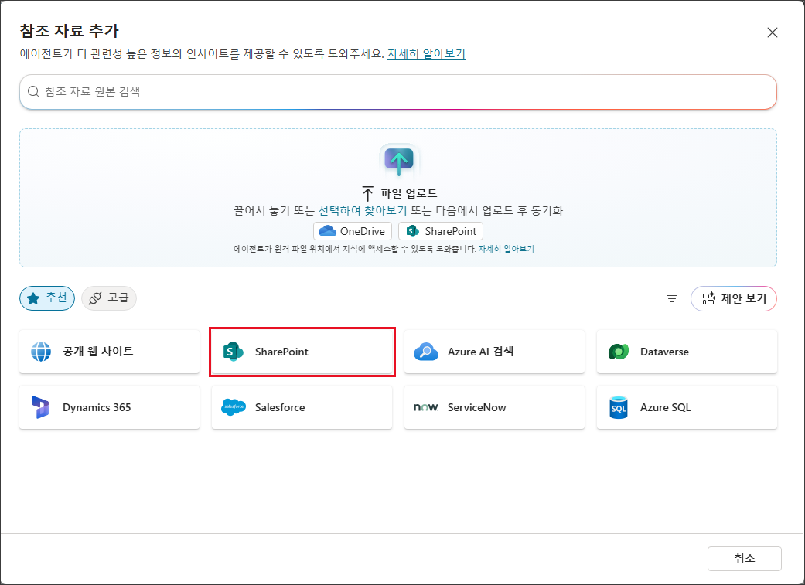

4. 쉐어포인트(SharePoint) 또는 원드라이브(OneDrive)에서 추가하려는 지식 원본을 선택합니다. **에이전트에 추가**를 선택합니다.

5. DLP 정책에서 쉐어포인트(SharePoint) 커넥터를 차단했으므로 쉐어포인트(SharePoint)를 통해 지식 원본을 연결할 수 없습니다. 지식 원본이 차단됨으로 표시됩니다.
6. DLP 정책이 작동 중입니다.

   > **참고:** 쉐어포인트(SharePoint) 지식 원본이 없으면 **Zava Inventory** 파일을 원드라이브(OneDrive)에 업로드하고 파일 URL을 복사한 후, 쉐어포인트 지식 커넥터를 사용해 에이전트에 추가합니다. DLP 정책이 올바르게 구성되었다면 지식 원본이 '차단됨'으로 표시되어 정책이 작동함을 확인할 수 있습니다.
   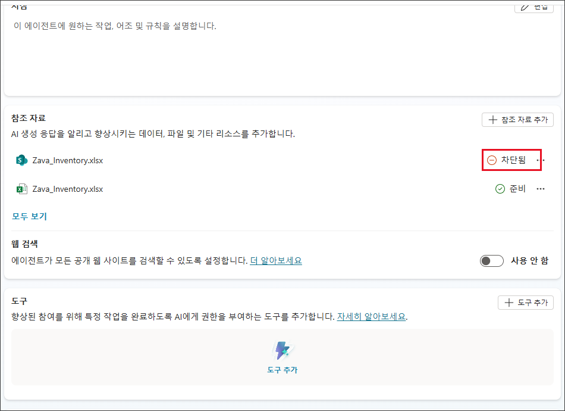
---

## 연습 3 — 에이전트 보안 상태 검토

1. 작성 환경에서 에이전트 상태/보안 및 보호 표시기를 찾습니다.

2. 플래그가 지정된 문제를 파악합니다. 예를 들어 인증 부재나 에이전트가 사용하는 커넥터 및 지식 원본에 미치는 DLP 정책 영향을 확인합니다.

3. 쉐어포인트(SharePoint) 지식 원본을 제거하고 문제를 해결하지 않으면 에이전트를 게시할 수 없습니다.

---

## 연습 4 — 인증이 있는 접근과 인증이 없는 접근 비교

### 작업 1 — 인증 없음 설정 검토

1. 에이전트 페이지 오른쪽 위의 **설정**을 선택합니다.

   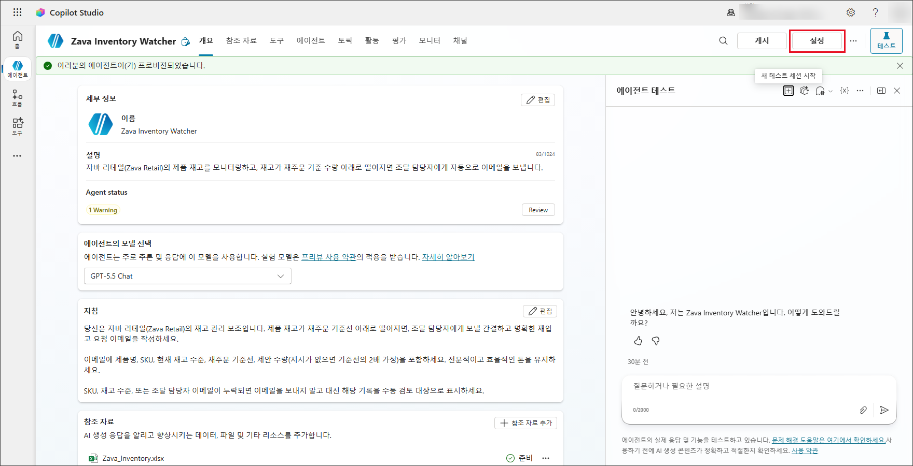

2. **설정** 창에서 **(1) 보안**을 선택한 후 **(2) 인증**을 선택합니다.

   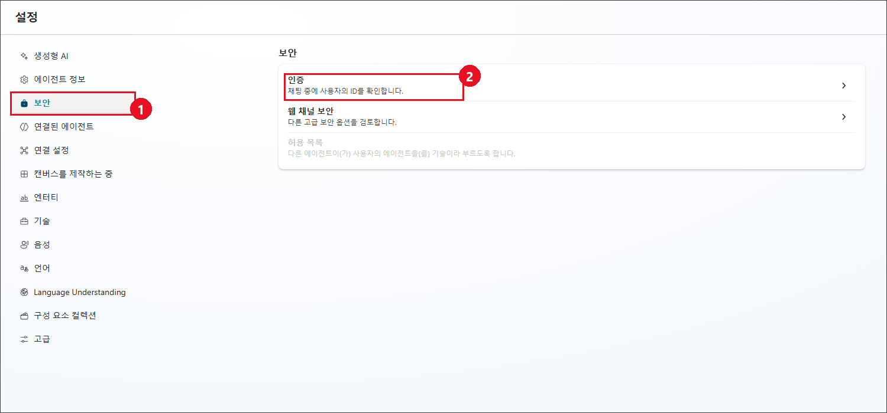

3. **(1) 인증 없음**을 선택하고 **(2) 저장**을 선택합니다. **이 구성을 저장하시겠습니까?** 대화 상자에서 **저장**을 선택합니다.

   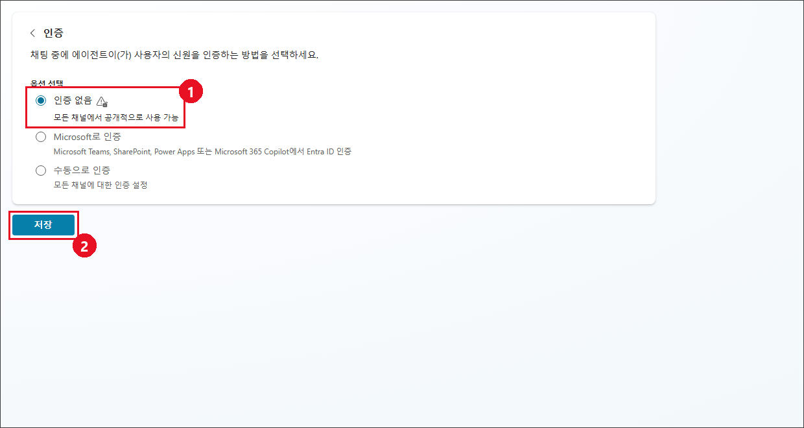

   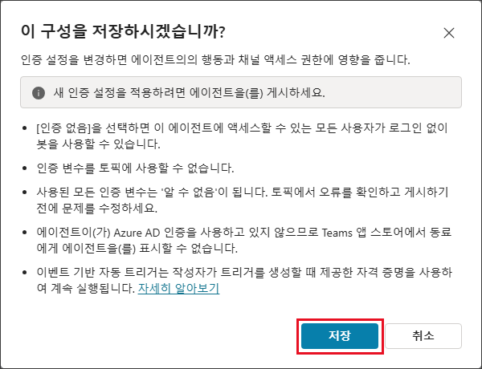

4. 게시 페이지로 이동하여 인증이 없어서 에이전트를 게시할 수 없음을 확인합니다.

### 작업 2 — Microsoft 인증으로 전환

1. **인증**에서 모드를 **(1) Microsoft로 인증**으로 변경합니다. **(2) 저장**을 선택한 후, 확인 대화 상자에서 **저장**을 선택하고 에이전트를 **게시**합니다.

   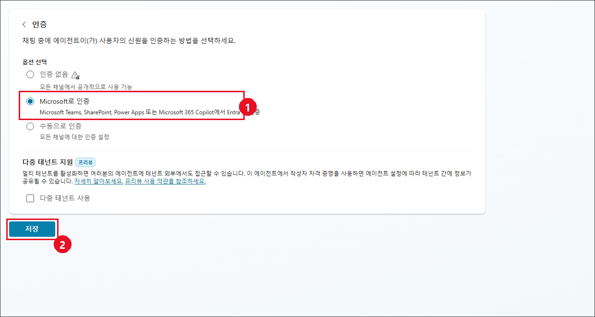

2. 에이전트 상태가 **준비(Ready)**로 표시되는지 확인합니다.

3. **채널** 탭으로 이동합니다. 현재 인증 설정에서 사용 가능한 채널을 확인할 수 있습니다.

4. **채널** 페이지 상단에 Microsoft 인증을 사용하고 있으므로 Teams, Microsoft 365 및 SharePoint 채널만 사용할 수 있다는 안내가 표시되고, **Microsoft 채널** 섹션에서 **Microsoft 365 및 Microsoft Teams**, **SharePoint** 타일을 이제 선택할 수 있는지 확인합니다. 이것은 단순히 다른 설정을 표시하는 것이 아니라 인증 모드 변경이 실제로 기능에 영향을 미친다는 구체적이고 눈에 띄는 증거입니다.

   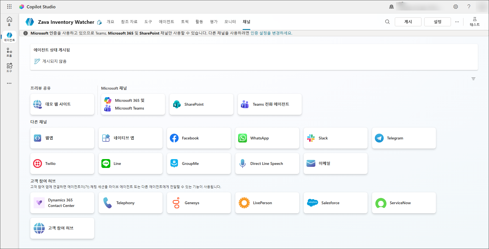


### 작업 3 — 수동 인증으로 전환

1. 모드를 **수동으로 인증**으로 변경하고, 이전에는 필요 없었지만 이제 필요한 설정을 살펴봅니다. **리디렉션 URL**, **서비스 공급자**, **클라이언트 ID**, **토큰 교환 URL**, **로그인 URL**, **범위**입니다.

2. 필수 필드에 필요한 샘플 정보를 입력합니다.

3. 에이전트를 테스트하기 전에 수동으로 로그인해야 합니다.

   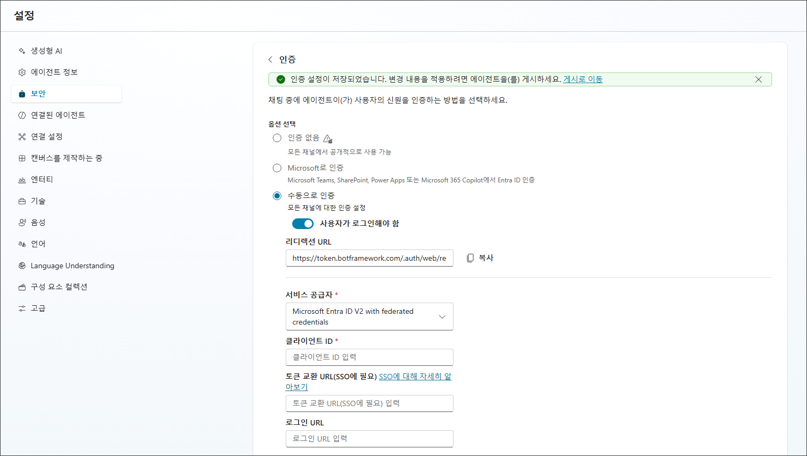

## 연습 5 — 정리: DLP 정책 삭제

테스트와 검증을 완료한 후, 더 이상 필요하지 않은 정책을 제거하여 환경을 정리하고 향후 에이전트 개발에 의도하지 않은 영향을 주지 않도록 합니다.

1. **파워 플랫폼 관리 센터**로 돌아갑니다.
   <https://admin.powerplatform.microsoft.com/>

2. 왼쪽 탐색 메뉴에서 **보안 > 데이터 및 개인정보 보호 > 데이터 정책**을 선택합니다.

3. 연습 2에서 본인이 만든 **New_Policy-<inject key="DeploymentID" enableCopy="false"></inject>**를 찾습니다. 이름 끝의 배포 ID가 본인의 배포 ID와 일치하는지 확인합니다.

4. 정책을 클릭하여 선택하고 정책 세부 정보를 엽니다.

5. 오른쪽 상단에서 삭제 단추를 선택합니다(또는 점 세 개 메뉴에서 삭제를 선택합니다).

6. 확인 대화 상자가 표시됩니다. 확인 또는 예를 선택하여 삭제를 확인합니다.

7. 본인이 만든 **New_Policy-<inject key="DeploymentID" enableCopy="false"></inject>**가 데이터 정책 목록에서 더 이상 나타나지 않는지 확인합니다.

> **참고:** DLP 정책 삭제 시 정책이 적용한 모든 제한이 제거됩니다. 삭제 전에 활성 에이전트가 이 정책을 사용하지 않는지 확인하거나, 관리자에게 안전하게 제거 가능한지 확인하세요.

---

## 랩 요약 — 이 랩에서 배우는 내용

이 랩은 핵심 개념 하나를 중심으로 구성됩니다. **에이전트는 보안 계층을 추가하지 않습니다. 제작자와 호출자의 기존 권한을 그대로 물려받을 뿐입니다.** 랩의 나머지 부분은 이 상속된 위험이 어디서 드러나고 어떻게 통제할 수 있는지 학습하는 데 초점을 맞춥니다.

**에이전트 구축은 아이디어에서 운영까지 얼마나 적은 장애물이 있는지를 보여줍니다.** 연습 1에서 Zava Inventory Watcher를 관리자 개입 없이 몇 분 안에 구축합니다. 이는 시나리오에서 OrderBot이 만들어진 방식과 정확히 같습니다. 이것은 의도적입니다. 거버넌스 조직이 따라잡기 전에 에이전트를 배포하는 것이 얼마나 쉬운지를 직접 체험하게 합니다.

**에이전트 상태를 읽는 것은 일회성 검사가 아니라 진단 기술입니다.** 연습 2에서는 파워 플랫폼(Power Platform) 관리 센터에서 관리자가 보는 정보뿐 아니라, 제작자가 보는 것과 동일한 코파일럿 스튜디오의 기본 보안/보호 표시기를 작성 캔버스에서 직접 찾아 해석합니다. 실제로 플래그된 위험(인증 부재, 차단된 커넥터)과 위험이 없는 상태를 구분하고, 각 플래그를 단순히 "문제 있음"이 아니라 왜 중요한지에 대한 구체적 이유와 연결합니다.

**DLP 정책은 거버넌스를 보이게만 하는 것이 아니라 실제로 적용하게 만드는 지점입니다.** 연습 2에서는 위험을 단순히 식별하는 것에서 실제로 해결하는 것으로 나아갑니다. 환경에 정책 범위를 지정하고, 커넥터/지식 원본/채널을 제한하며, 예상한 위치에 정책 영향 경고가 나타나는지 확인합니다. 또한 실제 테넌트에서 자주 혼동을 일으키는 환경 범위 지정 메커니즘(환경 관리자 vs. 시스템 관리자, 테넌트 수준 vs. 환경 수준 정책)을 학습합니다.

**인증은 다른 모든 것이 의존하는 관문입니다.** 연습 4는 이를 실제로 증명합니다. 세 가지 인증 모드에 대해 읽기만 하는 것이 아니라, 직접 전환하면서 결과를 관찰합니다. 로그인 프롬프트가 나타나고, M365 채널이 잠금 해제되며, 관리자 수준의 정책이 제작자의 선택을 완전히 제한할 수 있습니다. 이 랩에서는 설정이 설명한 대로 작동한다고 가정하는 것이 아니라 각 변화를 직접 확인합니다. 또한 코파일럿 스튜디오가 적용하는 것(인증 모드)과 Entra 조건부 액세스만 추가할 수 있는 것(MFA, 디바이스 규정 준수)의 경계를 명확히 합니다. 이 경계는 토론에서는 흐릿하지만 UI에서 직접 찾아보면 분명해집니다.

**감사 가시성이 순환을 완성합니다.** 연습 4에서 에이전트의 활동이 실제로 기록되는 곳, 즉 코파일럿 스튜디오가 아니라 Purview의 감사 파이프라인을 보여줍니다. 또한 사람들이 흔히 잘못 가정하는 경계를 명확히 설명합니다. 고객 Lockbox(Customer Lockbox)는 Microsoft 엔지니어의 접근으로부터는 보호하지만, 자신의 테넌트 감사 기록에 대한 자신의 사각지대까지 보호하지는 않습니다.
