# Lab 5: Microsoft 365 코파일럿 재무 에이전트로 재무 보고 및 인수 모델링 최적화

## 예상 소요 시간: 30분

## 목표 및 시나리오

이 랩에서는 Microsoft 365 코파일럿이 Excel, Teams, Microsoft 365 코파일럿 챗에 AI
기능을 직접 제공하여 재무 전문가의 업무 흐름을 어떻게 개선하는지 살펴봅니다. 자바
리테일(Zava Retail)의 재무 분석가 역할로서 코파일럿을 사용해 제품 원가 데이터를
분석하고, 재무 회의 결과를 요약 및 정리하며, 후속 커뮤니케이션을 작성하고, 체계적인
재무 및 운영 분석으로 잠재적 인수를 평가합니다. 이 랩은 코파일럿이 데이터 해석을
가속화하고 협업을 개선하며 회의 내용을 실행 가능한 작업으로 전환하고 경영진이
빠르고 정확한 의사 결정을 내릴 수 있도록 전략 보고서를 작성하는 방식을 보여줍니다.

이러한 실습을 통해 코파일럿이 수작업을 줄이고 정확도를 높이며 복잡한 재무 정보를
경영진이 바로 의사 결정에 활용할 수 있는 명확한 인사이트로 전환하는 방식을 경험합니다.

## 주요 인물

- **재무 분석가(사용자):** 데이터 분석, 보고, 전략적 재무 평가를 주도합니다.
- **로빈 클라인(Robin Kline) — 재무 관리자:** 비즈니스 맥락, 우선순위, 의사 결정
  방향을 제공합니다.
- **아마리 리베라(Amari Rivera) — 재무 팀 구성원:** 재무 운영 관련 자료와 실행 항목을
  제공합니다.
- **퀸시 브룩스(Quincy Brooks) — 재무 팀 구성원:** 재무 계획 및 작업 실행을
  지원합니다.
- **미겔 레예스(Miguel Reyes) — 재무 팀 구성원:** 분석 및 부서 간 재무 조정을
  지원합니다.
- **에릭 솔로몬(Eric Solomon) — 재무 팀 구성원:** 규정 준수, 보고, 후속 조치를
  담당합니다.
- **경영진:** 코파일럿 분석 결과를 검토하여 제품 출시 및 인수 계획의 전략적
  의사 결정을 지도합니다.

---

## 연습 1: Excel의 코파일럿으로 신제품 라인 매출원가(COGS) 분석

재무 팀은 자바 리테일(Zava Retail)의 신규 Zava Home 제품 라인에 대한 매출원가(COGS,
Cost of Goods Sold) 추정치를 확정하고 있습니다. 팀의 수석 재무 분석가인 여러분은
상품화 팀이 제공한 최신 COGS 데이터를 검증하고 경영진이 핵심 수치를 쉽게 검토하도록
정리해야 합니다.

다음 단계를 순서대로 진행합니다.

1. 가상 머신에서 브라우저를 열고 <https://onedrive.live.com/login>으로 이동합니다.
자격 증명으로 로그인합니다.

   - **이메일/사용자명:** <inject key="AzureAdUserEmail"></inject>

      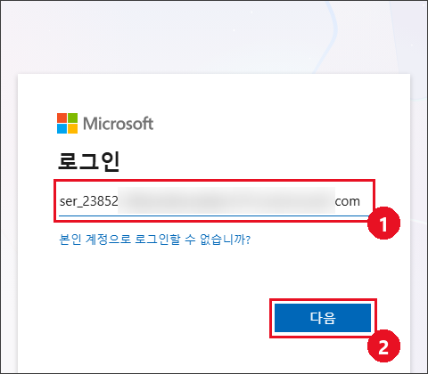

   > **참고:** 원드라이브(OneDrive)를 처음 열면 **Copilot으로 더 스마트하게 작업** 안내
   > 창이 두 단계로 표시됩니다. 첫 번째 안내에서 **(1) 다음**을 선택하고, 두 번째 안내에서
   > **(1) 확인**을 선택하여 닫습니다.

      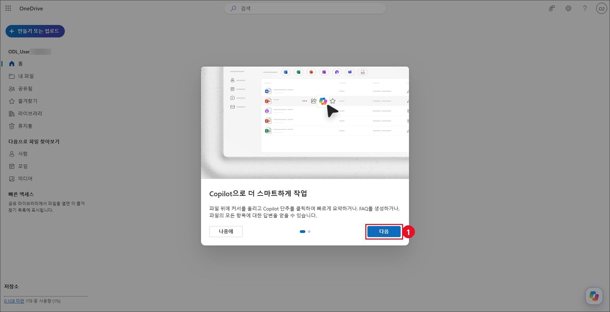

      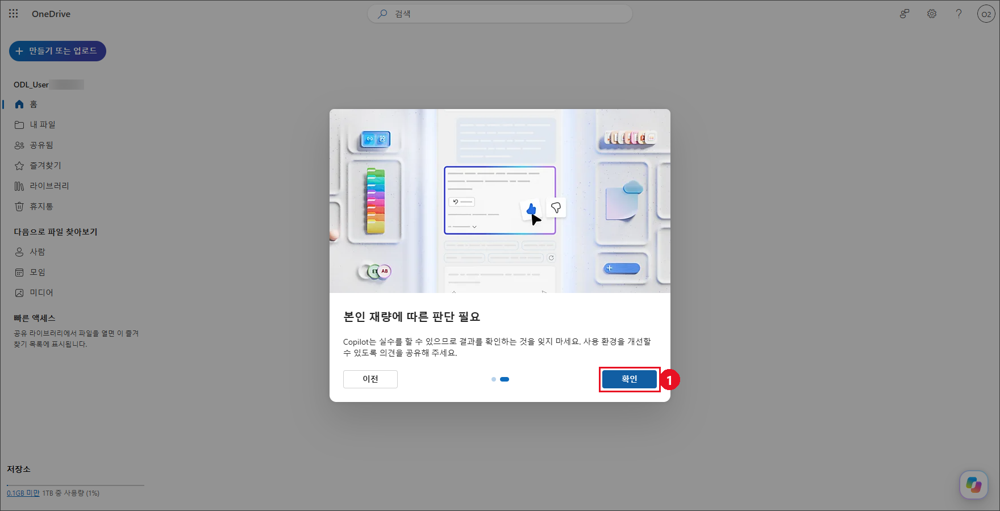

1. 왼쪽 탐색 창에서 **내 파일**을 선택합니다. **(1) 만들기 또는 업로드**를 선택한 후
   **(2) 파일 업로드**를 선택하여 필요한 파일을 업로드합니다.

   > **참고:** 이 메뉴를 처음 열면 **나만의 AI 도우미를 만들어 보세요** 안내 풍선이
   > 표시될 수 있습니다. **해제**를 선택하고 계속 진행합니다.

   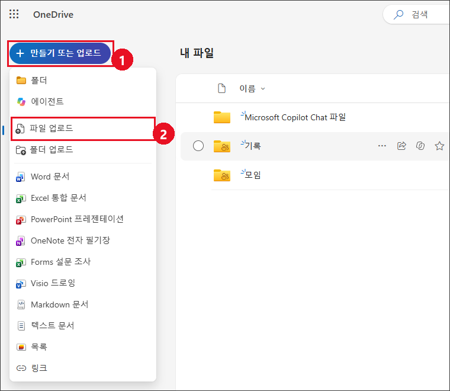

1. GitHub 저장소의 **[07-Lab5-재무-에이전트/labfiles](labfiles)** 폴더에서 다음 파일을 다운로드합니다:
   `Zava Homes COGS update.xlsx`, `Zava Retail Finance meeting notes.txt`,
   `Relecloud Business Perspective.docx`

   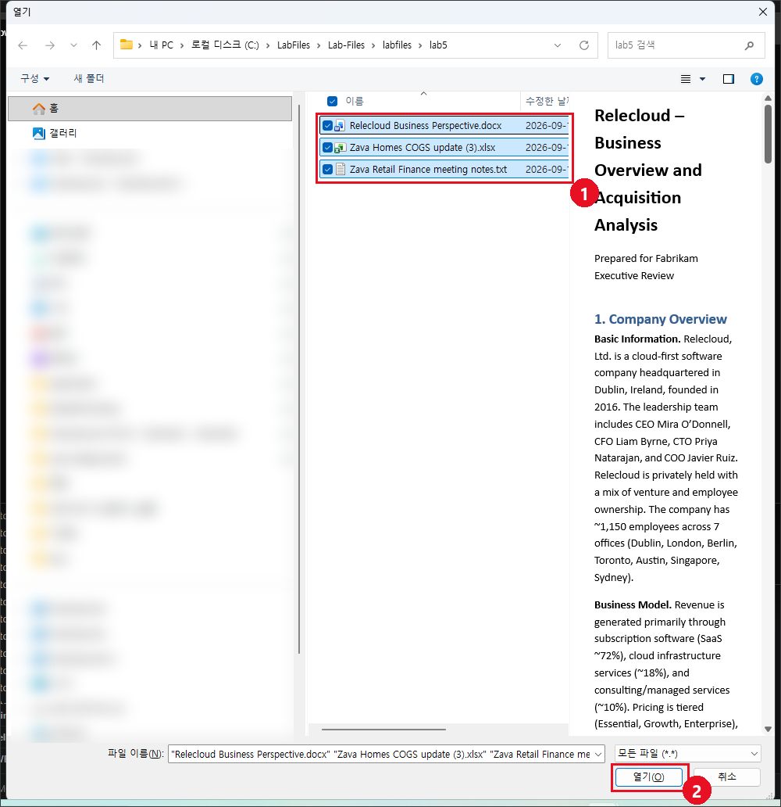

1. **원드라이브(OneDrive) > 내 파일**에서 업로드한 `Zava Homes COGS update.xlsx`
   파일을 선택하여 열고 내용을 검토합니다.

   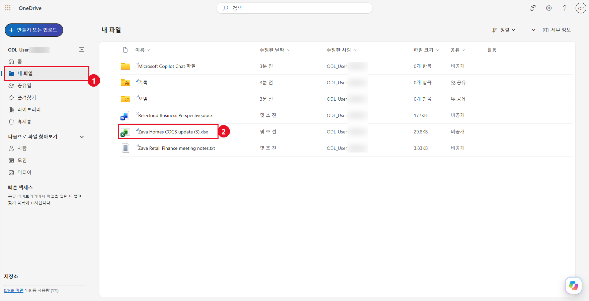

1. Excel 통합 문서가 새 탭에서 열리면 화면 오른쪽 아래의 **Copilot** 아이콘(**Copilot과
   채팅**)을 선택합니다. 오른쪽에 **통합 문서 편집** 창이 열립니다.

   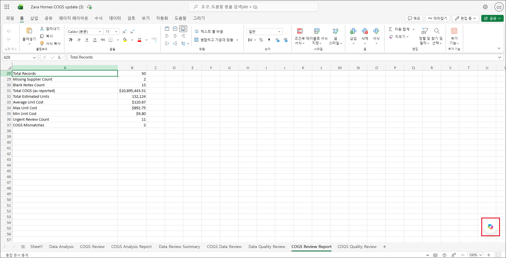

   > **참고:** **더 많은 작업 공간이 필요하세요?** 알림이 표시되면 **X**를 선택하여 닫습니다.

1. 데이터 세트를 분석하려면 **편집하려는 항목 설명** 상자에 아래 **(1) 프롬프트**를
   입력하고 **(2) 보내기**(화살표)를 선택합니다. 코파일럿이 새 시트를 만드는 데 1~2분이
   걸릴 수 있습니다.

   ```
   저는 자바 리테일(Zava Retail)의 재무 분석가입니다. 자바 리테일(Zava Retail)의 신규 Zava Home 제품 라인을 위한 Zava Homes COGS update 스프레드시트를 분석해 주세요. 이 스프레드시트의 데이터 세트를 검토하여 새 시트에 다음 두 가지를 제공해 주세요. (1) 각 주요 열과 그 목적에 대한 명확한 설명, (2) 정확성에 영향을 줄 수 있는 누락되거나 일관성이 없는 데이터 포인트 목록. 새 시트에 간결하고 구조화된 형식으로 결과를 제시해 주세요.
   ```

1. 출력 결과를 검토합니다. 코파일럿이 새 시트에 열 설명과 데이터 품질 이슈를 정리하고,
   오른쪽 창에 결과 요약을 표시합니다. **완료**를 선택하여 변경 내용을 유지합니다.

   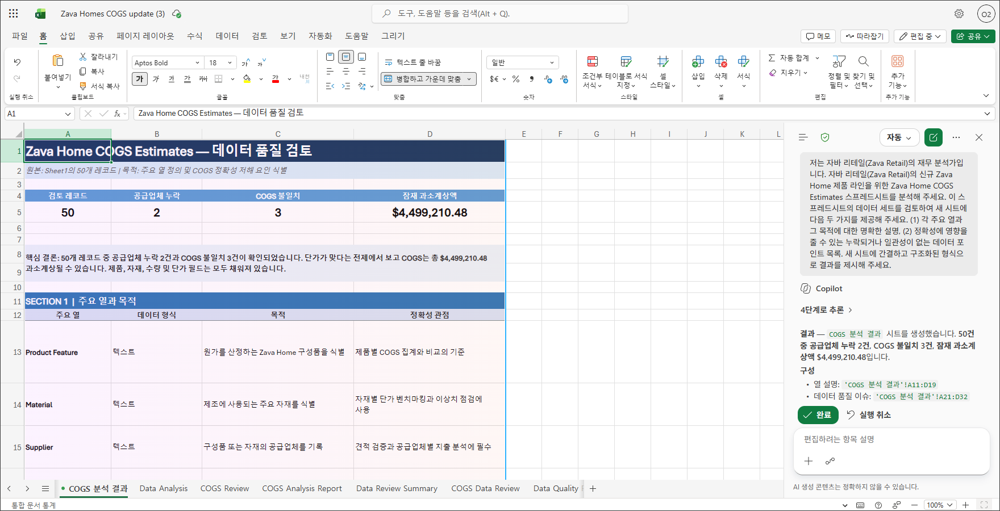

---

## 연습 2: Teams의 코파일럿으로 회의 메모 요약

자바 리테일(Zava Retail)의 재무 분석가로서 여러분은 자바 리테일(Zava Retail)의 재무
관리자 로빈 클라인(Robin Kline)과 재무 팀원 아마리 리베라(Amari Rivera), 퀸시
브룩스(Quincy Brooks), 미겔 레예스(Miguel Reyes), 에릭 솔로몬(Eric Solomon)과
함께 회의에 참석했습니다. 상세한 회의록을 작성할 시간이 없었기 때문에 코파일럿의
도움을 받기로 합니다.

### 작업 1: 회의 메모 요약

1. **원드라이브(OneDrive) > 내 파일**에서 업로드한 `Zava Retail Finance meeting
   notes.txt` 파일을 선택하여 열고 내용을 검토합니다.

   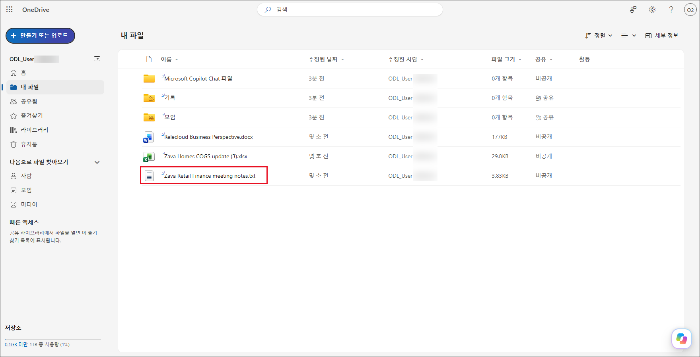

1. 가상 머신에서 브라우저를 열고 <https://teams.microsoft.com/>으로 이동합니다.

1. 코파일럿 챗을 엽니다. 웹용 팀즈(Teams)의 **채팅** 목록 맨 위에 있는 **Copilot**을
   선택합니다. **Copilot Chat에 오신 것을 환영합니다** 화면이 표시되고 위쪽에서 **업무**
   모드가 선택되어 있는지 확인합니다.

   > **참고:** 팀즈(Teams)를 처음 열면 **새 Teams 데스크톱 앱을 다운로드** 배너나 팀의
   > **일반** 채널이 먼저 표시될 수 있습니다. 배너는 무시하고 왼쪽 앱 모음에서 **채팅**을
   > 선택합니다.

   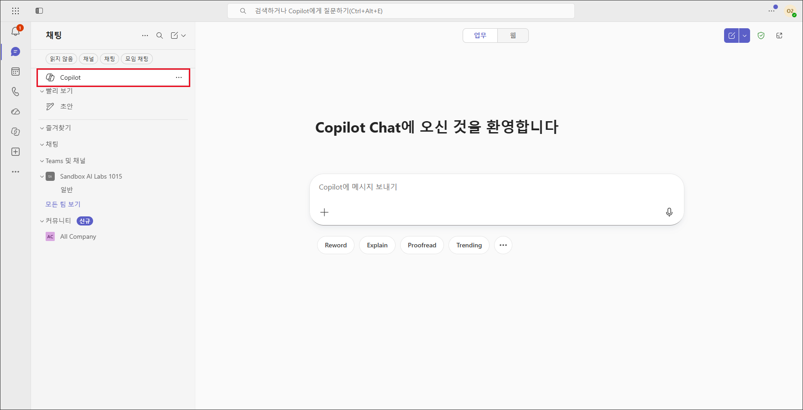

1. **Copilot에 메시지 보내기** 입력창에 다음 **(1) 프롬프트**를 입력하고 **(2) 보내기**를
   선택합니다.

   ```
   원드라이브(OneDrive)의 회의 메모를 다음 세 섹션으로 구성된 문서로 요약해 주세요. 결정 사항, 다음 단계, 담당 업무(회의 메모에 담당자 이름이 명시된 경우 함께 기재). 회의 참가자와 공유할 수 있도록 다운로드 가능한 파일로 만들어 주세요.
   ```

1. 코파일럿이 원드라이브(OneDrive)에 요약 문서를 저장하고 응답에 다운로드 링크를
   표시합니다. **회의 메모 요약 Word 문서 다운로드** 링크를 선택하여 문서를 다운로드합니다.

1. 출력 결과를 검토합니다.

   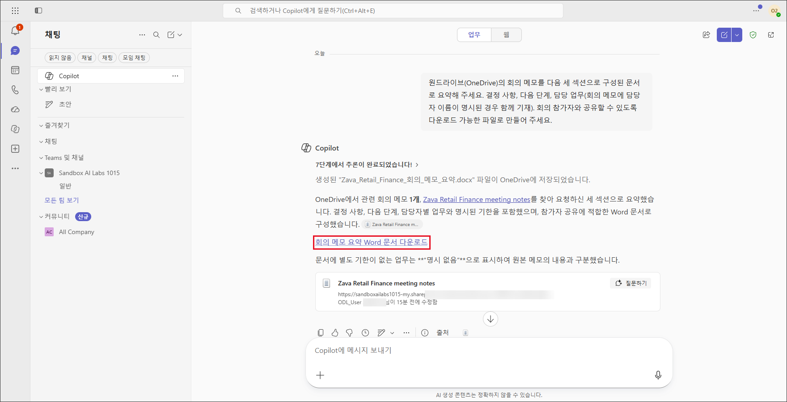

### 작업 2: 작업 목록 생성

보고서 요약에서 다음 단계를 검토한 후 회의 메모의 실행 항목을 기반으로 각 참가자의
상세 작업 목록을 생성하도록 코파일럿에 요청합니다.

1. 작업 목록을 생성하려면 입력창에 다음 **(1) 프롬프트**를 입력하고 **(2) 보내기**를
   선택합니다.

   ```
   회의 요약의 실행 항목과 다음 단계를 기반으로 각 참가자에 대한 상세한 작업 목록을 작성해 주세요. 책임을 명확히 할당하고, 필요한 경우 각 작업의 제안 마감일이나 높음, 중간, 낮음 같은 우선순위 수준을 포함해 주세요.
   ```

1. 출력 결과를 검토합니다.

   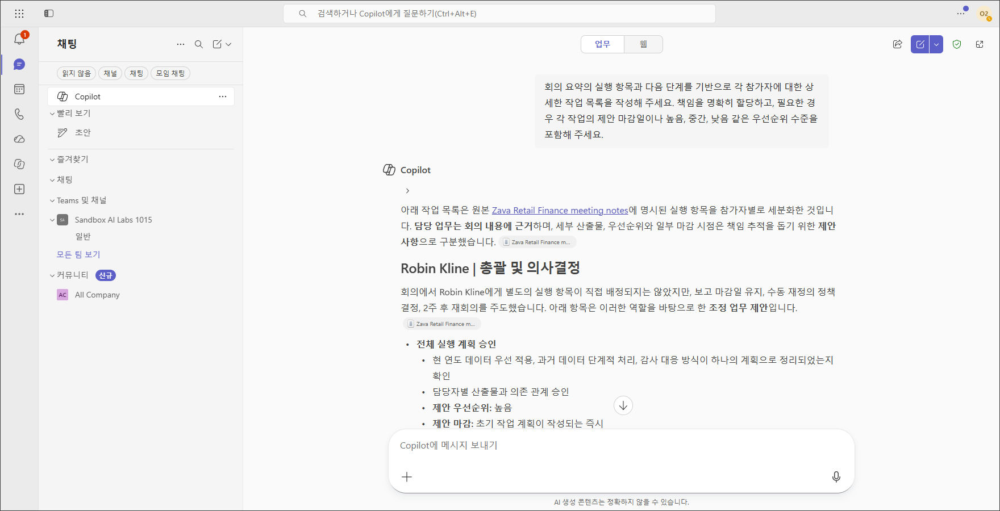

### 작업 3: 후속 이메일 작성

일정 계획의 다음 단계로 팀이 다시 모일 수 있도록 후속 이메일 초안을 작성하도록
코파일럿에 요청합니다.

1. 후속 이메일을 작성하려면 입력창에 다음 **(1) 프롬프트**를 입력하고 **(2) 보내기**를
   선택합니다.

   ```
   팀에 보낼 후속 이메일을 작성해 주세요. 회의 결과를 요약하고 각 참가자의 책임, 마감일, 우선순위 수준이 명시된 할당 작업 목록을 포함해 주세요.
   ```

1. 출력 결과를 검토합니다.

   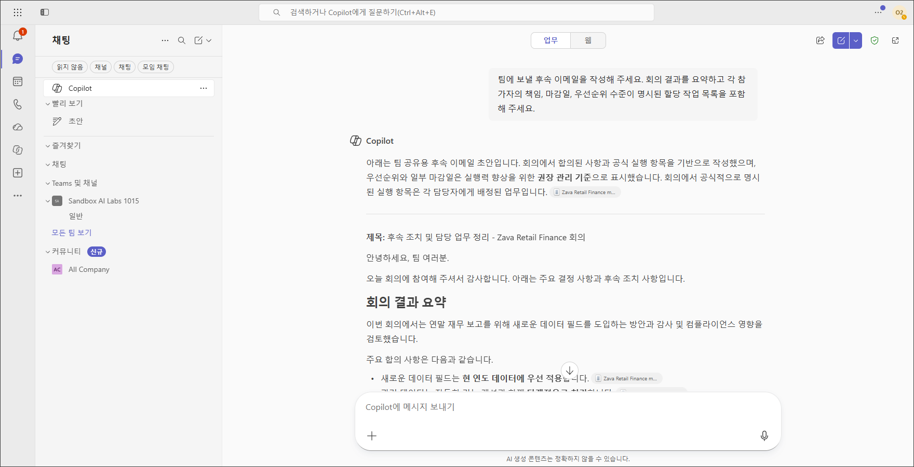

---

## 연습 3: 코파일럿 챗으로 잠재적 인수 분석

자바 리테일(Zava Retail)의 경영진은 릴리클라우드(Relecloud), Ltd.의 잠재적 인수를
검토하고 있습니다. 자바 리테일(Zava Retail)의 재무 관리자 로빈(Robin)이 릴리클라우드
(Relecloud)의 시장 지위, 재무 성과, 고객 및 매출 현황, 운영 역량, 지적 재산, 제품
로드맵, 위험 요소, 미래 전망을 포함한 상세한 비즈니스 분석 자료를 여러분에게 제공했습니다.

이 작업은 코파일럿 챗이 복잡한 재무 정보를 추출, 분류, 구조화하여 실행 가능한 요약으로
전환하는 능력과 구체적인 프롬프트가 일반적이고 모호한 프롬프트보다 일관되게 더 나은
결과를 제공하는 방식을 보여줍니다.

### 작업 1: 비즈니스 분석 요약 생성

1. 원드라이브(OneDrive)의 **내 파일(My files)**에서 연습 1에 업로드한
   `Relecloud Business Perspective.docx` 파일을 확인합니다. 아직 업로드하지 않았다면
   **[07-Lab5-재무-에이전트/labfiles](labfiles)** 폴더에서 해당 파일을 다운로드하여 업로드합니다.

   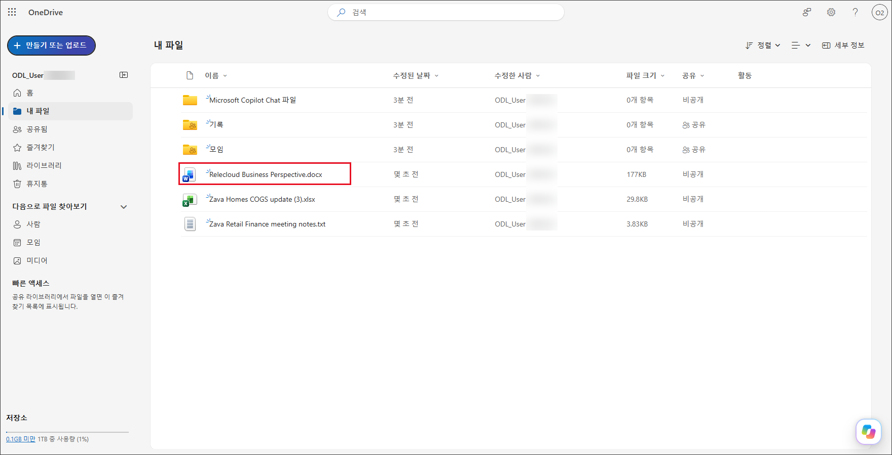

1. `https://m365.cloud.microsoft/`로 이동합니다. 코파일럿 챗이 열리면 화면 왼쪽 위에
   **Work IQ** 모드가 선택되어 있는지 확인합니다.

1. `Relecloud Business Perspective.docx` 파일을 첨부합니다. 입력창 왼쪽의 **(1) +**(원본
   추가 및 관리)를 선택한 후 **(2) 클라우드 파일 첨부**를 선택합니다.

   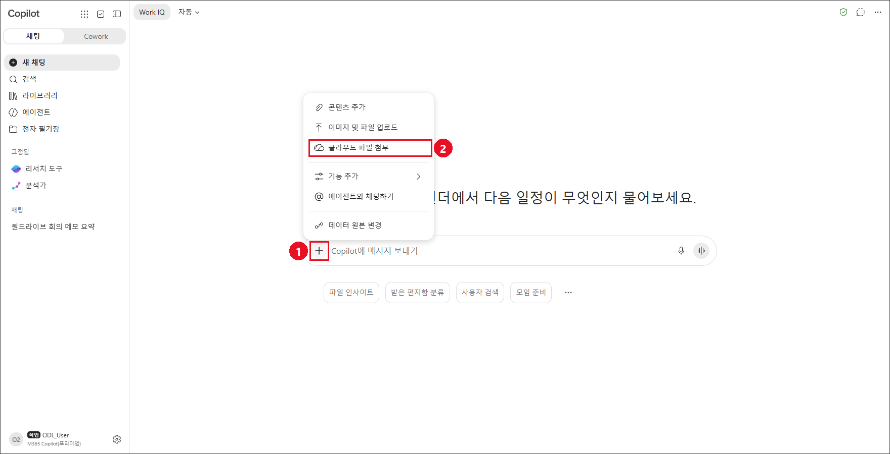

1. **항목 선택** 창에서 **(1) 내 파일**을 선택하고 **(2) Relecloud Business
   Perspective.docx**를 선택한 후 **(3) 선택**을 선택합니다.

   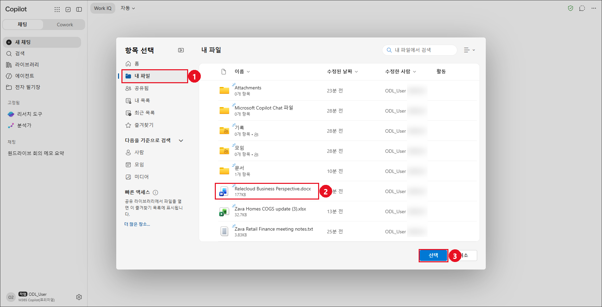

1. 첨부한 파일이 입력창 위에 표시됩니다. 다음 **(1) 프롬프트**를 입력하고 **(2) 보내기**를
   선택합니다.

   ```
   첨부된 릴리클라우드(Relecloud) Business Perspective 문서를 검토하여 다음 세 섹션으로 구성된 비즈니스 분석 요약을 작성해 주세요. (1) 릴리클라우드(Relecloud)의 재무 데이터, (2) 릴리클라우드(Relecloud)의 운영 분석, (3) 인수 통합 계획. 경영진 검토에 적합한 명확하고 체계적인 형식으로 요약을 제시해 주세요.
   ```

   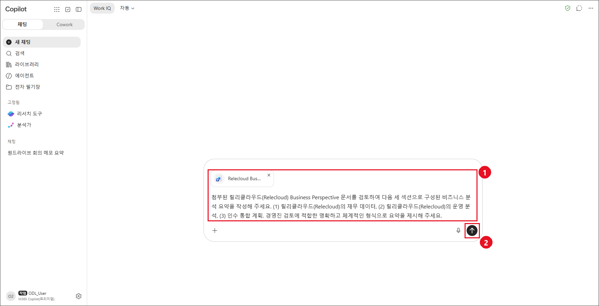

1. 출력 결과를 검토합니다.

   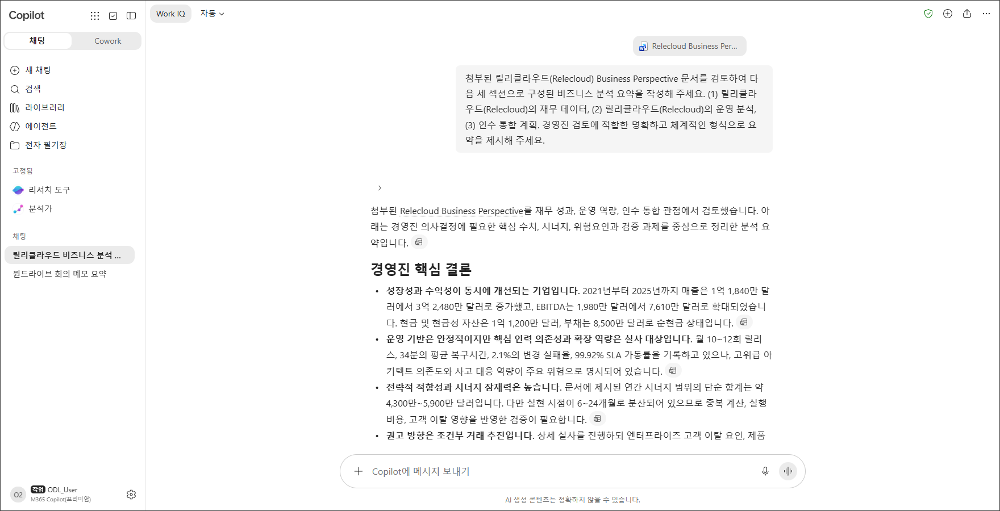

### 작업 2: 요약 확장 및 종합 보고서 생성

초기 요약을 검토한 후 더 깊이 있는 분석과 시각 자료가 포함된 종합적인 보고서를 생성하도록
코파일럿에 요청합니다.

1. 코파일럿 입력창에 다음 **(1) 프롬프트**를 입력하고 **(2) 보내기**를 선택합니다.
   여러 줄을 입력할 때는 Shift+Enter 키로 줄을 바꿉니다.

   ```
   이전 릴리클라우드(Relecloud) 인수 보고서를 확장하여 기존의 모든 정보에 다음 추가 분석을 포함해 주세요.

   재무 분석 섹션:
   - 가치 평가 배수 및 거래 구조 영향을 포함한 가치 평가 및 거래 구조
   - 유동성, 지급 능력, 수익성 추세, 코호트별 총매출-순매출 유지율, 지역별 연간 반복 수익(ARR) 동향, 현금 흐름 분석을 포함한 재무 건전성 및 재무 비율
   - 매출 구성, 고객 및 부문별 집중 위험, 이탈 요인, 유지율 추세를 포함한 매출 및 고객 집중도
   - 시간 경과에 따른 매출, EBITDA, 순이익, 매출총이익률, 영업이익률 추세를 보여주는 선 또는 막대 차트 포함

   운영 분석 섹션:
   - 매출원가(COGS), 운영비, 효율성 지표, 확장성 평가를 포함한 비용 구조 및 효율성
   - SWOT 분석 및 동종 업체 벤치마킹을 포함한 경쟁 포지셔닝
   - 강점, 약점, 기회, 위협을 요약하는 SWOT 매트릭스 시각화 포함
   - DevSecOps 성숙도, 인프라 준비 상태, 조직 확장성을 보여주는 확장성 평가 다이어그램 포함

   통합 계획 섹션:
   - 시너지 실현 기회, 통합 위험, 인수 후 통합 계획을 포함한 시너지 및 통합 모델링
   - 경영진 실적 및 조직 구조 평가를 포함한 리더십 및 조직 검토
   - 인수 후 통합의 단계와 주요 이정표를 보여주는 통합 타임라인(간트 차트) 포함

   재무 리더십의 의사 결정에 적합한 상세한 임원용 인수 분석 형식으로 보고서를 작성해 주세요.
   ```

1. 출력 결과를 검토합니다. 확장 보고서는 생성에 몇 분이 걸릴 수 있으며, 코파일럿이
   Word 문서로 작성한 뒤 다운로드 링크와 함께 주요 내용을 요약해 표시합니다.

   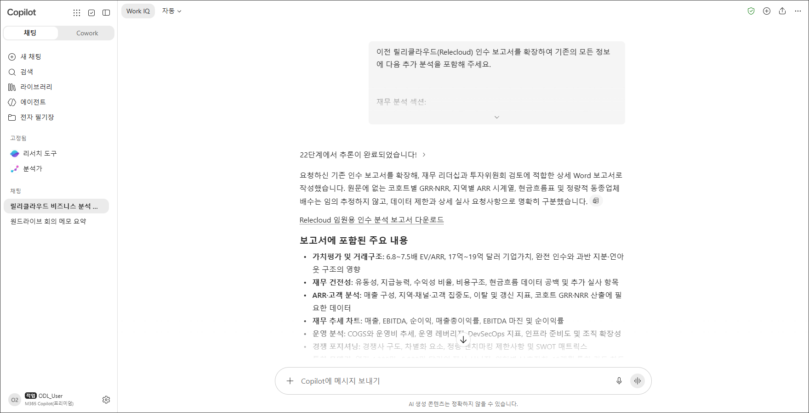

---

## 요약

이 랩에서는 자바 리테일(Zava Retail)의 재무 분석가로서 Excel, 팀즈(Teams), Microsoft
365 코파일럿 챗 전반에서 Microsoft 365 코파일럿을 활용하여 주요 비즈니스 과제를
해결했습니다. Excel에서는 Zava Home 제품 라인의 매출원가(COGS) 데이터를 분석하여
경영진이 검토할 수 있도록 원가 요인, 이상값, 핵심 인사이트를 식별했습니다. 팀즈
(Teams)에서는 재무 회의 메모를 요약하고 참가자별 작업 목록을 생성하며 후속 커뮤니케이션을
작성하고 정책 관련 업무를 지원했습니다. 코파일럿 챗에서는 릴리클라우드(Relecloud)에
대한 상세한 인수 분석을 수행하여 초기 요약에서 시각 자료와 통합 계획이 포함된
종합적인 재무 보고서로 발전시켰습니다. 이 전체 과정에서 명확한 목표, 맥락, 정보 출처,
기대 결과를 명시하는 프롬프트를 작성함으로써 더 정확하고 효과적인 코파일럿 결과를
얻는 방법을 익혔습니다.
