# Lab 6: 에이전트 365로 자바 리테일(Zava Retail) 에이전트 생태계 거버넌스 및 모니터링

## 시나리오

자바 리테일(Zava Retail)의 현장 및 프로젝트 팀은 이미 두 개의 라이브 에이전트를
운영하고 있습니다. 매장 직원을 위해 일정, 표준 운영 절차(SOP, Standard Operating
Procedure), 일상 업무를 지원하는 Holiday helper agent(연말연시 업무 도우미)와 직원들이 프로젝트 문서와
요약을 찾을 수 있도록 도와주는 Project Knowledge Assistant(프로젝트 지식 도우미)입니다. 연말연시가
다가오면서 매장 운영 부문 부사장인 조던 블레이크(Jordan Blake)는 IT 팀에 세 번째
에이전트인 Holiday Returns Helper(연말연시 반품 도우미)를 구축해 달라고 요청했습니다. 이 에이전트는
현장 직원들에게 연말연시 반품 기간, 교환 정책, 환불 방법에 대해 간결하고
모바일 친화적인 답변을 제공합니다. 매장 운영 관리자인 프리야 나이르(Priya Nair)는
에이전트가 사용할 반품 정책 콘텐츠를 작성했으며, 에이전트가 정식 운영되면
업무 책임자(business owner)로 지정될 예정입니다.

여러분은 자바 리테일(Zava Retail)의 AI 관리자인 마야 첸(Maya Chen)입니다.
여러분의 책임은 새로운 에이전트를 구축하는 것 이상입니다. 새로운 에이전트와
테넌트에서 이미 실행 중인 모든 에이전트가 단일 인벤토리에 표시되고, 정식
운영 전에 적절한 승인을 거치고, 현장 직원이 실제로 사용할 Microsoft Teams에
설치되며, 자바 리테일(Zava Retail)이 다른 에이전트에 이미 적용하는 거버넌스
제어(소유권, 차단, 위험 검토, 내보낼 수 있는 보고)를 동일하게 적용받도록 해야
합니다. 검토 진행 중 규정 준수 및 위험 관리 팀의 라일리 오세이(Riley Osei)는
샘 토레스(Sam Torres)의 Holiday helper agent에 대해 우려를 제기하고, 해당
표준 운영 절차(SOP) 응답 문구를 검토하는 동안 에이전트 일시 중지를 요청합니다.
이 실습에서는 코파일럿 스튜디오(Copilot Studio)에서 Holiday Returns Helper를
만들고 게시한 후 설치하고, Microsoft 365 관리 센터의 에이전트 365
개요 및 레지스트리를 사용하여 자바 리테일(Zava Retail) 전체 에이전트 생태계의
에이전트를 검사, 승인, 차단/차단 해제, 내보내기, 소유권 감사를 수행합니다.

## 주요 인물

- **마야 첸(Maya Chen) -- AI 관리자(Zava Retail IT):** 에이전트 365 레지스트리를
  소유하며 테넌트의 모든 에이전트를 승인, 게시, 차단, 감사할 책임을 맡습니다.

- **조던 블레이크(Jordan Blake) -- 매장 운영 부문 부사장(VP):** Holiday
  Returns Helper 프로젝트를 후원했으며 연말연시 전에 모든 매장 직원이 사용할 수
  있기를 요청했습니다.

- **프리야 나이르(Priya Nair) -- 매장 운영 관리자:** 반품 및 교환 업무의 일상
  담당자입니다. 프리야(Priya)가 작성한 반품 정책 콘텐츠가 에이전트의 지식 원본이
  되며, Holiday Returns Helper의 업무 책임자로 지정될 예정입니다.

- **라일리 오세이(Riley Osei) -- 규정 준수 및 위험 분석가:** 정책 문구 검토가
  완료될 때까지 Holiday helper agent를 일시적으로 차단해 달라는 요청을 제출했으며,
  차단 해제가 안전할 때 확인합니다.

## 목표

이 실습에서는 다음을 수행합니다.

1. 업로드한 지식 원본을 사용하여 코파일럿 스튜디오(Copilot Studio)에서 Holiday
   Returns Helper 에이전트를 만들고 게시합니다.

2. 에이전트 365 개요 페이지에서 테넌트 전체 메트릭을 검토합니다. 에이전트 수,
   활성 사용자, 보류 중인 요청, 소유자가 없는 에이전트 등을 확인합니다.

3. 레지스트리에서 보류 중인 에이전트 요청을 검사하고 Holiday Returns Helper를
   스토어에 게시합니다.

4. 새로 게시한 에이전트를 Microsoft Teams에 설치하고 실제 사용자 질문에 올바르게
   응답하는지 확인합니다.

5. 레지스트리에서 에이전트를 차단 및 차단 해제하고 각 작업의 영향을 이해합니다.

6. 오프라인 보고 및 감사 목적으로 전체 에이전트 인벤토리를 CSV로 내보냅니다.

7. 업무 책임자가 없는 에이전트를 식별하고 해당 거버넌스 공백을 해소하는 방법을
   이해합니다.

## 이 실습에서 사용하는 에이전트

## 연습 1: 새 에이전트 만들기 — Holiday Returns Helper

이 작업에서는 Holiday Returns Helper 에이전트를 만들고, 지침 및 지식 원본을
구성하고, 게시한 후, 샘플 반품 및 교환 질문으로 응답을 검증합니다.

1. 웹 브라우저를 열고 다음 링크로 이동합니다.

    ```
    https://copilotstudio.preview.microsoft.com/
    ```

2. **로그인** 페이지에서 제공된 **(1) 사용자 이름**을 입력하고 **(2) 다음**을
   선택합니다.

    - **이메일:** <inject key="AzureAdUserEmail"></inject>

      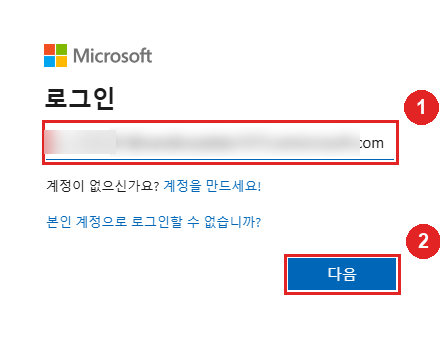

3. 제공된 **(1) 임시 액세스 패스**를 입력하고 **(2) 로그인**을 선택합니다.

    - **임시 액세스 패스:** <inject key="AzureAdUserPassword"></inject>

      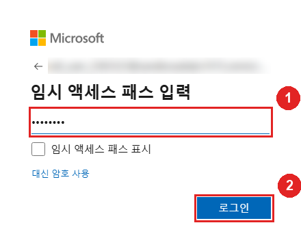

4. **로그인 상태를 유지하시겠습니까?** 메시지가 표시되면 **아니요**를 선택합니다.

    

5. 코파일럿 스튜디오(Copilot Studio) 홈페이지로 리디렉션됩니다. 왼쪽 탐색
   모음에서 **에이전트**를 선택합니다.

    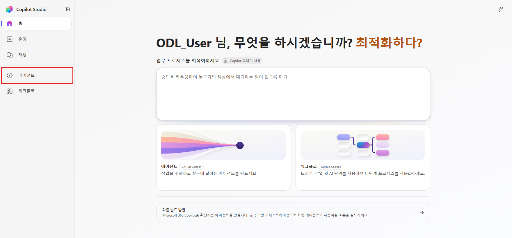

6. 오른쪽 위의 **새 에이전트**를 선택합니다.

    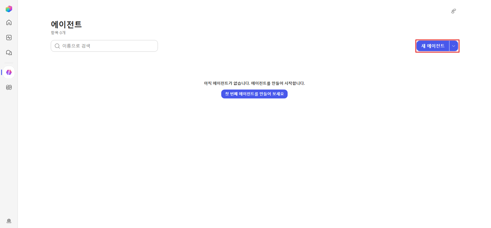

7. 에이전트 편집기가 열립니다. 위쪽의 **에이전트 이름 지정** 필드에 **Holiday
   Returns Helper <inject key="DeploymentID" enableCopy="false"></inject>**를 입력합니다.

    > **참고:** 이름 끝에는 본인의 배포 ID(DeploymentID)를 붙입니다. 이후 요청 목록,
    > 앱 검색, 차단 및 차단 해제 단계에서도 같은 이름을 사용합니다.

    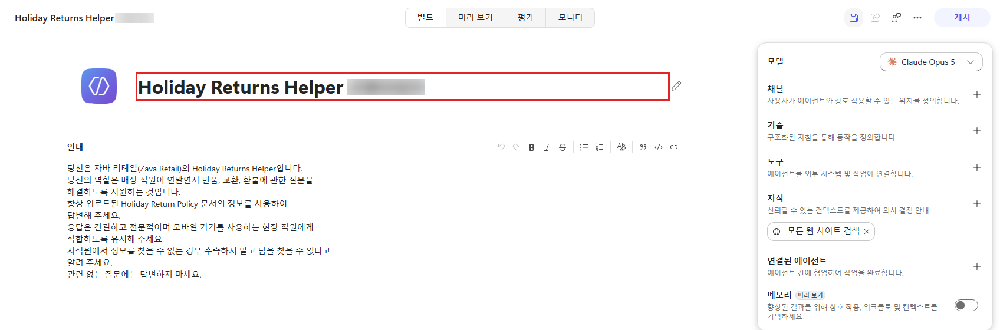

8. **(1) 안내** 필드에 다음 지침을 붙여넣고 오른쪽 위의 **(2) 저장** 아이콘을
   선택합니다.

    ```
    당신은 자바 리테일(Zava Retail)의 Holiday Returns Helper입니다.
    당신의 역할은 매장 직원이 연말연시 반품, 교환, 환불에 관한 질문을
    해결하도록 지원하는 것입니다.
    항상 업로드된 Holiday Return Policy 문서의 정보를 사용하여
    답변해 주세요.
    응답은 간결하고 전문적이며 모바일 기기를 사용하는 현장 직원에게
    적합하도록 유지해 주세요.
    지식 원본에서 정보를 찾을 수 없는 경우 추측하지 말고 답을 찾을 수 없다고
    알려 주세요.
    관련 없는 질문에는 답변하지 마세요.
    ```

    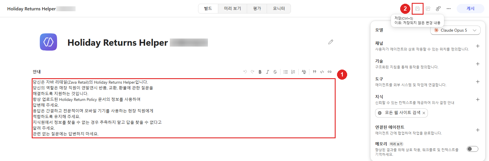

9. 오른쪽 패널의 **지식** 옆에 있는 **+**를 선택합니다. **참조 자료 추가** 대화
   상자에서 **끌어서 놓거나 클릭하여 업로드** 영역을 선택합니다.

    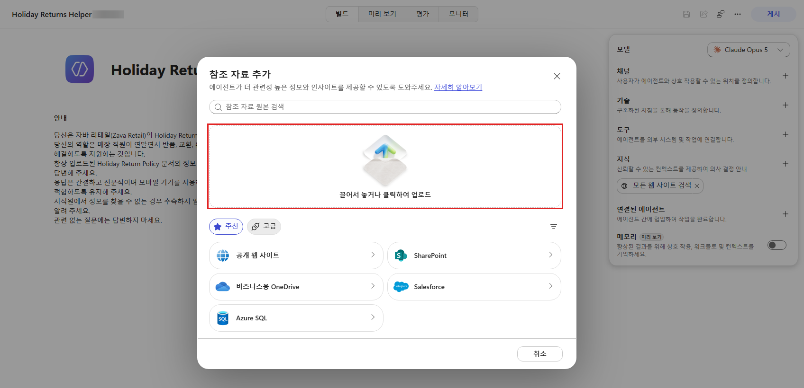

10. **열기** 대화 상자에서 **C:\LabFiles\Lab-Files\labfiles\lab6** 폴더로 이동하여
    **(1) Holiday_Return_Policy.docx**를 선택한 다음 **(2) 열기**를 선택합니다.

    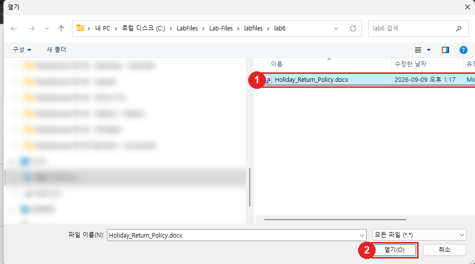

11. **파일 업로드** 대화 상자의 **파일(1)** 목록에 업로드한 파일이 표시되는지
    확인하고 **에이전트에 추가**를 선택합니다.

    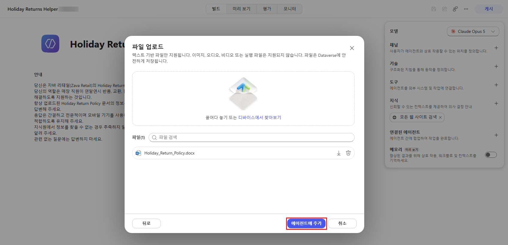

12. **지식** 패널에 **(1) Holiday_Return_Policy.docx**가 추가되었는지 확인합니다.
    에이전트가 정책 문서에만 근거해 답하도록 **모든 웹 사이트 검색** 옆의
    **(2) X**를 선택하여 웹 검색을 제거한 뒤 **저장**을 선택합니다.

    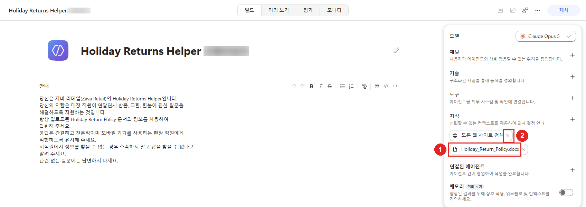

13. 오른쪽 위의 **게시**를 선택합니다.

    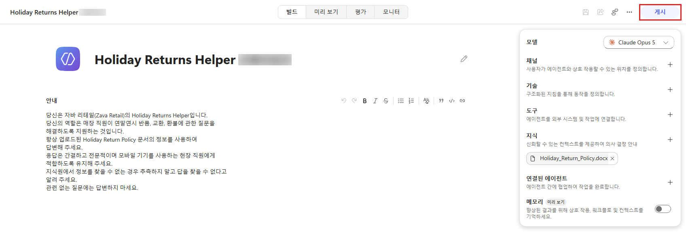

14. **게시** 대화 상자에서 아직 채널이 없으므로 **(1) 채널 추가**를 선택합니다.
    채널을 추가한 뒤에는 **(2) 에이전트 게시**를 선택하게 됩니다.

    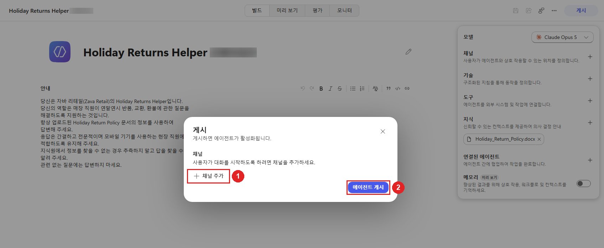

15. **채널 추가** 대화 상자에서 **Teams + Microsoft 365**를 선택합니다.

    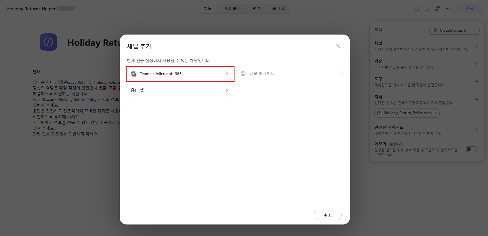

16. **가용성** 페이지에서 **(1) Microsoft 365 Copilot 및 Microsoft Teams**가
    선택되어 있는지 확인하고 **(2) 채널 추가**를 선택합니다.

    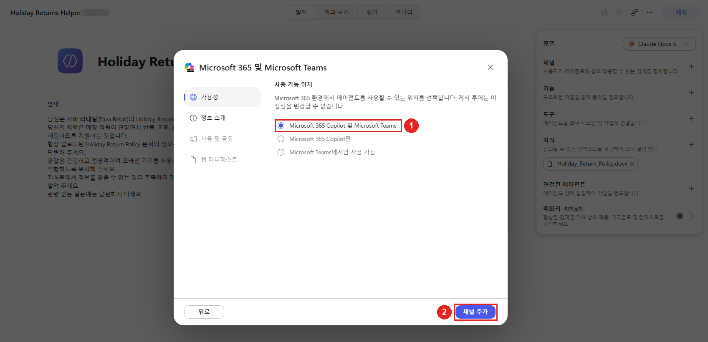

17. **게시** 대화 상자의 **채널** 아래에 **Teams + Microsoft 365**가 표시되면
    **에이전트 게시**를 선택합니다.

    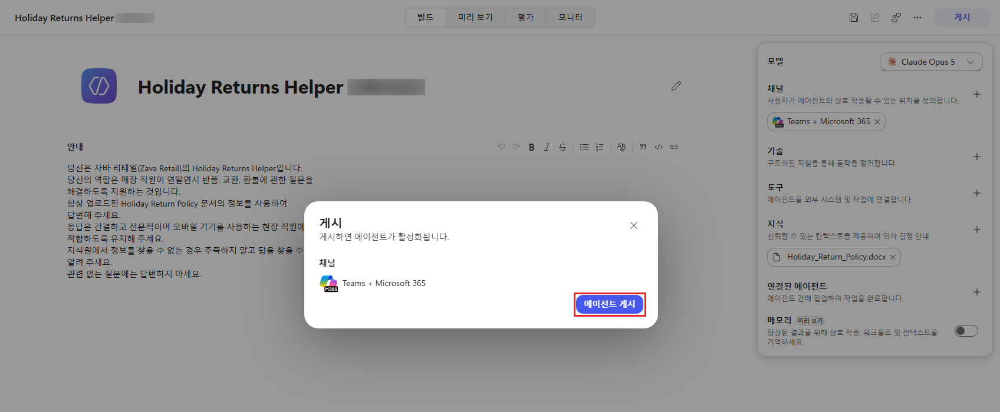

18. **에이전트가 성공적으로 게시되었습니다.** 대화 상자에서 **공유**를 선택합니다.

    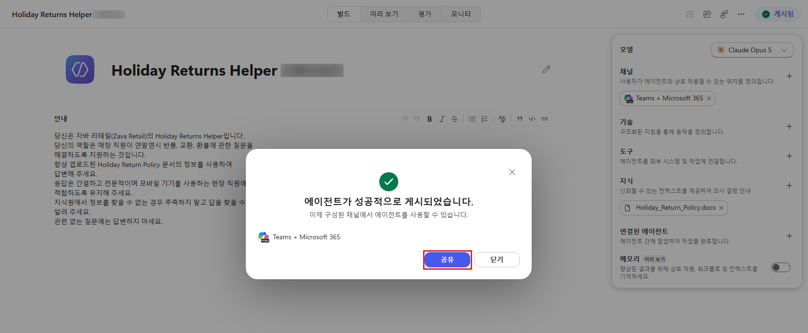

19. 공유 대화 상자의 **조직의 모든 사람** 행에서 **(1) 지정하지 않은 사용 권한
    없음** 드롭다운을 선택하고 **(2) 최종 사용자 액세스**를 선택합니다.

    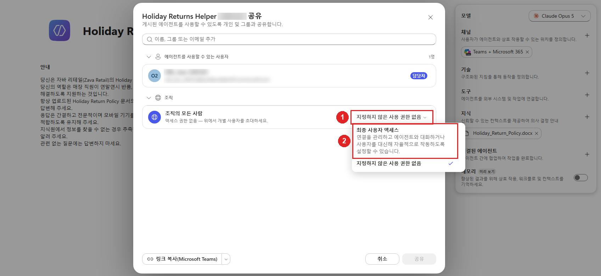

20. **(1) 최종 사용자 액세스**로 바뀐 것을 확인한 다음 **(2) 공유**를 선택합니다.

    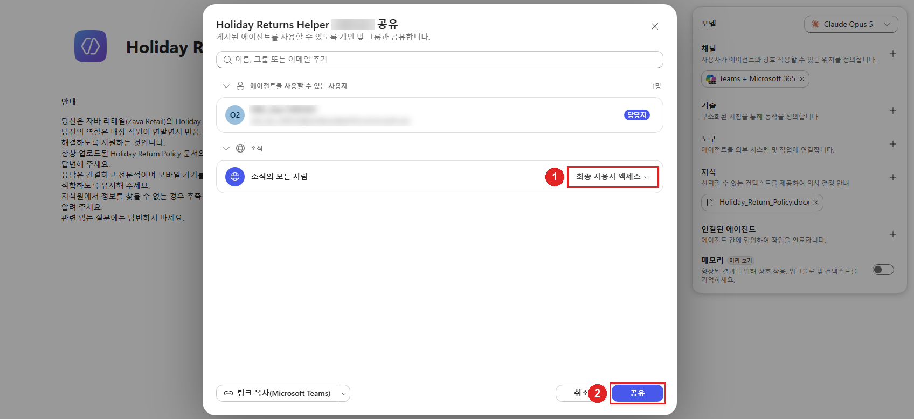

21. 오른쪽 패널의 **채널** 아래에 있는 **Teams + Microsoft 365** 칩을 선택하여 채널
    세부 정보를 엽니다. **(1) 사용 및 공유** 탭을 선택하고 **(2) 조직 카탈로그에
    제출**을 선택합니다.

    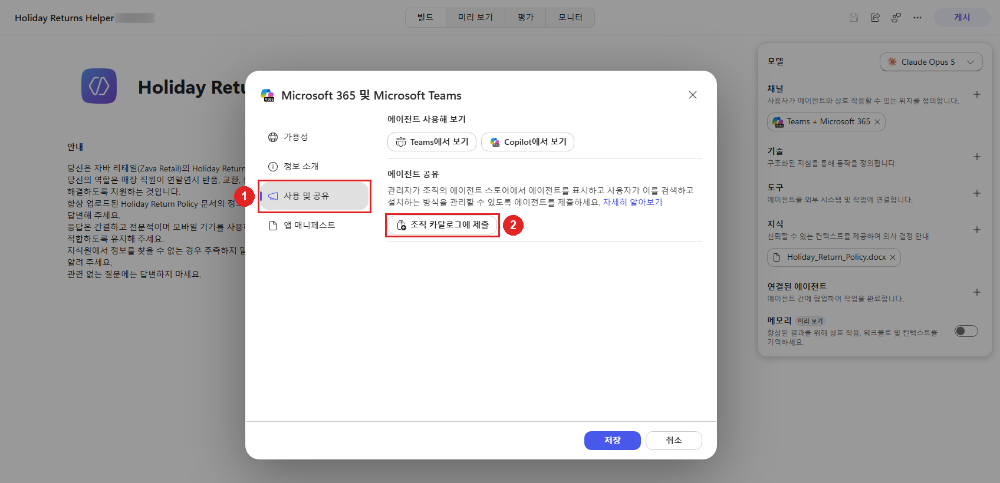

22. 제출 안내 사항을 검토한 후 **조직 카탈로그에 제출**을 선택합니다.

    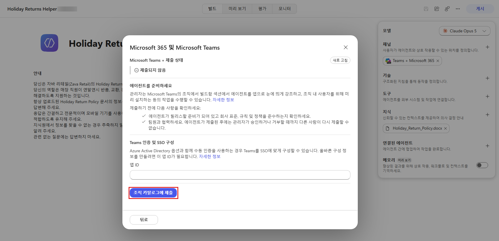

23. 확인 메시지에서 **예, 제출합니다.**를 선택합니다.

    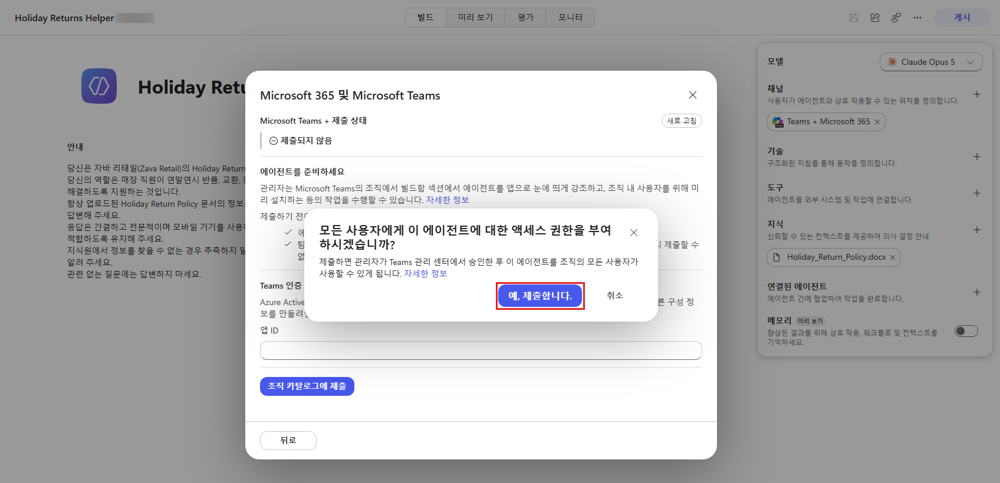

24. **Microsoft Teams + 제출 상태**가 **승인 대기 중**으로 바뀐 것을 확인하고 대화
    상자를 닫습니다. 관리자 승인 절차는 연습 3에서 진행합니다.

    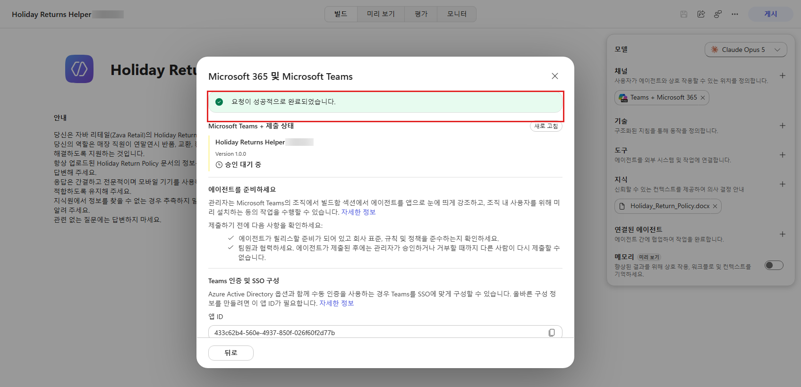

25. 위쪽의 **미리 보기** 탭을 선택하여 에이전트를 테스트합니다.

    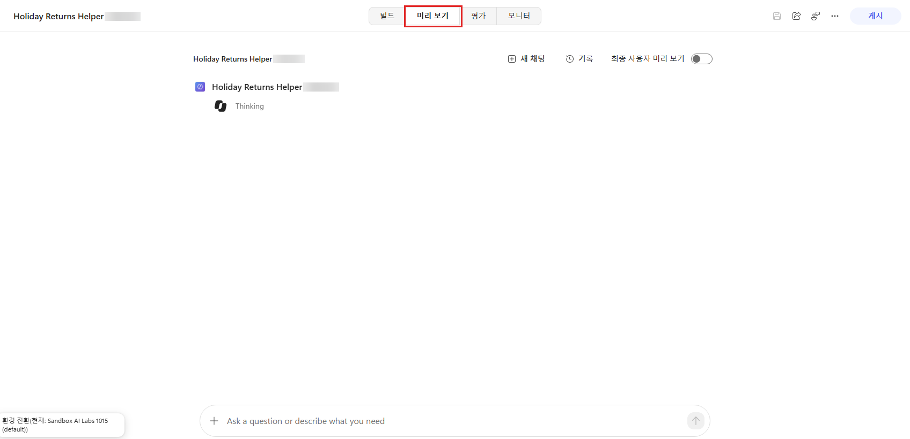

26. 프롬프트 필드에 다음 **(1) 프롬프트**를 입력하고 **(2) 보내기**를
    선택합니다.

    ```
    연말연시 반품 기간은 언제인가요?
    ```

    

27. 에이전트가 업로드한 정책 문서를 인용하여 품목별 반품 기간을 설명하는지
    확인합니다.

    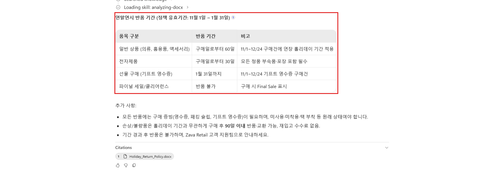

    > **참고:** 방금 업로드한 문서의 색인이 아직 끝나지 않았으면 에이전트가 문서를
    > 찾을 수 없다고 답할 수 있습니다. 1~2분 기다린 후 **새 채팅**을 선택하고
    > 같은 질문을 다시 입력하세요.

28. 다음 **(1) 프롬프트**를 입력하고 **(2) 보내기**를 선택합니다.

    ```
    고객이 환불을 요청하는 대신 상품을 교환할 수 있나요?
    ```

    

29. 교환 정책이 지식 문서와 일치하는지 확인합니다.

    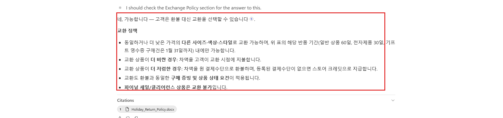

## 연습 2: 에이전트 레지스트리 탐색 및 에이전트 활동 모니터링

이 작업에서는 에이전트 레지스트리 메트릭, 활성 사용자, 보류 중인 에이전트
요청, 소유자가 없는 에이전트, 에이전트 분석을 검토합니다.

1. 브라우저를 열고 다음 링크로 이동합니다.

    ```
    https://admin.cloud.microsoft/
    ```

2. 왼쪽 탐색 창에서 **(1) 에이전트**를 확장하고 **(2) 개요**를 선택합니다.

    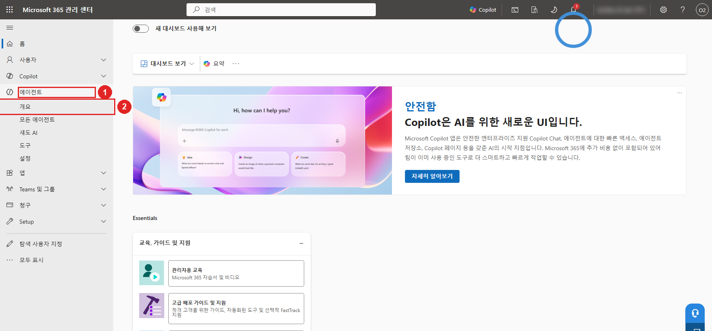

3. **Agent 365 개요** 페이지에서 다음 메트릭을 찾아 현재 값을 기록합니다.

    a. **(1) 에이전트 레지스트리** — 조직의 총 에이전트 수입니다.

    b. **(2) 활성 사용자** — 에이전트와 상호 작용한 고유 사용자 수입니다.

    c. **(3) 에이전트에 대한 보류 중인 요청** — 특정 에이전트를 추가하기 위한
       미결 요청입니다. 연습 1에서 제출한 Holiday Returns Helper가 여기에
       표시됩니다.

    d. **(4) 소유자가 없는 에이전트** — 소유자가 퇴사한 에이전트입니다.

    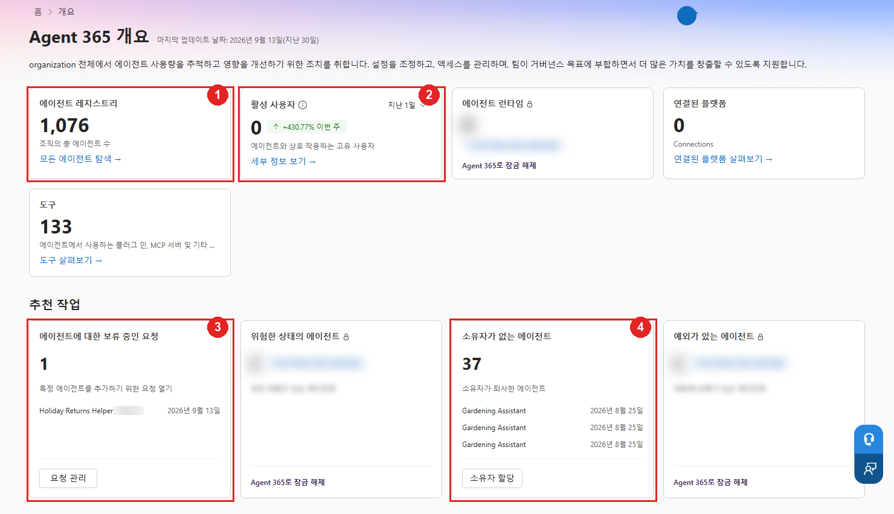

    e. 아래로 스크롤하여 **에이전트 분석** 섹션을 검토합니다. 작성자별 에이전트,
       에이전트를 빌드하는 데 사용되는 상위 플랫폼, 시간 경과에 따른 활성 사용자,
       활성 사용자별 인기 에이전트를 확인할 수 있습니다.

    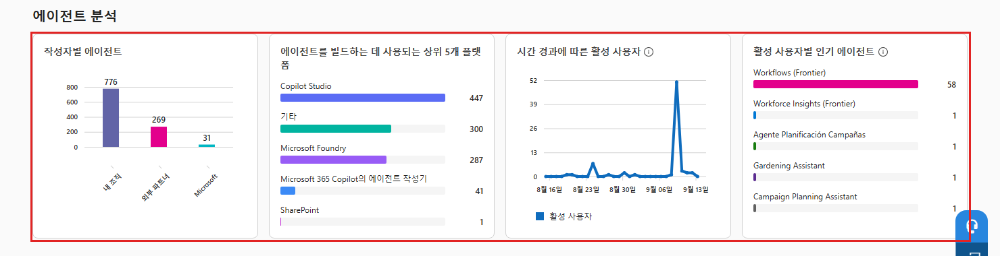

## 연습 3: Holiday Returns Helper 에이전트 검사, 게시, 검증

이 연습에서는 에이전트 레지스트리에서 Holiday Returns Helper 에이전트를
검토하고 조직용으로 게시한 후 Microsoft Teams에 설치하고 응답을 검증합니다.

### 작업 1: 에이전트 레지스트리에서 에이전트 검토 및 게시

이 작업에서는 Holiday Returns Helper 제출을 검토하고 조직의 에이전트 스토어에
에이전트를 게시합니다.

1. 왼쪽 탐색 창의 **에이전트** 아래에서 **(1) 모든 에이전트**를 선택한 다음
   **(2) 요청** 탭을 선택합니다.

    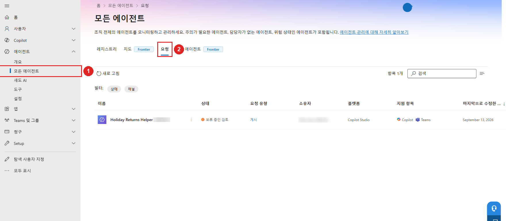

2. 요청 목록에서 **Holiday Returns Helper <inject key="DeploymentID" enableCopy="false"></inject>**를
   찾아 이름 옆의 세로 **⋮**(행 편집)를 선택합니다.

    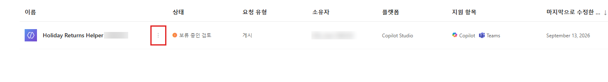

3. **Microsoft Store에 게시** 또는 **제출 거부** 중 하나를 선택할 수 있습니다.
   지금은 **Microsoft Store에 게시**를 선택합니다.

    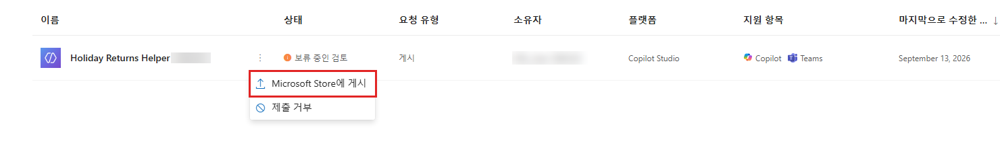

4. **새 에이전트 게시** 마법사의 **사용자 선택** 단계에서 **에이전트를 설치할 수
   있는 사용자 또는 그룹 선택** 아래의 **(1) 모든 사용자**를 선택하고, **에이전트를
   미리 설치할 사용자 또는 그룹 선택(선택 사항)** 아래의 **(2) 모든 사용자**를
   선택한 다음 **(3) 다음**을 선택합니다.

    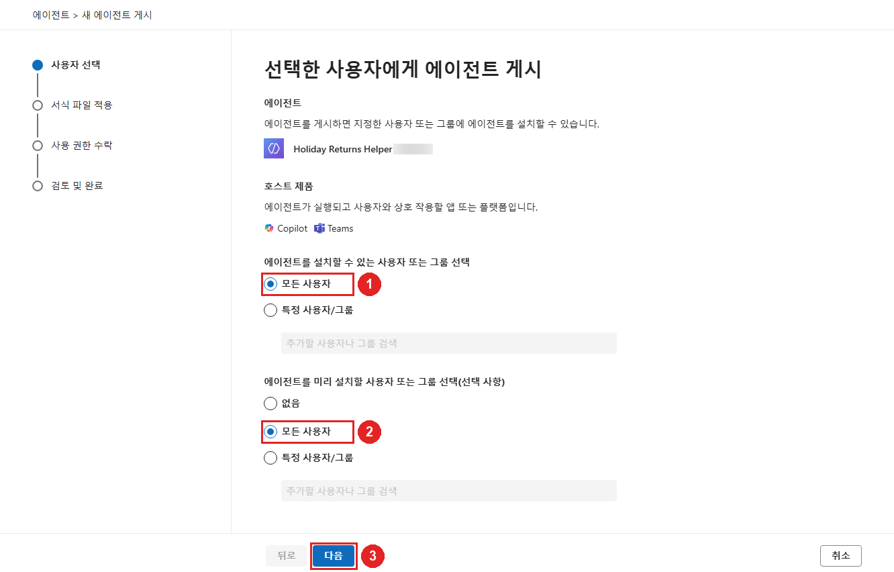

5. **서식 파일 적용** 단계에서 기본 정책 템플릿을 그대로 두고 **다음**을
   선택합니다.

    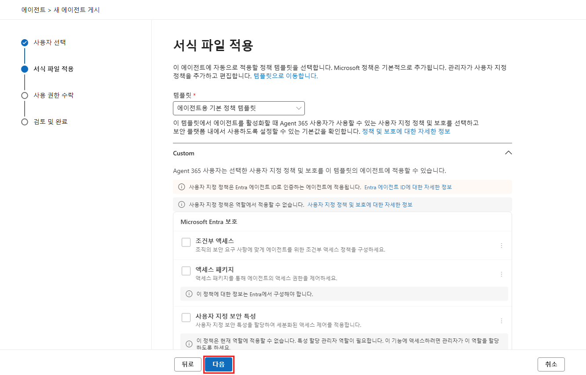

6. **사용 권한 수락** 단계에서 **다음**을 선택합니다. 이 에이전트에는 특별한
   권한이 필요하지 않습니다.

    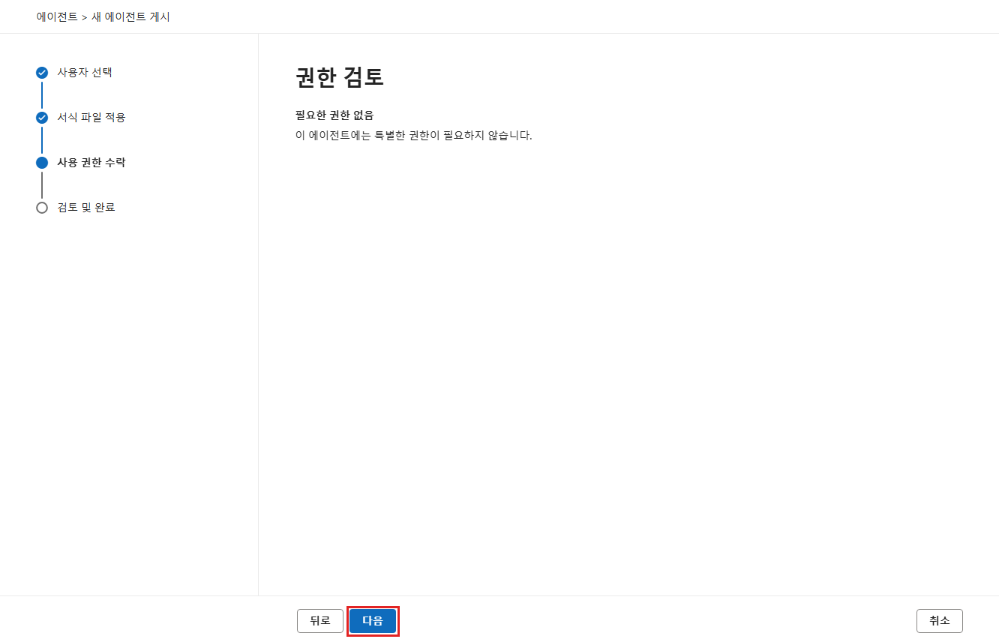

7. **검토 및 완료** 단계에서 **게시**를 선택합니다.

    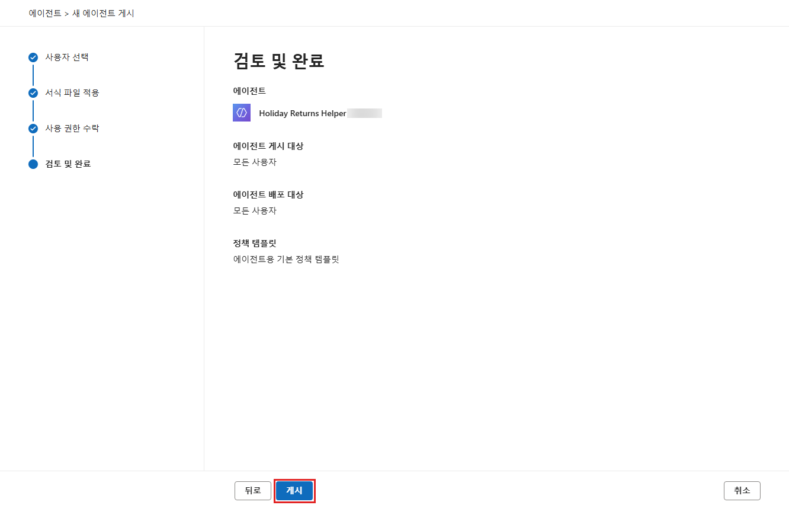

8. **Holiday Returns Helper … 게시함** 화면이 표시되면 **완료**를 선택합니다.

    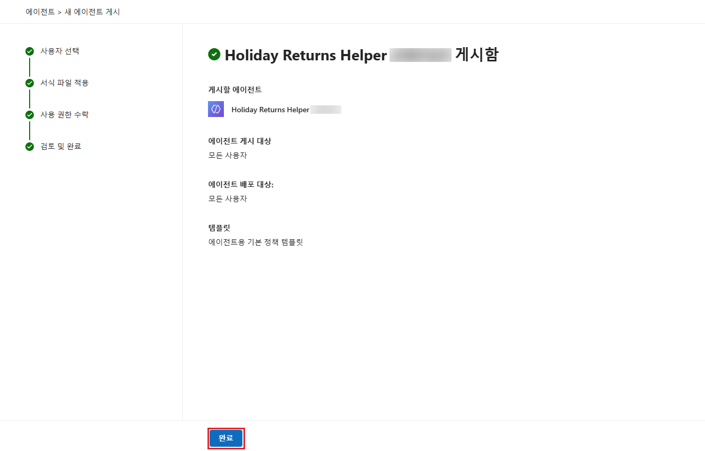

9. **레지스트리** 탭에서 **Holiday**를 검색하여 게시한 에이전트의 상태가
   **사용 가능**인지 확인합니다.

    

### 작업 2: Microsoft Teams에 에이전트 설치

이 작업에서는 게시된 Holiday Returns Helper 에이전트를 Microsoft Teams에
설치하여 현장 직원이 사용할 수 있도록 합니다.

1. **Microsoft Teams**를 엽니다. 다음 링크로 이동합니다.

    ```
    https://teams.cloud.microsoft/
    ```

2. 왼쪽 앱 모음에서 **앱**(저장소)을 선택합니다. **(1) 검색** 상자에 **Holiday**를
   입력하고 Enter 키를 누른 다음, 결과에서 **(2) Holiday Returns Helper <inject key="DeploymentID" enableCopy="false"></inject>** 카드를 선택합니다.

    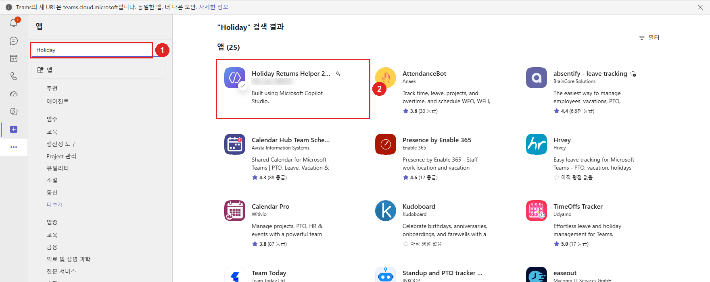

3. 앱 세부 정보 대화 상자에서 **Copilot으로 열기**를 선택합니다. 연습 3의 작업
   1에서 모든 사용자에게 미리 설치하도록 게시했기 때문에 이미 설치된 상태로
   표시됩니다.

    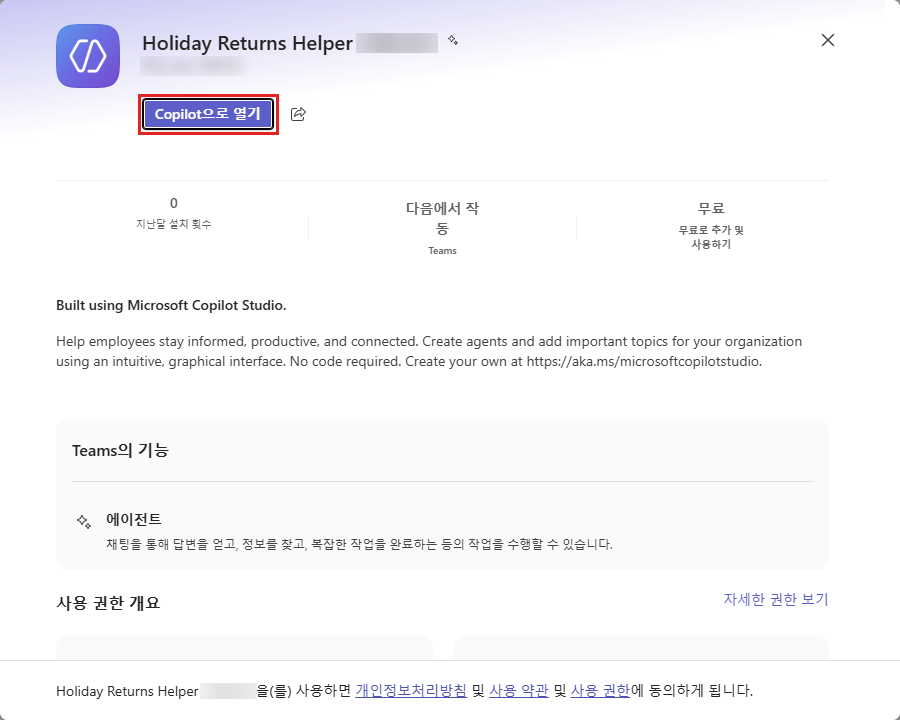

    > **참고:** 미리 설치 대상에 포함되지 않은 사용자에게는 **Copilot으로 열기**
    > 대신 **추가** 단추가 표시됩니다. 이 경우 **추가**를 선택하여 에이전트를
    > 설치합니다.

### 작업 3: 에이전트의 응답 검증

이 작업에서는 Microsoft Teams에서 Holiday Returns Helper를 테스트하고
고객 반품, 교환, 환불 질문에 정확히 응답하는지 검증합니다.

1. Microsoft Teams의 Copilot 창에 **Holiday Returns Helper** 에이전트가 열립니다.

    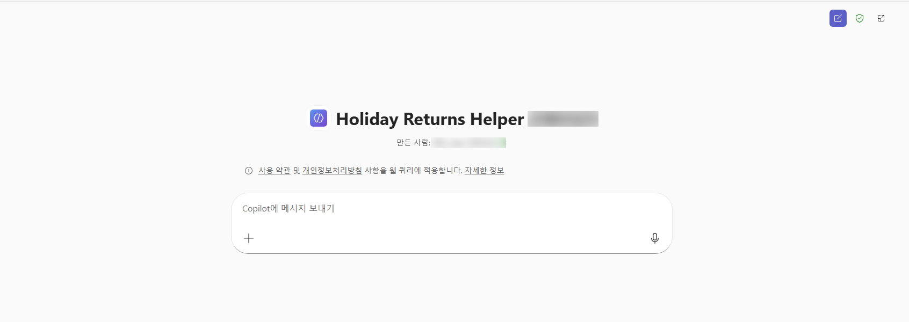

2. 다음 **(1) 프롬프트**를 입력하고 **(2) 보내기**를 선택합니다.

    ```
    고객이 환불을 요청하는 대신 상품을 교환할 수 있나요?
    ```

    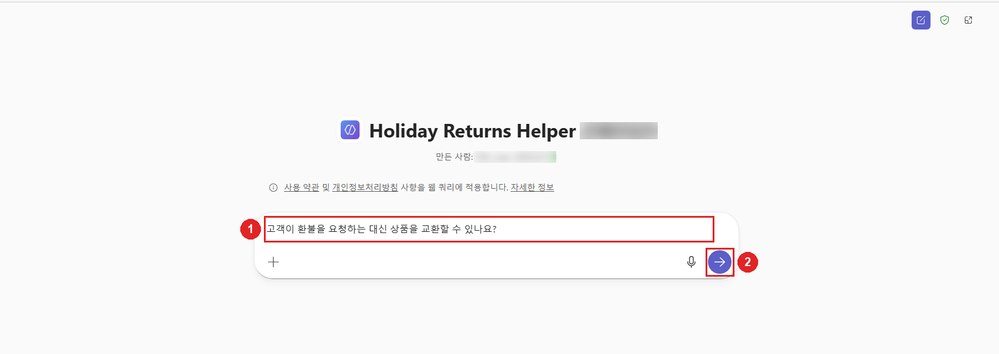

3. 응답을 검토하고 교환 정책이 올바르게 설명되었는지 확인합니다.

    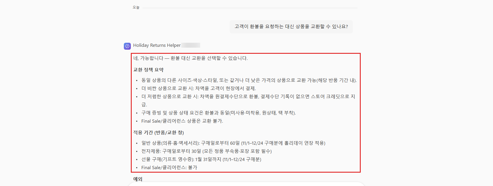

4. 다음 **(1) 프롬프트**를 입력하고 **(2) 보내기**를 선택합니다.

    ```
    지원되는 환불 방법은 무엇인가요?
    ```

    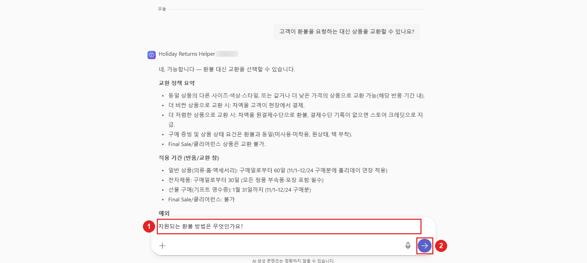

5. 응답을 검토하고 지원되는 환불 방법이 정확하게 설명되었는지 확인합니다.

    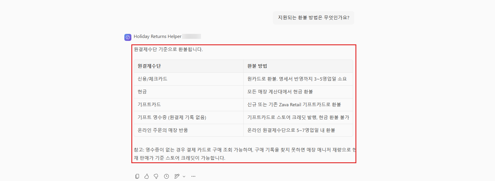

## 연습 4: 에이전트 차단 및 차단 해제

이 연습에서는 라일리(Riley)의 요청처럼 검토가 끝날 때까지 에이전트를 잠시 막아야
할 때를 대비해, 에이전트 레지스트리에서 에이전트를 차단하고 차단 상태를 검토한
후 다시 사용 가능 상태로 복원하는 절차를 연습합니다.

> **참고:** 실습 테넌트에는 시나리오의 Holiday helper agent가 없으므로, 다른
> 학습자의 에이전트에 영향을 주지 않도록 연습 1에서 직접 게시한 **Holiday Returns
> Helper <inject key="DeploymentID" enableCopy="false"></inject>**를 대상으로 진행합니다.

### 작업 1: 에이전트 차단

이 작업에서는 모든 사용자에 대해 에이전트를 차단하고 차단 이유를 기록합니다.

1. **모든 에이전트** 페이지에서 **레지스트리** 탭을 선택합니다. 검색 상자에
   **Holiday**를 입력하여 목록을 좁힌 다음, 본인이 게시한 에이전트를 선택하여
   세부 정보 창을 엽니다.

    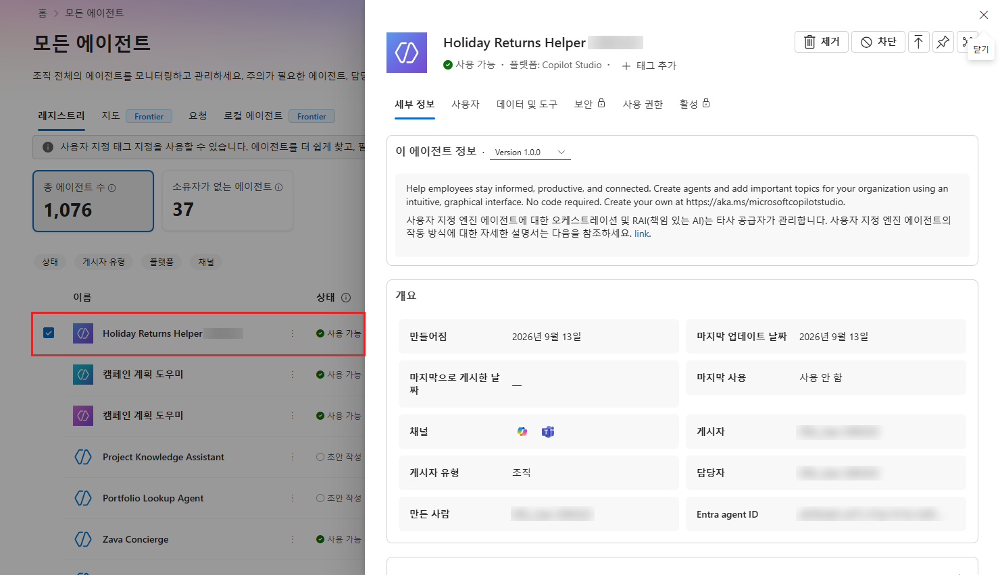

2. 세부 정보 창 위쪽에서 **차단**을 선택합니다.

    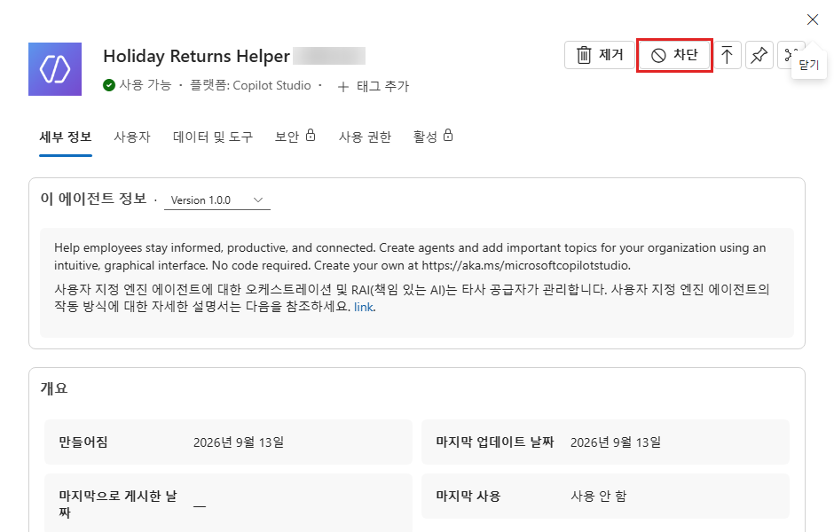

3. **에이전트 차단** 창에서 차단하면 조직의 사용자가 에이전트를 설치하거나 사용할
   수 없다는 메시지를 검토합니다. **(1) 에이전트 차단** 체크박스를 선택하고,
   **(2) 차단 이유(선택 사항)**에서 **사용 승인되지 않음**을 선택한 다음
   **(3) 저장**을 선택합니다.

    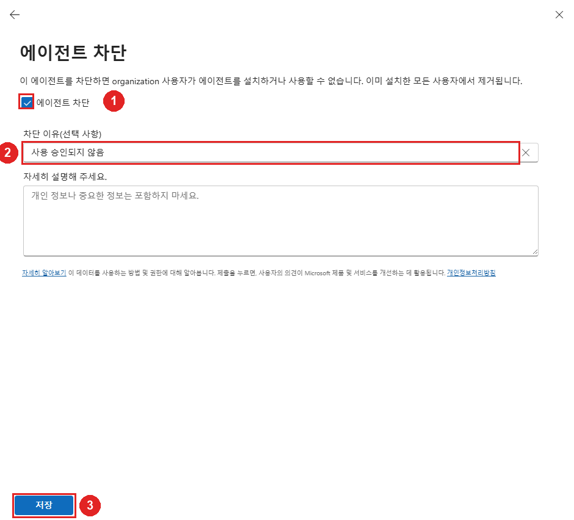

4. 세부 정보 창과 에이전트 목록에 **차단됨** 상태가 표시되는지 확인합니다.

    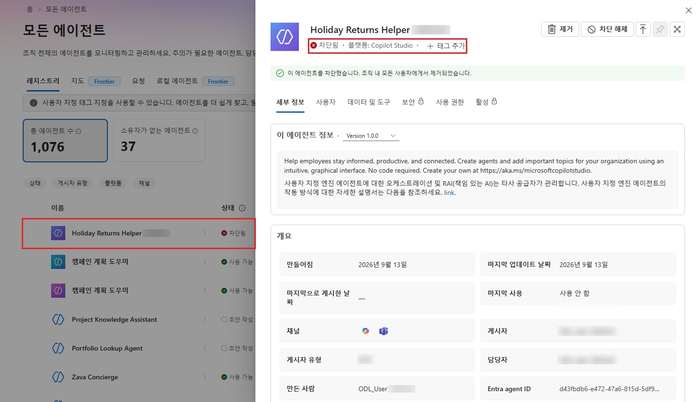

### 작업 2: 에이전트 차단 해제

이 작업에서는 에이전트의 차단을 해제하고 상태가 **사용 가능**으로 복원되는지
확인합니다.

1. 세부 정보 창 위쪽에서 **차단 해제**를 선택합니다.

2. **에이전트 차단 해제** 창에서 **에이전트 차단 해제** 체크박스를 확인합니다.

    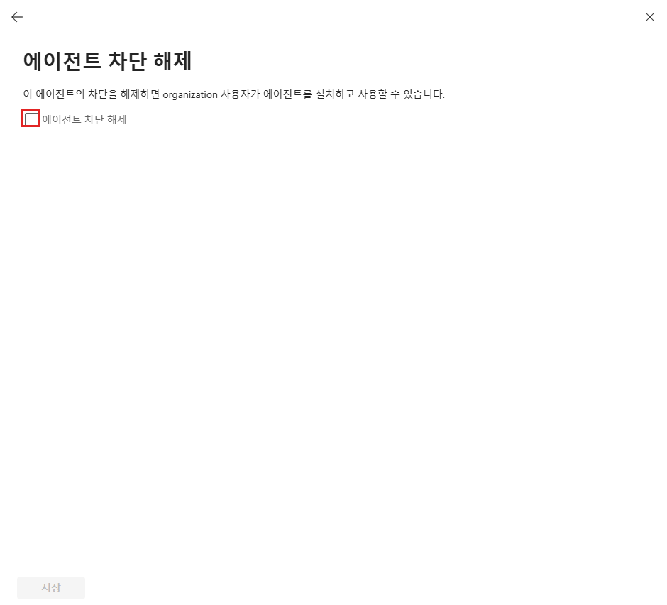

3. **(1) 에이전트 차단 해제** 체크박스를 선택한 다음 **(2) 저장**을 선택합니다.
   세부 정보 창을 닫습니다.

    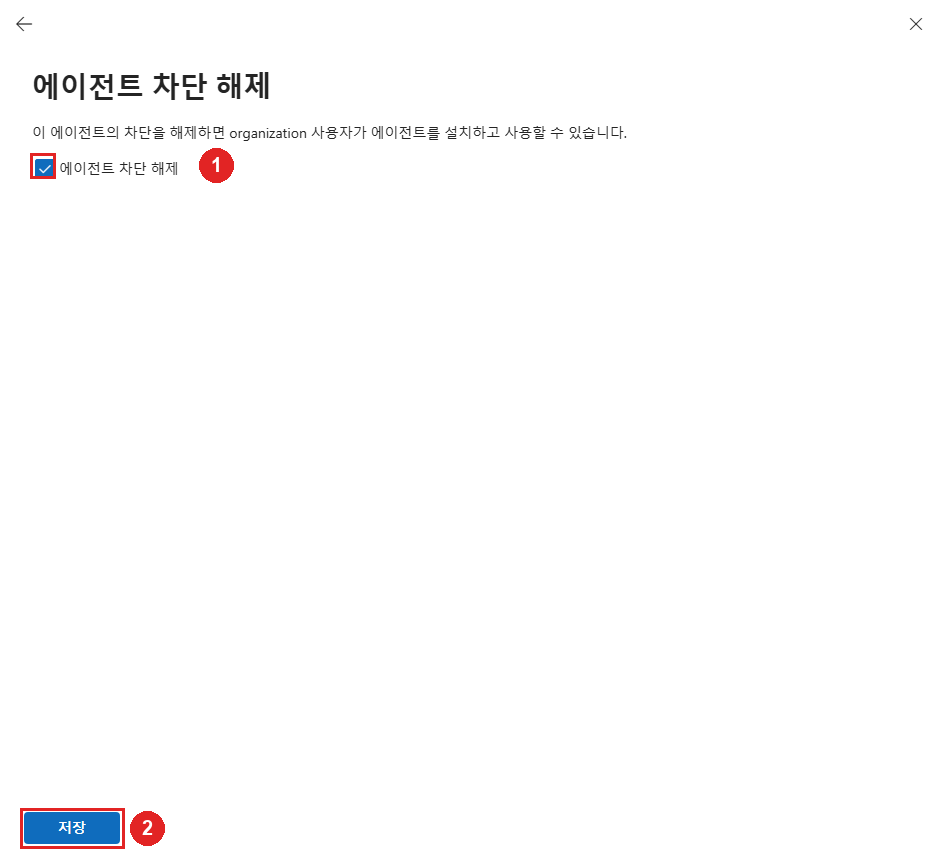

4. 목록에서 **새로 고침**을 선택하고 에이전트 상태가 다시 **사용 가능**으로
   표시되는지 확인합니다.

    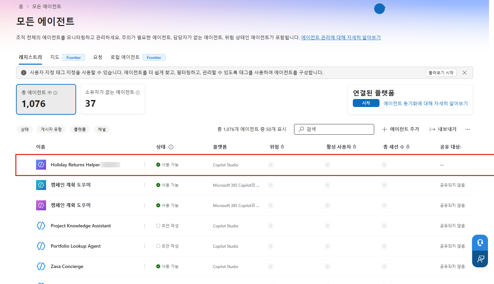

## 요약

이 실습에서는 Microsoft 코파일럿 스튜디오(Copilot Studio)에서 새 에이전트를
만들고 게시했습니다. 에이전트 365 개요를 탐색하여 테넌트 전체 에이전트
활동을 모니터링하고, 에이전트 레지스트리를 사용하여 조직용 에이전트를 검토,
승인, 게시했습니다. Microsoft Teams에 에이전트를 설치하고 응답을 검증했으며,
에이전트 차단 및 차단 해제 작업을 수행했습니다. 또한 보고 목적으로 에이전트
인벤토리를 내보내고 잠재적인 소유권 공백을 식별했습니다. 이러한 작업은 조직
전체에서 AI 에이전트에 거버넌스를 적용하고 모니터링하며 관리하는 에이전트 365의 핵심
기능을 보여 줍니다.

이 실습을 마치면 다음을 수행할 수 있습니다.

- 업로드한 지식 원본을 사용하여 코파일럿 스튜디오(Copilot Studio)에서 새 에이전트를
  만들 수 있습니다.

- 에이전트 365 개요 페이지에서 테넌트 전체 에이전트 메트릭을 검토할 수 있습니다.

- 에이전트 레지스트리를 사용하여 에이전트를 검토, 승인, 게시할 수 있습니다.

- 새 에이전트를 Microsoft Teams에 설치하고 응답을 검증할 수 있습니다.

- 에이전트 레지스트리에서 에이전트를 차단 및 차단 해제할 수 있습니다.

- 거버넌스 및 규정 준수를 위해 에이전트 인벤토리를 내보낼 수 있습니다.
