# Lab 7: 퀴즈 생성 에이전트의 토픽을 위한 프롬프트 액션 구현

## 목표

프롬프트 액션(prompt action)은 Microsoft 코파일럿(Copilot)의 기능을 확장하는
주요 방법입니다. 이를 통해 비즈니스에 특화된 자연어 액션을 만들 수 있습니다.
GPT 모델은 제공된 지침에 따라 필요한 작업을 수행하도록 이 액션들을 해석합니다.
액션은 AI 플러그인 정의로 래핑되어 런타임에 일치하는 사용자 의도 또는 발화가
감지될 때 코파일럿이 호출할 수 있습니다.

이 실습에서는 주어진 주제를 기반으로 퀴즈 문항을 생성하는 퀴즈 생성 토픽용
프롬프트 액션을 만드는 방법을 학습합니다.

**예상 소요 시간:** 40분

---

## 시작하기 전에: 이전 환경(클래식 UI)으로 전환

이 실습의 단계와 화면은 코파일럿 스튜디오(Copilot Studio)의 이전 환경(클래식 UI)을 기준으로 작성되었습니다. 토픽과 프롬프트 도구는 이전 환경에서만 사용할 수 있으므로, 홈 화면 오른쪽 위의 새로운 환경 스위치가 켜져 있으면 먼저 다음 절차로 이전 환경으로 전환합니다.

1. **새로운 Copilot Studio** 홈 화면에서 **사용자 프로필** 옆에 있는 **... (1)** 를 클릭하고 **기존 환경 열기 (2)** 를 선택하여 이전 포털로 전환합니다.

    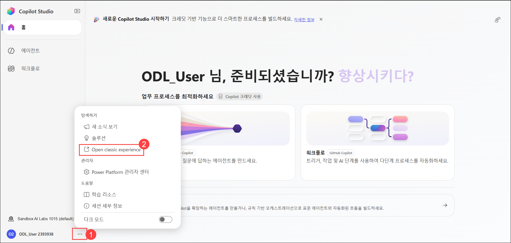

1. **Microsoft에 피드백 제출** 팝업에서 **피드백 건너뛰기** 를 클릭합니다.

    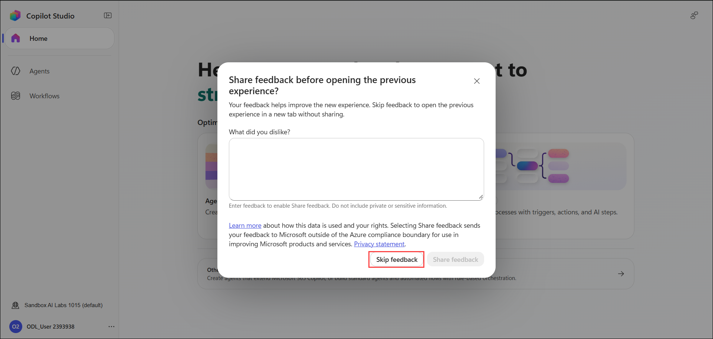

    >Copilot Studio가 로드되지 않으면 `Default-environmentid` **(1)** 를 **실습 1 작업 1 9단계 (2)** 에서 복사하여 메모장에 붙여넣은 **환경 ID** 로 교체하고 **Enter** 키를 누릅니다.

	

	

1. 오른쪽 상단에서 **환경 (1)** 을 클릭하고 **DevOne-<inject key="Deployment ID" enableCopy="false"></inject> (2)** 를 선택한 다음 계속 진행합니다.

   

## 연습 1: 자연어를 사용하여 에이전트 만들기

1. 가상 머신에서 브라우저를 열고 실습 자격 증명을 사용하여
   `https://copilotstudio.microsoft.com/`에 로그인합니다.

2. 홈 페이지의 **무엇을 빌드하시겠습니까?** 아래 텍스트 영역(**에이전트가 수행해야
   할 작업을 설명하는 것으로 구축을 시작**)에 다음 **(1) 프롬프트**를 입력합니다.

   ```
   웹 사이트의 콘텐츠를 활용하여 사용자의 일반적인 질문에 답변하는 질의응답 도우미 역할을 해 주세요.
   ```

   **(2) 보내기** 화살표를 선택합니다.

   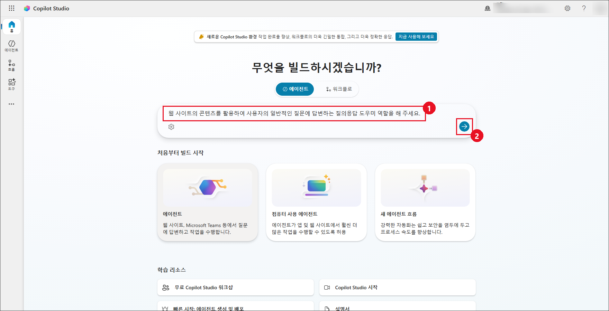

3. 요구 사항에 따라 에이전트가 생성되고, 이름과 설명, 지침이 자동으로 채워진
   **개요** 페이지가 열립니다.

4. **개요** 페이지를 아래로 스크롤하여 **참조 자료**(Knowledge, 지식 원본) 섹션에서
   **+ 참조 자료 추가**를 선택합니다.

   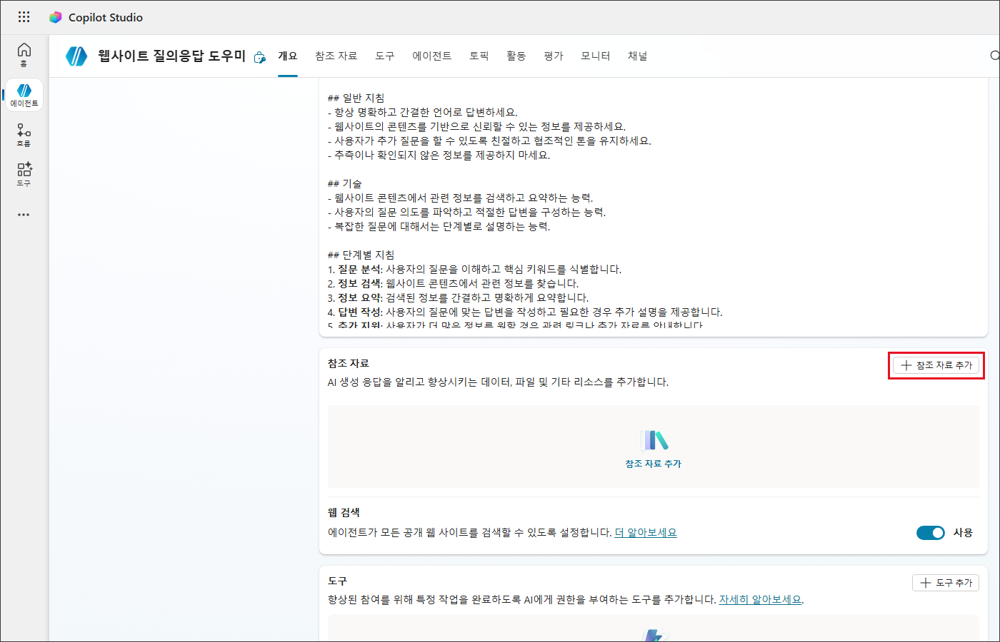

5. **공개 웹 사이트** 옵션을 선택합니다.

   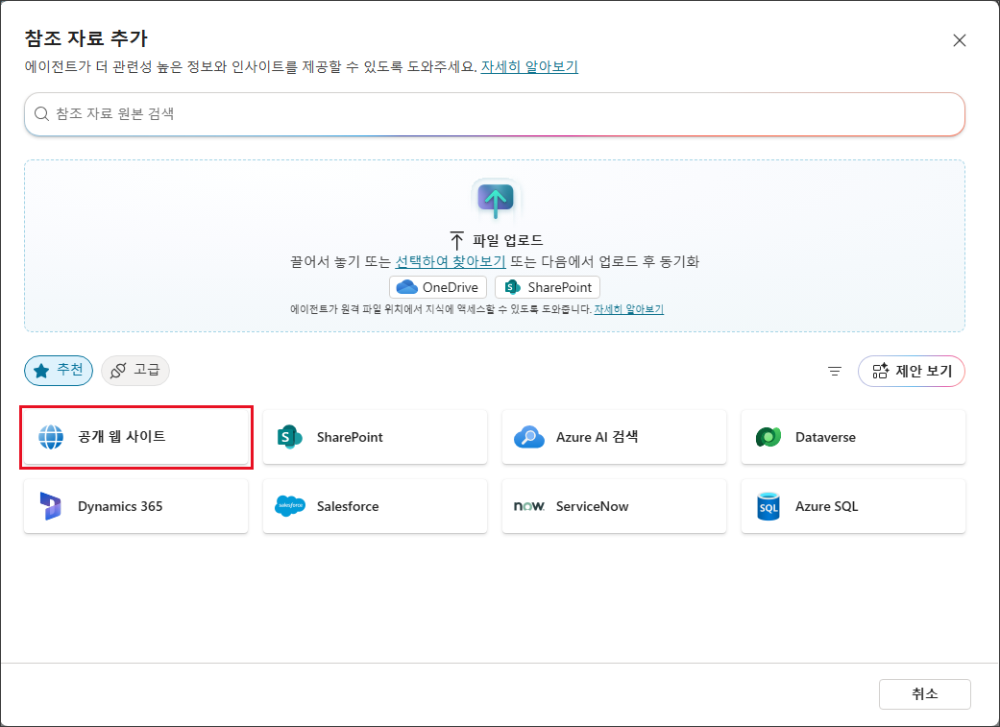

6. **(1) 공개 웹 사이트 링크**에 `www.microsoft.com`을 입력하고 **(2) 추가**를 선택합니다.

   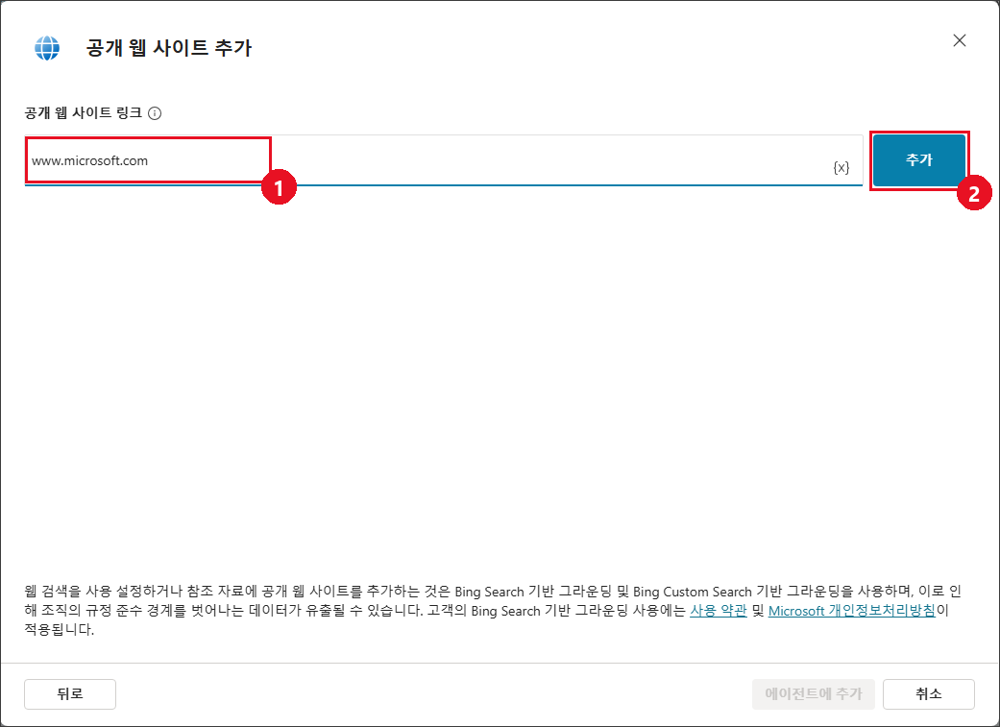

7. 추가된 링크를 확인한 후 **에이전트에 추가**를 선택합니다.

   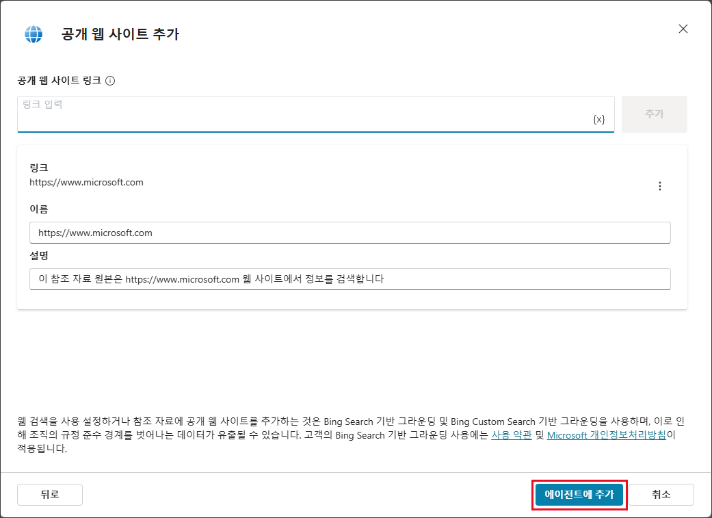

8. 웹 사이트가 에이전트의 참조 자료(지식 원본)로 추가되고 **준비** 상태로 표시됩니다.

9. **(1) 테스트**를 선택하여 **에이전트 테스트** 창을 열고, 다음 **(2) 질문**을
   입력한 후 **(3) 보내기**를 선택합니다.

   ```
   Copilot Studio란 무엇인가요?
   ```

   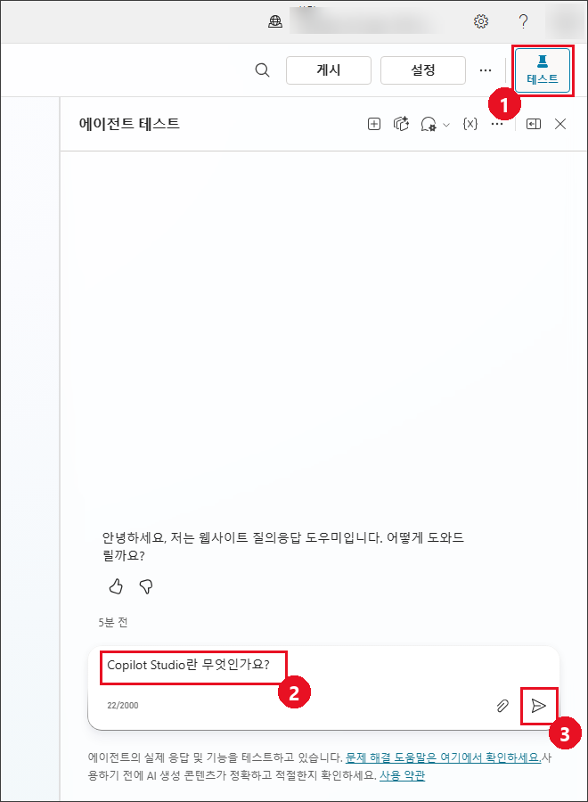

   응답이 표시되면 테스트 창이 확장되어 **원본 검색** 활동과 참조된 원본을 함께
   보여 줍니다.

   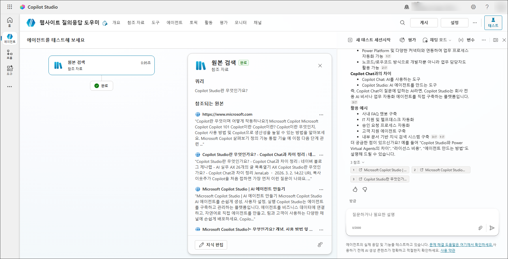

10. 같은 방법으로 다음 질문을 입력합니다.

    ```
    최신 Xbox 모델은 무엇인가요?
    ```

    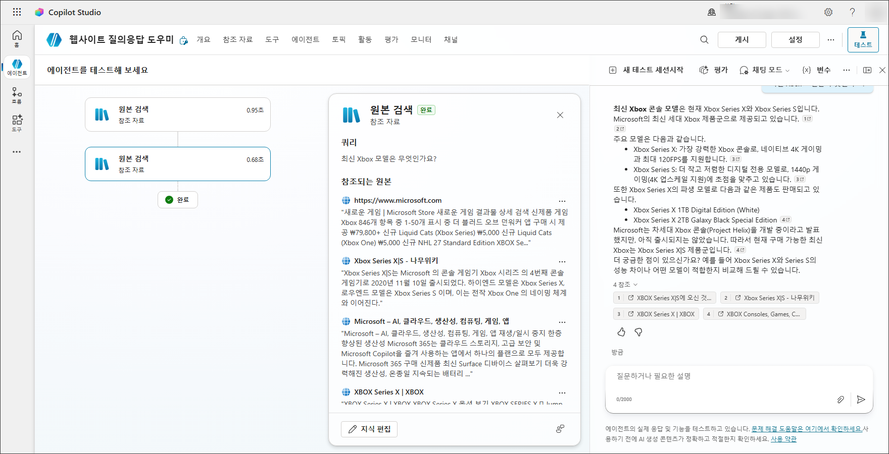

11. 위의 두 질문 모두에 대해 에이전트가 웹 사이트 참조 자료와 일반 지식을
    사용하므로 일반적인 답변을 받게 됩니다.

---

## 연습 2: 생성형 답변용 토픽의 프롬프트 액션 만들기

코파일럿 스튜디오(Copilot Studio)의 프롬프트를 사용하여 자연어 액션을 만들 수
있습니다. 이는 코파일럿 확장 기능으로 작동합니다. 이 액션들은 AI Builder의
생성형 AI 모델과 자연어 이해 기능을 활용하여 코파일럿의 특정 시나리오를
처리합니다. 즉, 자연어 기반 프롬프트 액션을 작성하는 것만으로도 코파일럿의
기능을 확장할 수 있습니다.

이 연습에서는 토픽 노드에 프롬프트 액션을 추가하는 방법을 학습합니다.

1. 에이전트의 **(1) 토픽** 탭을 선택하고, **(2) + 토픽 추가** 드롭다운을 연 후
   **(3) 새로 시작**을 선택합니다.

   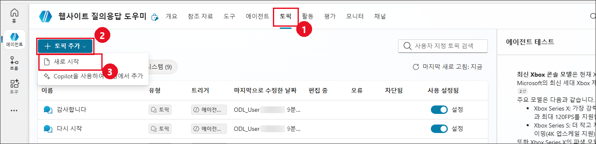

2. 위쪽의 **(1) 토픽 이름**(제목 없음)을 선택하고 다음 이름을 입력합니다.

   ```
   Generate questions for a quiz
   ```

   **트리거** 노드의 **(2) 토픽이 수행하는 작업 설명** 상자에 다음 내용을
   입력합니다(**복사** 옵션을 선택한 후 붙여넣습니다).

   ```
   주어진 주제를 바탕으로 퀴즈 문항을 여러 개 만들고, 제공된 지침에 따라 퀴즈 형식을 지정합니다

   제공된 주제를 바탕으로 여러 문항으로 구성된 퀴즈를 만들고 퀴즈 형식을 지정합니다

   제공된 주제를 사용하여 여러 문항의 퀴즈를 생성하고 문항 형식을 지정합니다

   특정 주제와 형식에 맞는 퀴즈 문항을 만듭니다

   제공된 주제를 바탕으로 지정된 문항 수에 맞춰 퀴즈 형식을 지정합니다
   ```

3. **(3) 저장**을 선택하여 토픽을 저장합니다.

   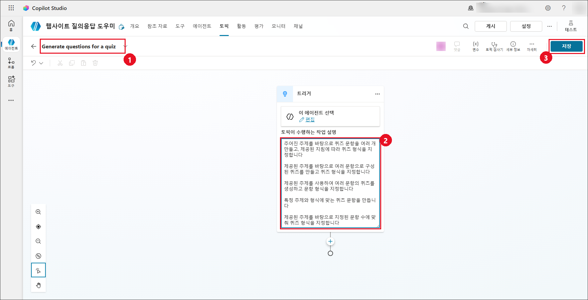

4. **트리거** 노드 아래의 **(1) +** 기호를 선택합니다. **(2) 도구 추가**를 선택한
   후 **도구 추가** 창의 **기본 도구** 탭에서 **(3) 새 프롬프트**를 선택합니다.

   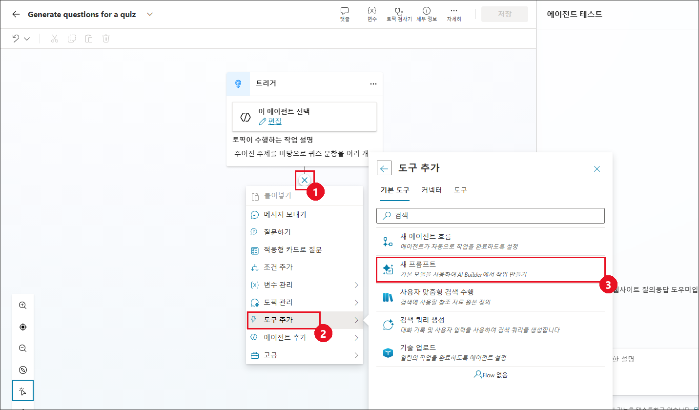

5. 프롬프트 대화 상자가 나타납니다. 프롬프트 작성 방법을 안내하는 플라이아웃(의도
   정의)이 표시될 수 있습니다. **다음**을 선택하여 안내를 진행하거나 **닫기**로
   닫습니다.

6. 퀴즈 문항을 생성하는 프롬프트를 작성합니다. 대화 상자 위쪽의 **(1) 프롬프트
   이름**(Custom prompt ...)을 선택하고 **Quiz Generator <inject key="DeploymentID"></inject>**를
   입력합니다.

   > **참고:** 같은 환경에 이름이 같은 프롬프트가 이미 있으면 저장할 수 없습니다.
   > 이름 뒤에 DeploymentID를 붙여 고유한 이름을 사용합니다.

7. **(2) 지침** 필드에 다음 내용을 붙여넣습니다.

   ```
   [topic] 주제를 다루는 퀴즈 문항을 [number]개 생성해 주세요. 객관식이나 참·거짓 문항과 같은 형식을 정하되, 지정된 [format] 형식을 사용해 주세요. 정답은 괄호 안에 표시해 주세요.
   ```

   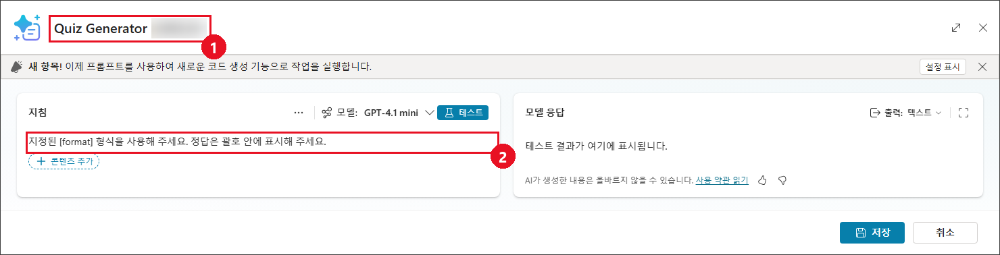

8. 지침에서 **(1) `[number]`** 텍스트를 선택하고 **+ 콘텐츠 추가**를 선택한 후
   **텍스트**를 선택합니다. **텍스트 입력** 창의 **(2) 이름**에 `number`를
   입력하고(기본값 '텍스트 입력'을 지웁니다), **(3) 샘플 데이터**에 `5`를 입력한
   후 **(4) 닫기**를 선택합니다.

   > **팁:** 대화 상자 오른쪽 위의 **전체 화면** 아이콘을 선택하면 지침을 더 넓게
   > 편집할 수 있습니다.

   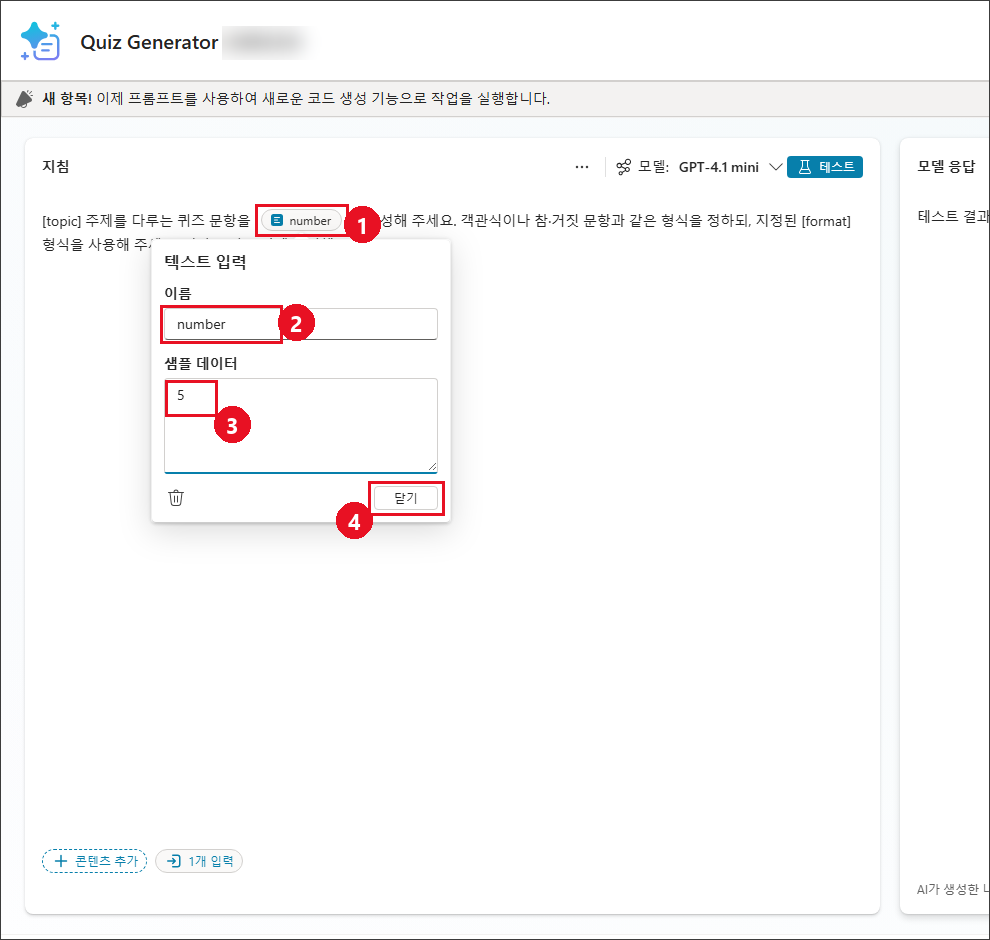

9. 같은 방법으로 `[topic]`을 선택하고 **+ 콘텐츠 추가** > **텍스트**를 선택합니다.
   **이름**에 `topic`을 입력하고 **샘플 데이터**에 `Science`를 입력한 후
   **닫기**를 선택합니다.

   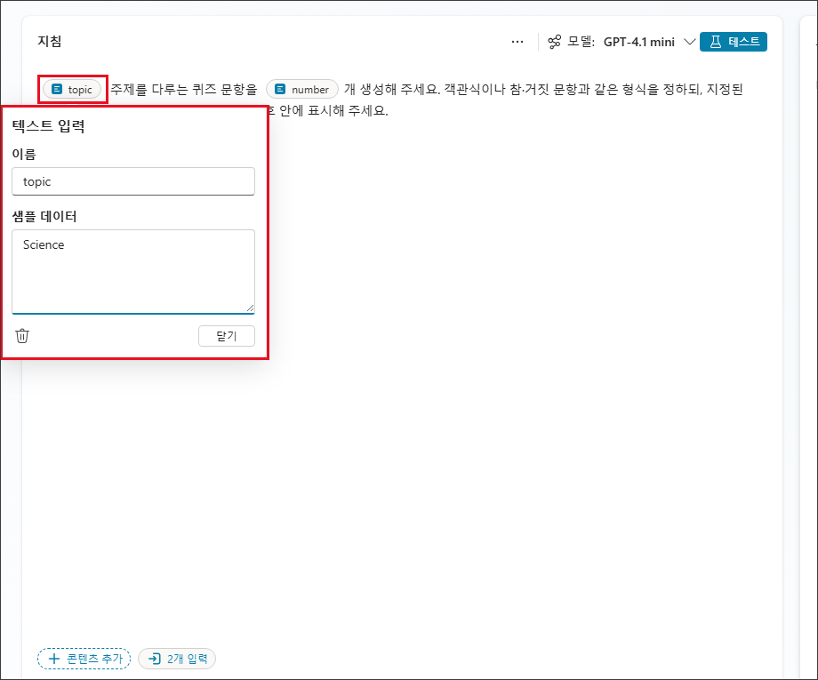

10. `[format]`을 선택하고 **+ 콘텐츠 추가** > **텍스트**를 선택합니다. **이름**에
    `format`을 입력하고 **샘플 데이터**에 `bullet points`를 입력한 후 **닫기**를
    선택합니다. **(1) 지침**에 세 입력이 모두 표시되면 프롬프트 창의 **(2) 저장**을
    선택합니다.

    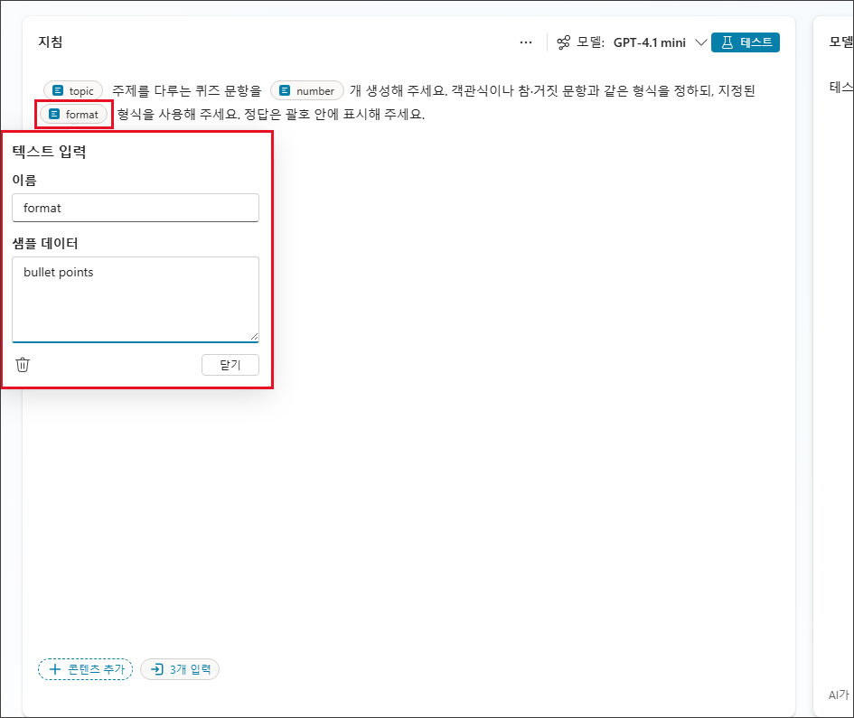

    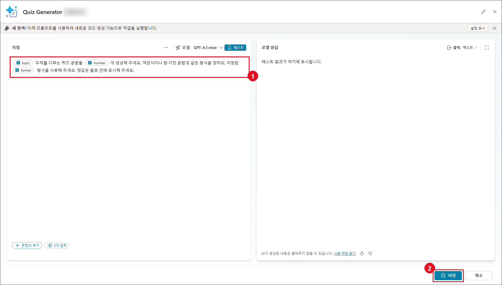

11. 이제 **프롬프트** 노드가 토픽의 작성 캔버스에 표시됩니다. 다음으로 입력
    매개 변수 값을 정의해야 합니다. 이를 통해 에이전트가 값을 채울 수 있습니다.
    `topic` 입력의 **(1) ...**(변수 선택) 아이콘을 선택합니다.

12. **변수 선택** 창에서 **(2) 시스템** 탭을 선택하고, **변수 검색**에
    `Activity.Text`를 입력한 후 **(3) Activity.Text**를 선택합니다. 이렇게 하면
    사용자의 전체 응답을 사용하여 값을 식별합니다.

    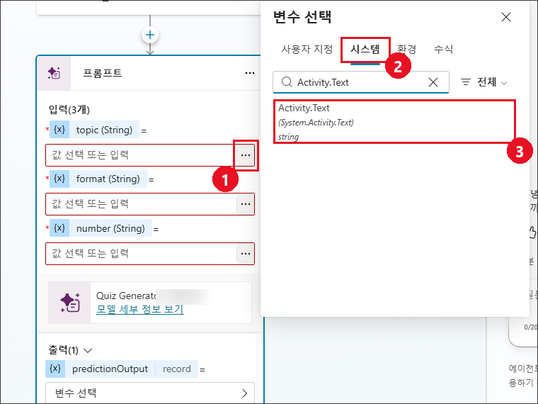

13. 프롬프트 액션의 나머지 입력 매개 변수에도 같은 방식으로 반복합니다.

    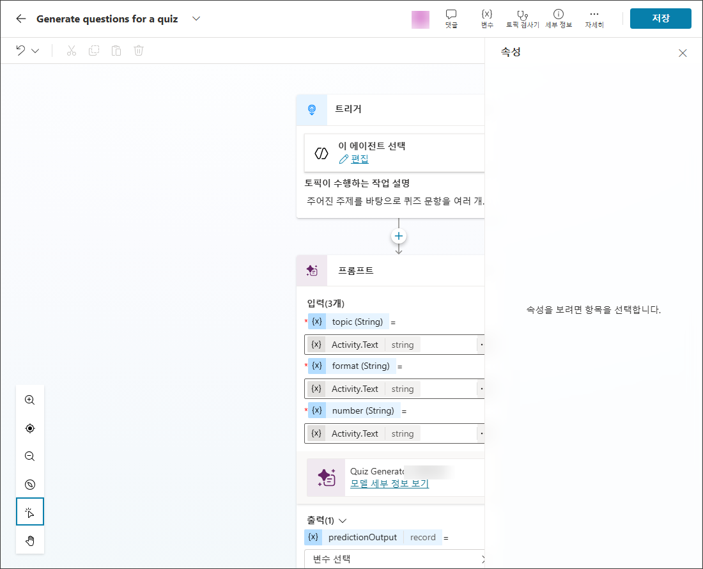

14. 다음으로 프롬프트 액션의 출력 변수를 정의합니다. 이를 통해 토픽의 이후
    단계에서 응답을 참조할 수 있습니다. **출력** 섹션의 **(1) >**(변수 선택)
    아이콘을 선택한 후 **(2) 사용자 지정** 탭에서 **(3) 새로 만들기**를 선택합니다.

    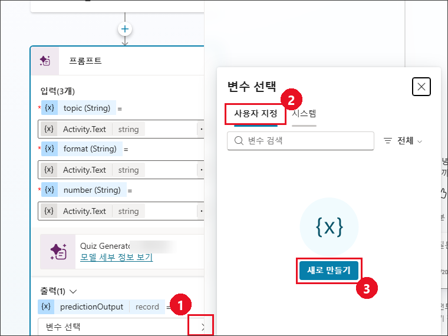

    `Var1` 변수가 만들어지면 노드에서 **Var1**을 선택하여 **변수 속성** 창을 열고,
    **변수 이름**을 다음으로 변경합니다.

    ```
    VarQuizQuestionsResponse
    ```

15. **프롬프트** 노드 아래의 **(1) +** 아이콘을 선택하여 새 노드를 추가하고
    **(2) 메시지 보내기**를 선택합니다.

    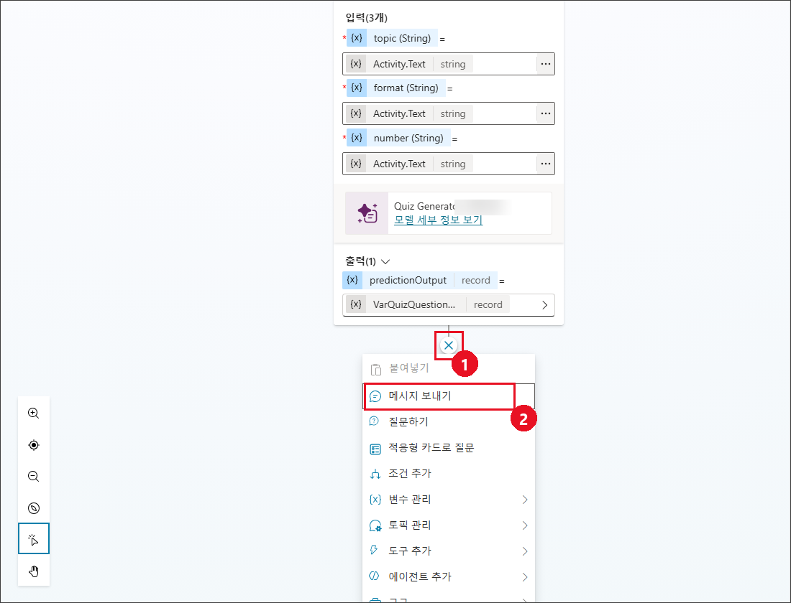

16. **메시지** 노드 도구 모음의 **(1) {x}**(변수 삽입) 아이콘을 선택한 후
    **사용자 지정** 탭에서 **(2) VarQuizQuestionsResponse.text**를 선택합니다.
    이렇게 하면 프롬프트 액션 응답의 text 속성이 **메시지** 노드에 추가됩니다.
    **저장**을 선택하여 토픽을 저장합니다.

    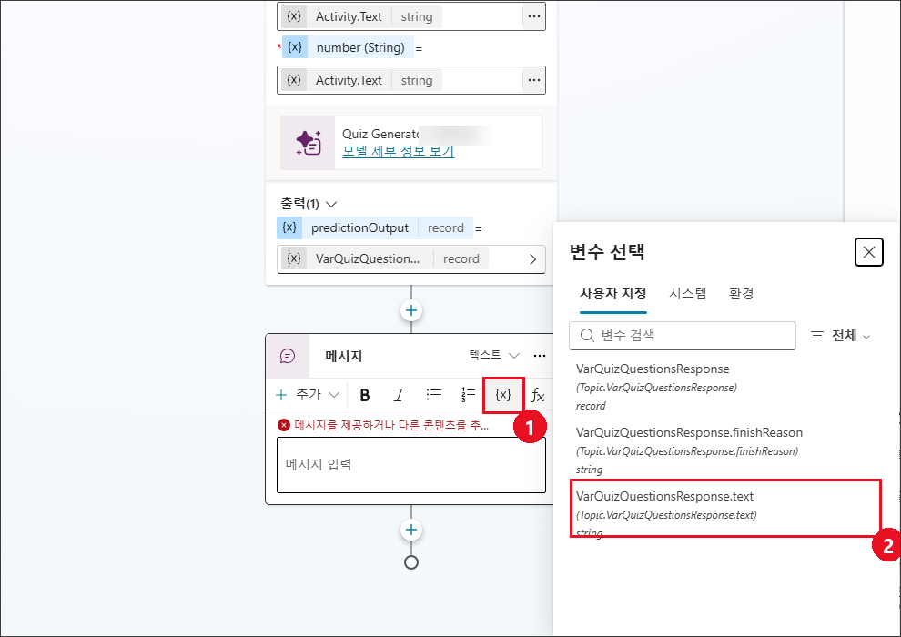

17. 이제 토픽 세부 정보를 업데이트합니다. 생성형 모드가 활성화될 때 에이전트가
    사용자 의도와 토픽을 연결하는 데 이 정보를 사용합니다. 도구 모음의
    **세부 정보**를 선택한 후 다음을 입력합니다.

    - **모델 표시 이름:** `generate questions for a quiz`
    - **모델 설명:** `이 토픽은 사용자가 제공한 문항 수, 주제, 형식을 바탕으로 퀴즈 문항을 만듭니다`

    > **참고:** **모델 설명**은 **트리거** 노드의 **토픽이 수행하는 작업 설명**과 같은
    > 필드이므로, 앞에서 입력한 설명이 이 내용으로 바뀝니다.

    **저장**을 선택하여 토픽을 저장합니다.

18. 이제 에이전트를 테스트할 준비가 완료되었습니다. **에이전트 테스트** 창에서
    **(1) 새 테스트 세션 시작**을 선택하고, 다음 **(2) 질문**을 입력한 후
    **(3) 보내기**를 선택합니다.

    ```
    지리를 주제로 퀴즈 문항 5개를 만들고 객관식 형식으로 구성해 주세요
    ```

    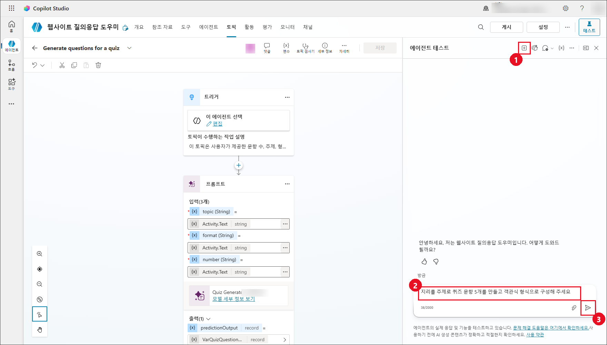

    에이전트가 **generate questions for a quiz** 토픽을 호출하여 프롬프트로 생성한
    퀴즈를 응답으로 보여 줍니다.

    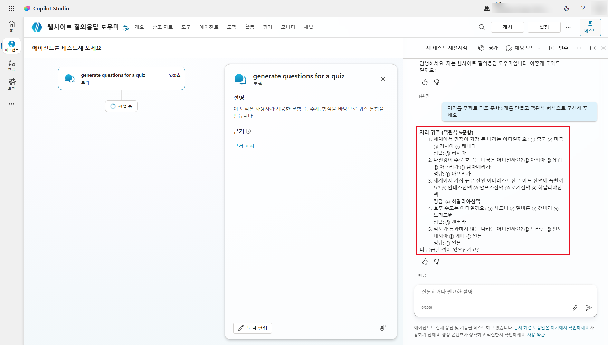

---

## 실습 3: Powerapps 환경 삭제

1. Power Platform 관리 센터에서 왼쪽 탐색 창의 **관리 (1)** 를 선택합니다.

1. 관리 아래에서 **환경 (2)** 을 선택하고, 환경 목록에서 사용자의 환경인 **DevOne-<inject key="Deployment ID" enableCopy="false"></inject> (3)** 을 선택합니다. 환경이 선택된 상태에서 명령 모음 오른쪽 위에 있는 **... (자세히) (4)** 아이콘을 클릭한 다음 드롭다운 메뉴에서 **삭제 (5)** 를 선택합니다.

   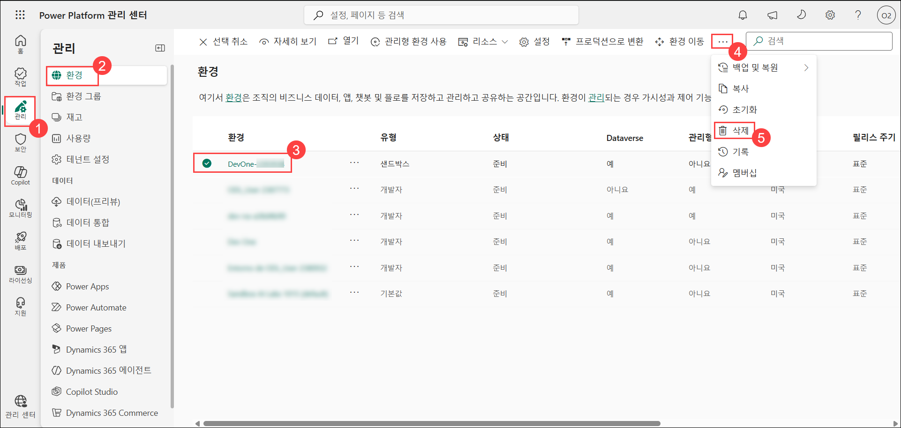

1. 환경 삭제 확인 대화 상자에서 표시된 대로 정확하게 **환경 이름 (1)** 을 입력한 다음 **확인 (2)** 을 선택합니다.

   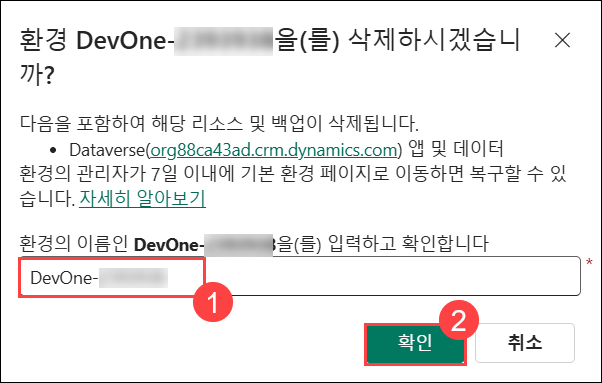

## 요약

이번 실습에서는 Microsoft Copilot Studio를 사용하여 프롬프트 작업(prompt actions)으로 에이전트의 기능을 확장하는 작업을 진행했습니다. 먼저 자연어를 통해 에이전트를 생성하고 공개 웹사이트를 지식 소스로 추가한 다음, 에이전트가 자체 지식을 활용하여 범위 내 질문과 범위 외 질문을 각각 어떻게 처리하는지 테스트했습니다. 이어서 "퀴즈용 질문 생성"이라는 사용자 지정 항목(custom topic)을 만들고, 그 안에 프롬프트 작업을 구성하여 입력 매개변수(개수, 주제, 형식)를 정의하고 이를 시스템 변수를 통해 사용자 입력에 매핑했습니다. 마지막으로 프롬프트의 출력을 "메시지 보내기" 노드에 연결하여 에이전트가 생성된 퀴즈 질문을 반환할 수 있도록 하고, 특정 주제에 대한 형식화된 퀴즈를 생성하도록 요청하여 전체 흐름을 테스트했습니다. 이 실습을 통해 Copilot Studio 에이전트 내에서 신뢰할 수 있고 재사용 가능한 생성형 작업을 만들기 위해 명확한 매개변수와 지침으로 구조화된 프롬프트를 설계하는 방법을 익혔습니다.
